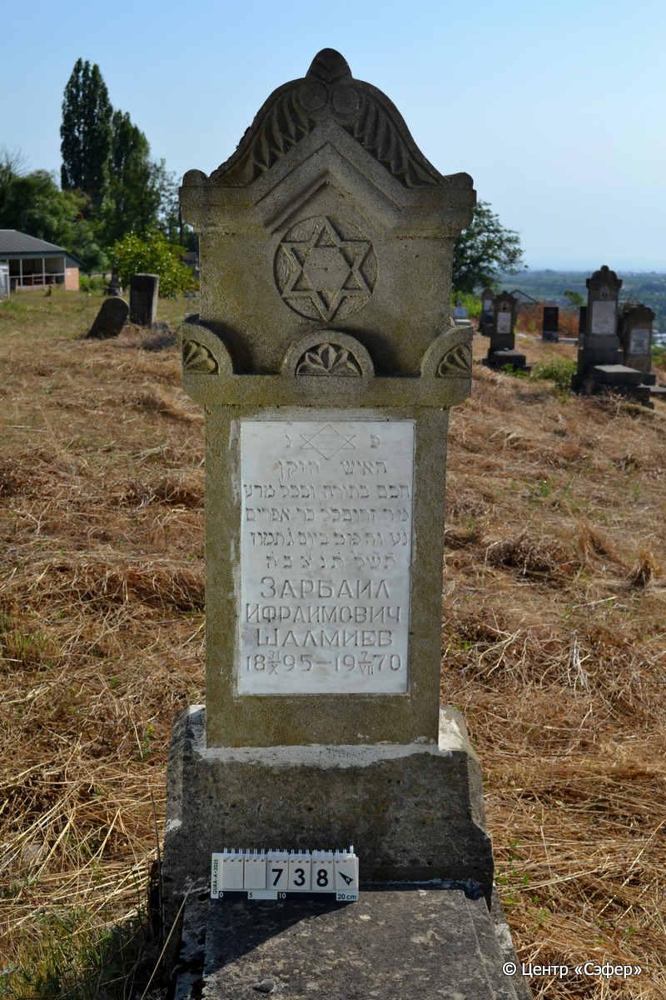
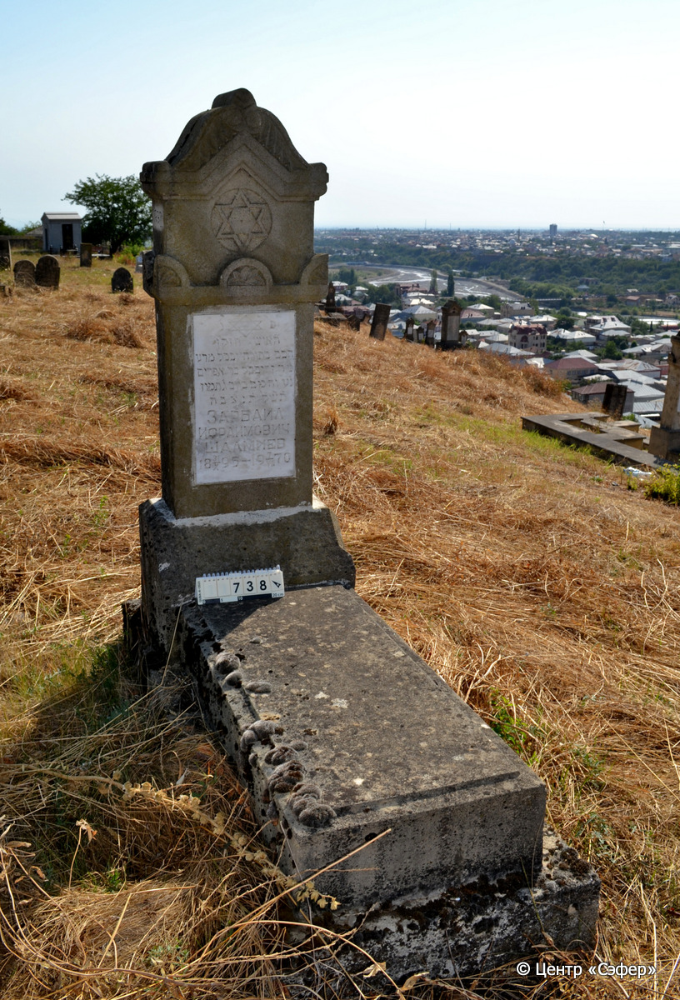

::: {style="font-size: 1em; margin-bottom: 1.2em"}
[Куба (центральное)](../cemeteries/QBA.html) > QBA0738
:::

```{r}
suppressPackageStartupMessages(library(tidyverse))
```


:::: {.columns}

::: {.column width="20%"}

```{r}
#| lightbox:
#|   group: photos




```
:::

::: {.column width="5%"}
:::

::: {.column width="74%"}

::: {.name-style}
Зерубавель, сын Эфраима (Зарбаил Ифраимович)
:::

::: {style="font-size: 1.2em;"}
זרובבל בן אפרים
:::

:::: {.columns}
::: {.column width="5%"}
{width=1.3em}
:::

::: {.column style="width: 40%; padding-left: 0.2em;"}
31.10.1895 /  
:::

::: {.column width="5%"}
{width=1.3em}
:::

::: {.column style="width: 50%; padding-left: 0.2em;"}
07.07.1970 / 03.Ta.5730
:::

::::


::: {.panel-tabset}

#### Эпитафия

```{r}
tibble(`Оригинал` = "פ נ׳
האיש הזקן
חכם בתורה ובכל מדע
מ׳ ר׳ זרובבל ב״ר אפרים
נ״ע וה״מ״כ ביום ג׳ תמוז
ת֘ש֘ל֘ ת֗נ֗צ֗ב֗ה֗
ЗАРБАИЛ
ИФРАИМОВИЧ
ШАЛМИЕВ
31/X 1895 -  7/VII 1970",
       `Перевод` = "Здесь покоится
пожилой человек,
знаток Торы и разных наук,
г-н р. Зерубавель, сын р. Эфраима,
душа его в раю, и благословен его покой, во вторник, 3 таммуза
730 года. Да будет душа его завязана в узле жизни.
ЗАРБАИЛ
ИФРАИМОВИЧ
ШАЛМИЕВ
31/X 1895 -  7/VII 1970") |>
  mutate(`Оригинал` = str_split(`Оригинал`, "
"),
         `Перевод` = str_split(`Перевод`, "
")) |>
  unnest_longer(c(`Оригинал`, `Перевод`)) |> 
  mutate(id = 1:n()) |> 
  relocate(id, .before = Перевод) |> 
  rename(` ` = id) |> 
  knitr::kable(align = c("r", "c", "l"))
```

|||
|-|---|
|**Примечания**| |
|**Язык**      |иврит, русский    |
|**Метки**     |знаток Писания    |
: {tbl-colwidths="[25,75]"}

#### Памятник

|||
|-|---|
|**Тип памятника**   |L-образный                                                                         |
|**Материал**        |известняк, мрамор (мраморная вставка для текста, цементный раствор, следы эрозии
)                                                     |
|**Размеры**         |160×58×43  --- стела; 21×52×113  --- плита; 20×70×175  --- основание                                                                        |
|**Тип декора**      |архитектурно-орнаментальный, растительный, традиционная символика                                                                        |
|**Элементы декора** |треугольное завершение с волютами и растительным мотивом, конёк. звезда Давида в круглой нише, пояс из пальметок, звезда Давида на вставке
                                                                          |
|**Координаты**      |[41.37088414, 48.50879054](https://www.google.com/maps/place/41.37088414, 48.50879054)                    |
: {tbl-colwidths="[25,75]"}

#### Источник

|||
|-|---|
|**Место хранения**        |Архив полевых исследований Центра «Сэфер»     |
|**Контакты**              |students@sefer.ru    |
|**Ссылка**                |https://sfira.org        |
|**Исходный ID**           |  |
|**Условия использования** |[CC BY-NC 4.0](https://creativecommons.org/licenses/by-nc/4.0/deed.ru)     |
: {tbl-colwidths="[25,75]"}

:::

:::

::::

