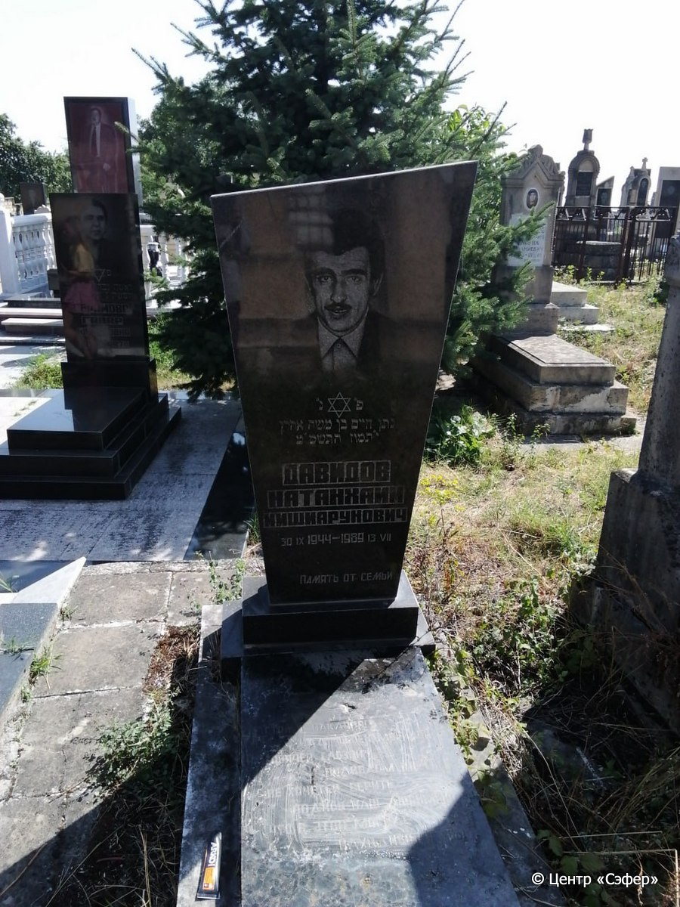
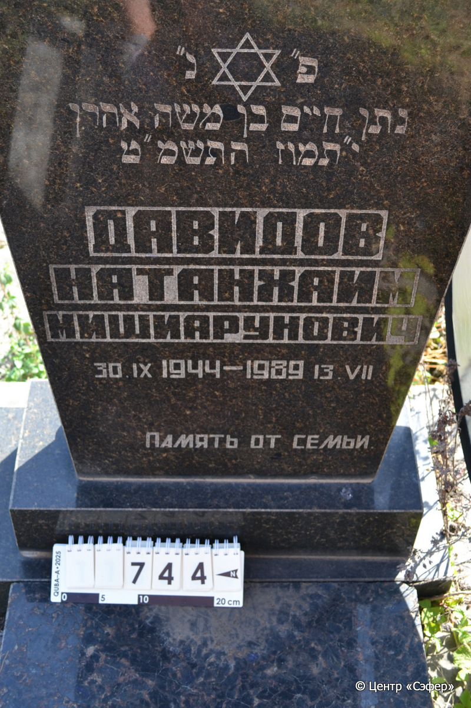
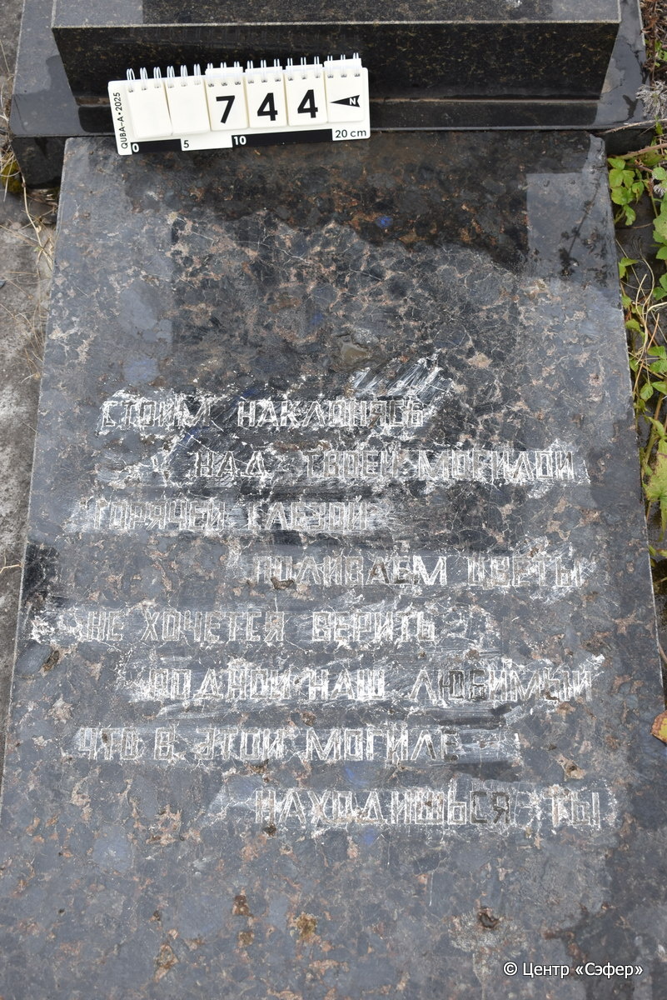
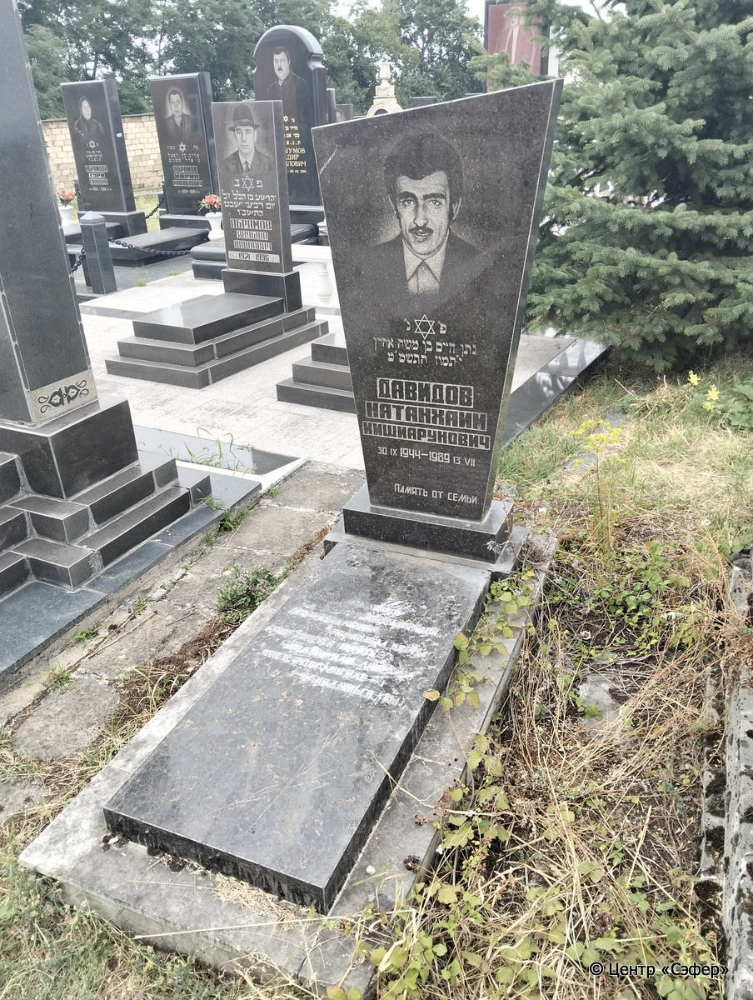

::: {style="font-size: 1em; margin-bottom: 1.2em"}
[Куба (центральное)](../cemeteries/QBA.html) > QBA0744
:::

```{r}
suppressPackageStartupMessages(library(tidyverse))
```


:::: {.columns}

::: {.column width="20%"}

```{r}
#| lightbox:
#|   group: photos






```
:::

::: {.column width="5%"}
:::

::: {.column width="74%"}

::: {.name-style}
ДАВИДОВ Натан Хаим, сын Аарона (Натанхаим Мишиарунович)
:::

::: {style="font-size: 1.2em;"}
נתן חיים בן אהרן
:::

:::: {.columns}
::: {.column width="5%"}
{width=1.3em}
:::

::: {.column style="width: 40%; padding-left: 0.2em;"}
30.09.1944 /  
:::

::: {.column width="5%"}
{width=1.3em}
:::

::: {.column style="width: 50%; padding-left: 0.2em;"}
13.07.1989 / 10.Ta.5749
:::

::::


::: {.panel-tabset}

#### Эпитафия

```{r}
tibble(`Оригинал` = "сверху
פ״נ״
נתן חיים בן אהרן
י״תמוז התשמ״ט
Давидов
 Натанхаим
Мишиарунович
30.IX 1944 - 1989 13.VII
память от семьи

снизу
стоим наклонясь
над твоею могилой
горячей слезой
поливаем цветы
не хочется верить
родной наш любимый
что в этой могиле
находишься ты",
       `Перевод` = "
Здесь покоится
Натан Хаим, сын Аарона.
10 таммуза 5749 года.
Давидов
Натанхаим
Мишиарунович
30.IX 1944 - 1989 13.VII
память от семьи

 
Стоим, наклонясь,
над твоею могилой,
горячей слезой
поливаем цветы.
Не хочется верить,
родной наш, любимый,
что в этой могиле
находишься ты.") |>
  mutate(`Оригинал` = str_split(`Оригинал`, "
"),
         `Перевод` = str_split(`Перевод`, "
")) |>
  unnest_longer(c(`Оригинал`, `Перевод`)) |> 
  mutate(id = 1:n()) |> 
  relocate(id, .before = Перевод) |> 
  rename(` ` = id) |> 
  knitr::kable(align = c("r", "c", "l"))
```

|||
|-|---|
|**Примечания**| |
|**Язык**      |иврит, русский    |
|**Метки**     |     |
: {tbl-colwidths="[25,75]"}

#### Памятник

|||
|-|---|
|**Тип памятника**   |L-образный                                                                         |
|**Материал**        |габбро-диорит, мрамор (мраморное основание)                                                     |
|**Размеры**         |136×54×22  --- стела; 8×53×120  --- плита; 16×79×177  --- основание                                                                        |
|**Тип декора**      |архитектурно-орнаментальный, растительный, традиционная символика                                                                        |
|**Элементы декора** |скошенное завершение, фотопортрет, звезда Давида, две перекрещенные гвоздики на плите                                                                          |
|**Координаты**      |[41.37119755, 48.50870188](https://www.google.com/maps/place/41.37119755, 48.50870188)                    |
: {tbl-colwidths="[25,75]"}

#### Источник

|||
|-|---|
|**Место хранения**        |Архив полевых исследований Центра «Сэфер»     |
|**Контакты**              |students@sefer.ru    |
|**Ссылка**                |https://sfira.org        |
|**Исходный ID**           |  |
|**Условия использования** |[CC BY-NC 4.0](https://creativecommons.org/licenses/by-nc/4.0/deed.ru)     |
: {tbl-colwidths="[25,75]"}

:::

:::

::::

