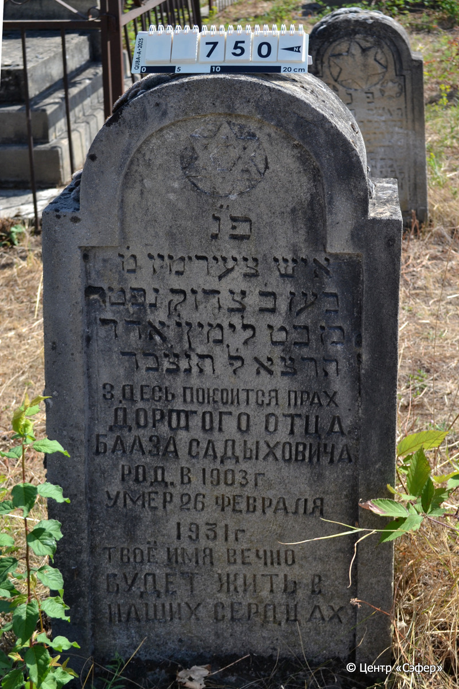

::: {style="font-size: 1em; margin-bottom: 1.2em"}
[Куба (центральное)](../cemeteries/QBA.html) > QBA0750
:::

```{r}
suppressPackageStartupMessages(library(tidyverse))
```


:::: {.columns}

::: {.column width="20%"}

```{r}
#| lightbox:
#|   group: photos



```
:::

::: {.column width="5%"}
:::

::: {.column width="74%"}

::: {.name-style}
Боаз, сын Цадока (Дорогого)
:::

::: {style="font-size: 1.2em;"}
בעז בן צדוק
:::

:::: {.columns}
::: {.column width="5%"}
{width=1.3em}
:::

::: {.column style="width: 40%; padding-left: 0.2em;"}
-.-.1903 /  
:::

::: {.column width="5%"}
{width=1.3em}
:::

::: {.column style="width: 50%; padding-left: 0.2em;"}
26.02.1931 / 10.Ad.5691
:::

::::


::: {.panel-tabset}

#### Эпитафия

```{r}
tibble(`Оригинал` = "פ״נ
איש צעיר ימיו מ֗
בעז ב֗ צדוק נפטר
בן כט לימין י׳ אדר
הרצ״א לפ׳ק תנצ׳בד
Здесь покоится прах
дорогого отца
Бааза Садыховича
род. в 1903 г
умер 26 февраля
1931 г
твоё имя вечно
будет жить в
наших сердцах",
       `Перевод` = "Здесь покоится
человек, юный днями, г-н
Боаз, сын Цадока. Скончался
29 лет от роду, 10 адара
5691 года по малому летоисчислению. Да будет душа его завязана в узле жизни.
Здесь покоится прах
дорогого отца
Бааза Садыховича,
родился в 1903 г.,
умер 26 февраля
1931 г.
Твоё имя вечно
будет жить в
наших сердцах.") |>
  mutate(`Оригинал` = str_split(`Оригинал`, "
"),
         `Перевод` = str_split(`Перевод`, "
")) |>
  unnest_longer(c(`Оригинал`, `Перевод`)) |> 
  mutate(id = 1:n()) |> 
  relocate(id, .before = Перевод) |> 
  rename(` ` = id) |> 
  knitr::kable(align = c("r", "c", "l"))
```

|||
|-|---|
|**Примечания**| |
|**Язык**      |иврит, русский    |
|**Метки**     |     |
: {tbl-colwidths="[25,75]"}

#### Памятник

|||
|-|---|
|**Тип памятника**   |стела                                                                         |
|**Материал**        |известняк (следы эрозии)                                                     |
|**Размеры**         |109×50×22  --- стела                                                                        |
|**Тип декора**      |традиционная символика                                                                        |
|**Элементы декора** |полукруглое завершение с плечиками и звездой Давида                                                                          |
|**Координаты**      |[41.37112844, 48.50873386](https://www.google.com/maps/place/41.37112844, 48.50873386)                    |
: {tbl-colwidths="[25,75]"}

#### Источник

|||
|-|---|
|**Место хранения**        |Архив полевых исследований Центра «Сэфер»     |
|**Контакты**              |students@sefer.ru    |
|**Ссылка**                |https://sfira.org        |
|**Исходный ID**           |  |
|**Условия использования** |[CC BY-NC 4.0](https://creativecommons.org/licenses/by-nc/4.0/deed.ru)     |
: {tbl-colwidths="[25,75]"}

:::

:::

::::

