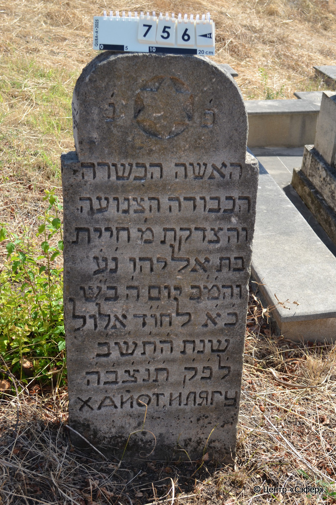

::: {style="font-size: 1em; margin-bottom: 1.2em"}
[Куба (центральное)](../cemeteries/QBA.html) > QBA0756
:::

```{r}
suppressPackageStartupMessages(library(tidyverse))
```


:::: {.columns}

::: {.column width="20%"}

```{r}
#| lightbox:
#|   group: photos



```
:::

::: {.column width="5%"}
:::

::: {.column width="74%"}

::: {.name-style}
Хаят, дочь Элияху (Хайот)
:::

::: {style="font-size: 1.2em;"}
חיית בת אליהו
:::

:::: {.columns}
::: {.column width="5%"}
{width=1.3em}
:::

::: {.column style="width: 40%; padding-left: 0.2em;"}
  /  
:::

::: {.column width="5%"}
{width=1.3em}
:::

::: {.column style="width: 50%; padding-left: 0.2em;"}
03.09.1942* / 21.El.5702
:::

::::


::: {.panel-tabset}

#### Эпитафия

```{r}
tibble(`Оригинал` = "פ׳נ׳
האשה הכשרה
הכבודה הצנועה
והצדקת מ׳ חיית
בת אליהו נ׳ע׳
והמ׳כ יום ה׳ ב״ש
כ׳א׳ לחו״ד אלול
שנת ה׳ת׳ש׳ב׳
ל׳פ׳ק׳ ת׳נ׳צ׳ב׳ה׳
Хайот, Илягу",
       `Перевод` = "Здесь покоится
женщина добродетельная
и уважаемая, скромная
и праведная, г-жа Хаят,
дочь Элияху, душа ее в раю,
и благословен ее покой. Четверг,
21 число месяца элул,
года 5702
по малому летоисчислению. Да будет душа ее завязана в узле жизни.
Хайот, Илягу") |>
  mutate(`Оригинал` = str_split(`Оригинал`, "
"),
         `Перевод` = str_split(`Перевод`, "
")) |>
  unnest_longer(c(`Оригинал`, `Перевод`)) |> 
  mutate(id = 1:n()) |> 
  relocate(id, .before = Перевод) |> 
  rename(` ` = id) |> 
  knitr::kable(align = c("r", "c", "l"))
```

|||
|-|---|
|**Примечания**| |
|**Язык**      |иврит, русский    |
|**Метки**     |     |
: {tbl-colwidths="[25,75]"}

#### Памятник

|||
|-|---|
|**Тип памятника**   |стела                                                                         |
|**Материал**        |известняк (следы эрозии, сколы)                                                     |
|**Размеры**         |101×43×11  --- стела                                                                        |
|**Тип декора**      |                                                                         |
|**Элементы декора** |полукруглое завершение с плечиками и звездой Давида в круглой рамке                                                                          |
|**Координаты**      |[41.37085397, 48.50885468](https://www.google.com/maps/place/41.37085397, 48.50885468)                    |
: {tbl-colwidths="[25,75]"}

#### Источник

|||
|-|---|
|**Место хранения**        |Архив полевых исследований Центра «Сэфер»     |
|**Контакты**              |students@sefer.ru    |
|**Ссылка**                |https://sfira.org        |
|**Исходный ID**           |  |
|**Условия использования** |[CC BY-NC 4.0](https://creativecommons.org/licenses/by-nc/4.0/deed.ru)     |
: {tbl-colwidths="[25,75]"}

:::

:::

::::

