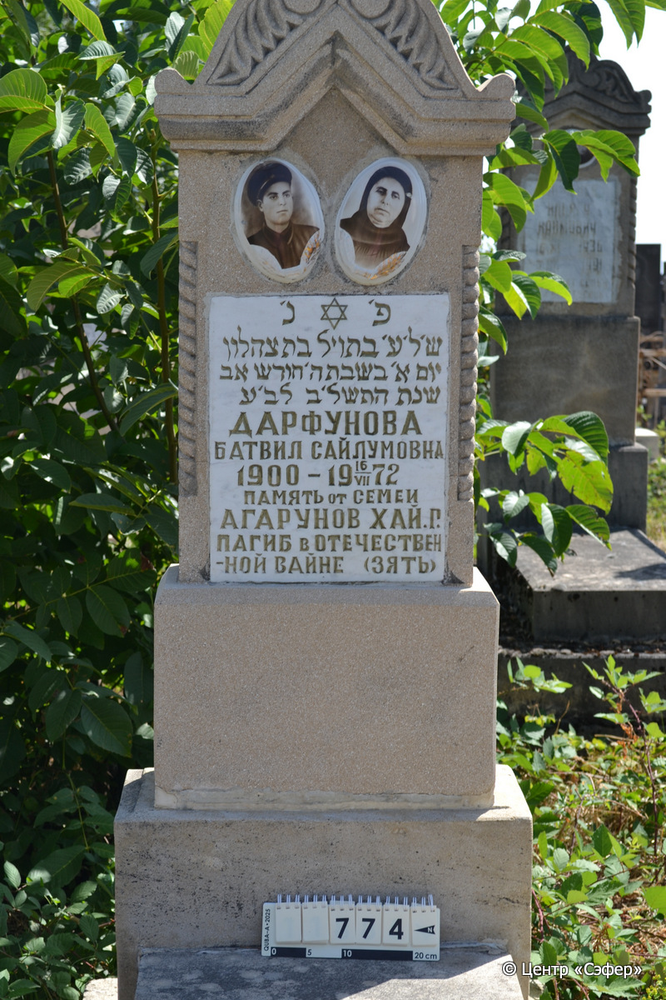
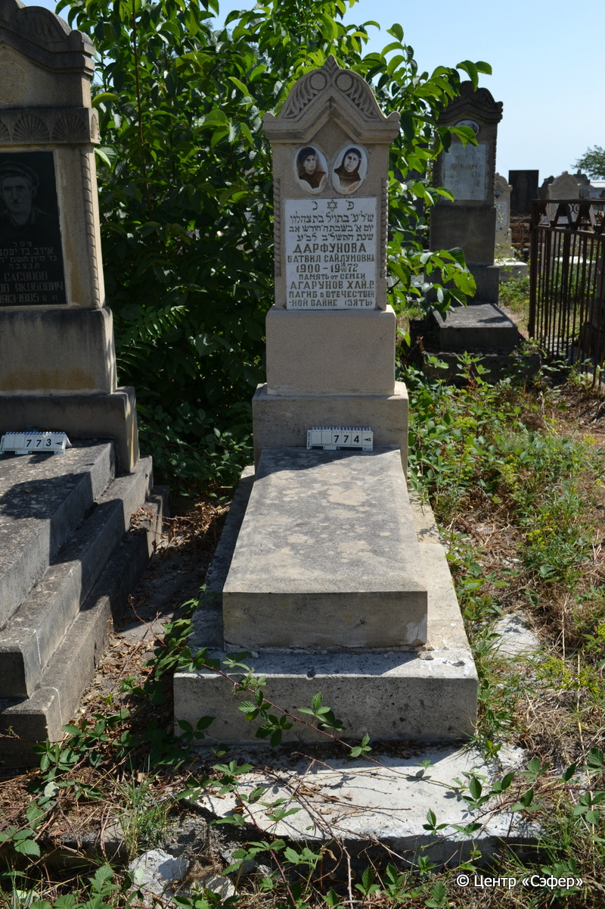

::: {style="font-size: 1em; margin-bottom: 1.2em"}
[Куба (центральное)](../cemeteries/QBA.html) > QBA0774
:::

```{r}
suppressPackageStartupMessages(library(tidyverse))
```


:::: {.columns}

::: {.column width="20%"}

```{r}
#| lightbox:
#|   group: photos




```
:::

::: {.column width="5%"}
:::

::: {.column width="74%"}

::: {.name-style}
ДАРФУНОВА Батвил, дочь Цахалона (Сайлумовна)
:::

::: {style="font-size: 1.2em;"}
בתויל בת צהלון
:::

:::: {.columns}
::: {.column width="5%"}
{width=1.3em}
:::

::: {.column style="width: 40%; padding-left: 0.2em;"}
-.-.1900 /  
:::

::: {.column width="5%"}
{width=1.3em}
:::

::: {.column style="width: 50%; padding-left: 0.2em;"}
16.07.1972 / 05.Av.5732
:::

::::


::: {.panel-tabset}

#### Эпитафия

```{r}
tibble(`Оригинал` = "פ׳נ׳
ש׳ל׳ע׳ בתויל בת צהלון
יום א׳ בשבת ה׳ חודש אב
שנת התשל׳ב לב׳ע 
Дарфунова
Батвил Сайлумовна
1900 - 19 16 VII 1972
память от семеи
Агарунов Хай. Г. 
Пагиб в отчествен-
ной вайне (зять)",
       `Перевод` = "Здесь покоится
ушедшая в вечность Батвил, дочь Цахалуна.
Воскресенье, 5 число месяца ав
года 5732 от сотворения мира.
Дарфунова
Батвил Сайлумовна
1900 - 19 16 VII 1972
память от семьи.
Агарунов Хай. Г. 
Погиб в <Великой> Отчественной
войне (зять).") |>
  mutate(`Оригинал` = str_split(`Оригинал`, "
"),
         `Перевод` = str_split(`Перевод`, "
")) |>
  unnest_longer(c(`Оригинал`, `Перевод`)) |> 
  mutate(id = 1:n()) |> 
  relocate(id, .before = Перевод) |> 
  rename(` ` = id) |> 
  knitr::kable(align = c("r", "c", "l"))
```

|||
|-|---|
|**Примечания**| |
|**Язык**      |иврит, русский    |
|**Метки**     |     |
: {tbl-colwidths="[25,75]"}

#### Памятник

|||
|-|---|
|**Тип памятника**   |L-образный                                                                         |
|**Материал**        |известняк, мрамор (два керамических медальона с портретами, мраморная вставка для текста, цементный раствор, трещины, следы эрозии, сколы)                                                     |
|**Размеры**         |160×60×25  --- стела; 20×52×125  --- плита; 17×75×173  --- основание                                                                        |
|**Тип декора**      |архитектурно-орнаментальный, растительный, традиционная символика                                                                        |
|**Элементы декора** |треугольное завершение с волютами и растительным орнаментом, витые полуколонны, два портрета на медальонах с растительным орнаментом, звезда Давида на вставке                                                                          |
|**Координаты**      |[41.37118574, 48.50879864](https://www.google.com/maps/place/41.37118574, 48.50879864)                    |
: {tbl-colwidths="[25,75]"}

#### Источник

|||
|-|---|
|**Место хранения**        |Архив полевых исследований Центра «Сэфер»     |
|**Контакты**              |students@sefer.ru    |
|**Ссылка**                |https://sfira.org        |
|**Исходный ID**           |  |
|**Условия использования** |[CC BY-NC 4.0](https://creativecommons.org/licenses/by-nc/4.0/deed.ru)     |
: {tbl-colwidths="[25,75]"}

:::

:::

::::

