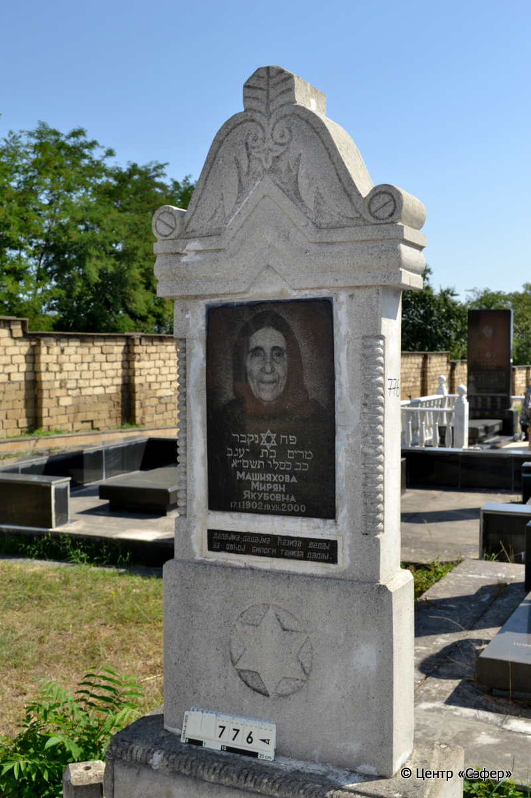
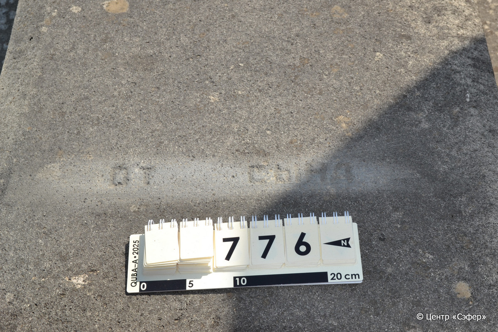
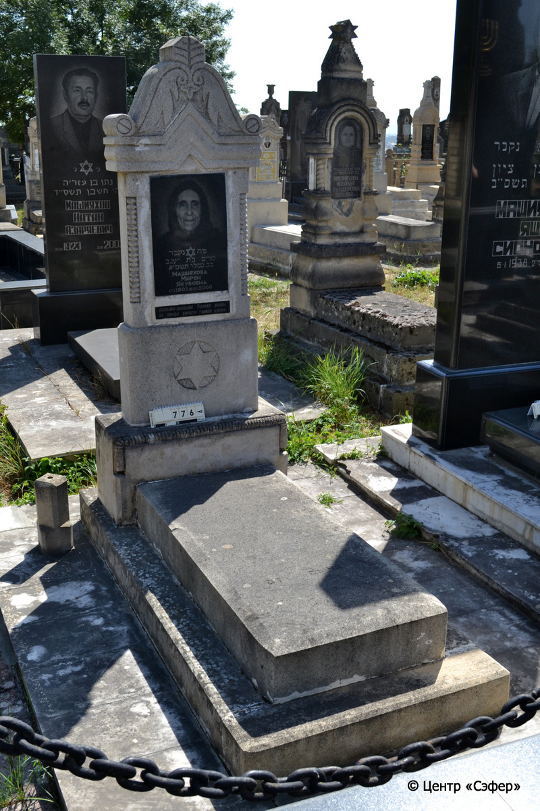

::: {style="font-size: 1em; margin-bottom: 1.2em"}
[Куба (центральное)](../cemeteries/QBA.html) > QBA0776
:::

```{r}
suppressPackageStartupMessages(library(tidyverse))
```


:::: {.columns}

::: {.column width="20%"}

```{r}
#| lightbox:
#|   group: photos





```
:::

::: {.column width="5%"}
:::

::: {.column width="74%"}

::: {.name-style}
МАШИЯХОВА Мирьям, дочь Яакова (Мирян Якубовна)
:::

::: {style="font-size: 1.2em;"}
מרים בת יעגב
:::

:::: {.columns}
::: {.column width="5%"}
{width=1.3em}
:::

::: {.column style="width: 40%; padding-left: 0.2em;"}
17.01.1902 /  
:::

::: {.column width="5%"}
{width=1.3em}
:::

::: {.column style="width: 50%; padding-left: 0.2em;"}
19.12.2000 / 22.Ki.5761
:::

::::


::: {.panel-tabset}

#### Эпитафия

```{r}
tibble(`Оригинал` = "פה נקבר 
מרים בת יעגב 
כב כסליו תשס״א
Машияхова
Мирян
Якубовна
17. I. 1902 - 19. XII. 2000
дадаjма-дадаjма ħазиза дадаj 
аз овhоj билоги тамиза дадаj

снизу
от сына",
       `Перевод` = "Здесь покоится
Мирьям, дочь Яакова.
22 кислева 761.
Машияхова
Мирян
Якубовна
17. I. 1902 - 19. XII. 2000
Мама-мама, дорогая мама!
Чище родникой воды, моя мама.


от сына") |>
  mutate(`Оригинал` = str_split(`Оригинал`, "
"),
         `Перевод` = str_split(`Перевод`, "
")) |>
  unnest_longer(c(`Оригинал`, `Перевод`)) |> 
  mutate(id = 1:n()) |> 
  relocate(id, .before = Перевод) |> 
  rename(` ` = id) |> 
  knitr::kable(align = c("r", "c", "l"))
```

|||
|-|---|
|**Примечания**| |
|**Язык**      |иврит, русский, джуури    |
|**Метки**     |     |
: {tbl-colwidths="[25,75]"}

#### Памятник

|||
|-|---|
|**Тип памятника**   |L-образный                                                                         |
|**Материал**        |известняк, габбро-диорит (две вставки из темного камня для текста и портрета, цементный раствор, следы эрозии, сколы, трещины)                                                     |
|**Размеры**         |200×80×35  --- стела; 20×65×140  --- плита; 14×65×210  --- основание                                                                        |
|**Тип декора**      |архитектурно-орнаментальный, растительный, традиционная символика                                                                        |
|**Элементы декора** |треугольное завершение с волютами и растительными мотивами, конек, витые полуколонны, звезда Давида и портрет на вставке, звезда Давида в курглой нише стеле, у основания стелы край рельефно оформлен, ваза                                                                          |
|**Координаты**      |[41.37129732, 48.5088145](https://www.google.com/maps/place/41.37129732, 48.5088145)                    |
: {tbl-colwidths="[25,75]"}

#### Источник

|||
|-|---|
|**Место хранения**        |Архив полевых исследований Центра «Сэфер»     |
|**Контакты**              |students@sefer.ru    |
|**Ссылка**                |https://sfira.org        |
|**Исходный ID**           |  |
|**Условия использования** |[CC BY-NC 4.0](https://creativecommons.org/licenses/by-nc/4.0/deed.ru)     |
: {tbl-colwidths="[25,75]"}

:::

:::

::::

