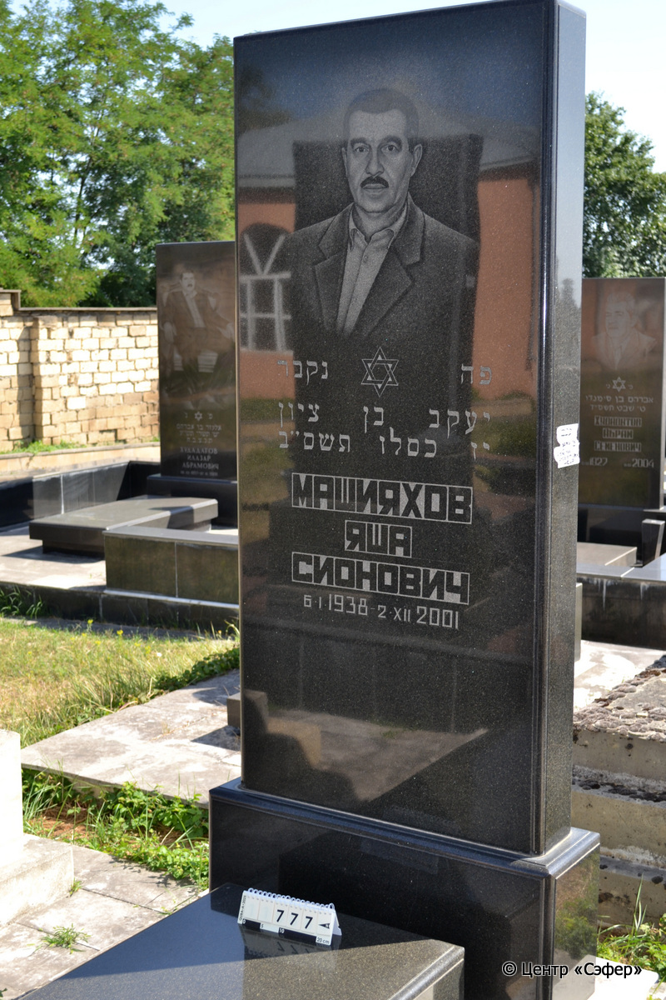
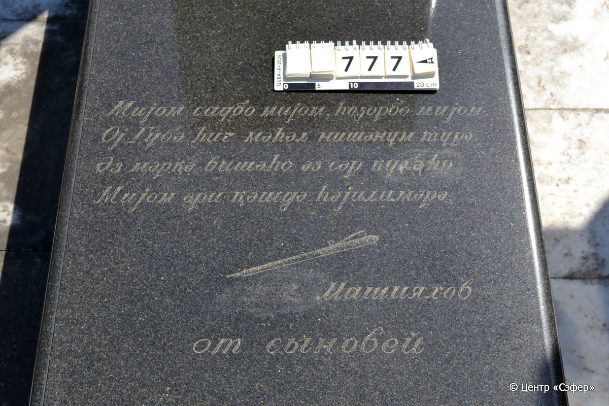
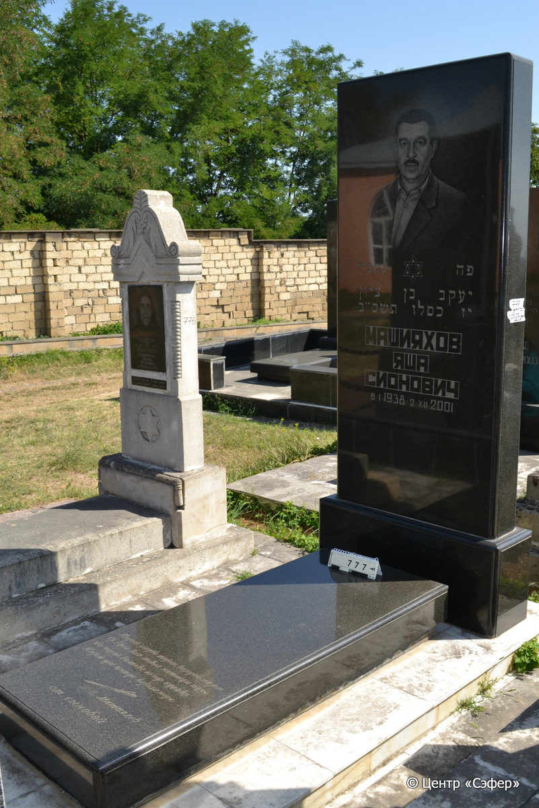
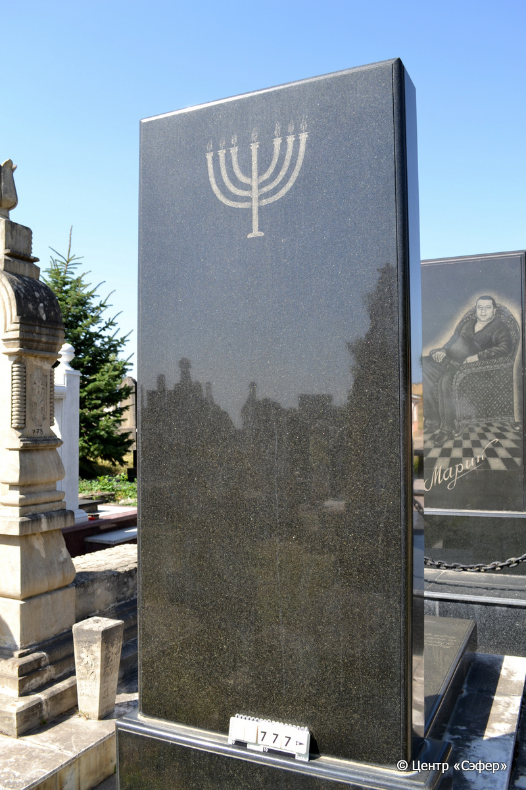

::: {style="font-size: 1em; margin-bottom: 1.2em"}
[Куба (центральное)](../cemeteries/QBA.html) > QBA0777
:::

```{r}
suppressPackageStartupMessages(library(tidyverse))
```


:::: {.columns}

::: {.column width="20%"}

```{r}
#| lightbox:
#|   group: photos






```
:::

::: {.column width="5%"}
:::

::: {.column width="74%"}

::: {.name-style}
МАШИЯХОВ Яаков, сын Циона (Яша Сионович)
:::

::: {style="font-size: 1.2em;"}
יעקב בן ציון
:::

:::: {.columns}
::: {.column width="5%"}
{width=1.3em}
:::

::: {.column style="width: 40%; padding-left: 0.2em;"}
06.01.1938 /  
:::

::: {.column width="5%"}
{width=1.3em}
:::

::: {.column style="width: 50%; padding-left: 0.2em;"}
02.12.2001 / 17.Ki.5762
:::

::::


::: {.panel-tabset}

#### Эпитафия

```{r}
tibble(`Оригинал` = "פה נקבר
יעקב בן ציון 
יז כסלו תשס״ב
Машияхов
Яша
Сионович
6.I.1938 - 2. XII. 2001

снизу
 Миjом садбо миjом hозорбо миjом
Оj Губǝ hиƨ мǝhǝл нишǝнум турǝ
ǝз мǝрӄǝ вишǝho ǝз сǝр кухǝhо
миjом ǝри ӄǝшдǝ hǝjилимǝрǝ 

Машияхов
от сыновей",
       `Перевод` = "Здесь покоится
Яаков, сын Циона.
17 кислева 762 года.
Машияхов
Яша
Сионович
6.I.1938 - 2. XII. 2001


Приду, сто раз приду, тысячу раз приду!
Ой, Губа, никогда не покину тебя!
Из тёмных лесов приду
На поиски своего детства.

Машияхов
от сыновей") |>
  mutate(`Оригинал` = str_split(`Оригинал`, "
"),
         `Перевод` = str_split(`Перевод`, "
")) |>
  unnest_longer(c(`Оригинал`, `Перевод`)) |> 
  mutate(id = 1:n()) |> 
  relocate(id, .before = Перевод) |> 
  rename(` ` = id) |> 
  knitr::kable(align = c("r", "c", "l"))
```

|||
|-|---|
|**Примечания**| |
|**Язык**      |иврит, русский, джуури    |
|**Метки**     |     |
: {tbl-colwidths="[25,75]"}

#### Памятник

|||
|-|---|
|**Тип памятника**   |L-образный                                                                         |
|**Материал**        |габбро-диорит, мрамор (стела и поита из темного камня, основание из светлого мрамора, цементный раствор)                                                     |
|**Размеры**         |230×100×30  --- стела                                                                        |
|**Тип декора**      |традиционная символика                                                                        |
|**Элементы декора** |портрет и звезда Давида на лицевой стороне, на обратной минора, на плите изображение перьевой ручки                                                                          |
|**Координаты**      |[41.37128209, 48.50881942](https://www.google.com/maps/place/41.37128209, 48.50881942)                    |
: {tbl-colwidths="[25,75]"}

#### Источник

|||
|-|---|
|**Место хранения**        |Архив полевых исследований Центра «Сэфер»     |
|**Контакты**              |students@sefer.ru    |
|**Ссылка**                |https://sfira.org        |
|**Исходный ID**           |  |
|**Условия использования** |[CC BY-NC 4.0](https://creativecommons.org/licenses/by-nc/4.0/deed.ru)     |
: {tbl-colwidths="[25,75]"}

:::

:::

::::

