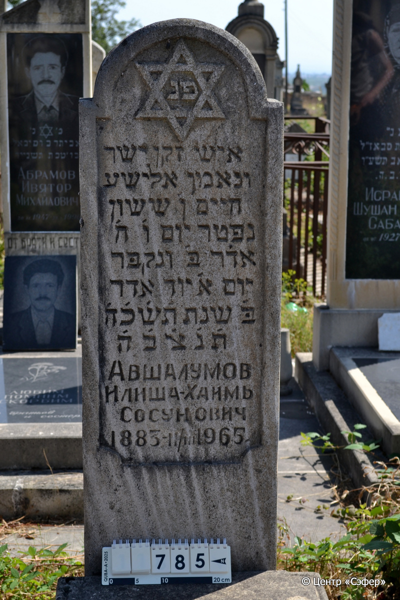
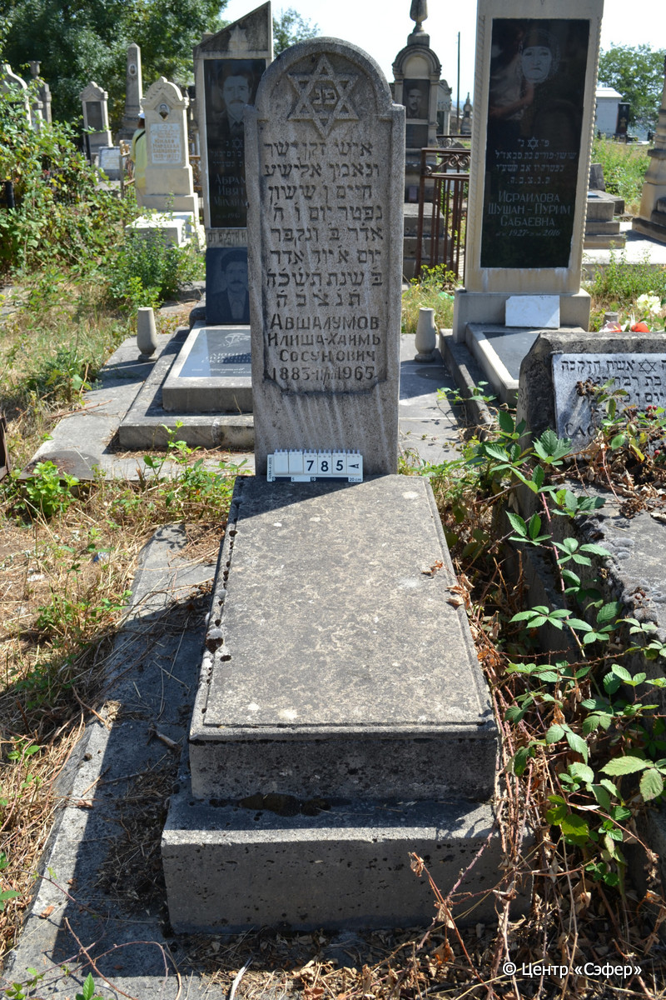

::: {style="font-size: 1em; margin-bottom: 1.2em"}
[Куба (центральное)](../cemeteries/QBA.html) > QBA0785
:::

```{r}
suppressPackageStartupMessages(library(tidyverse))
```


:::: {.columns}

::: {.column width="20%"}

```{r}
#| lightbox:
#|   group: photos




```
:::

::: {.column width="5%"}
:::

::: {.column width="74%"}

::: {.name-style}
АВШАЛУМОВ Элиша Хаим, сын Сасона (Сосунович)
:::

::: {style="font-size: 1.2em;"}
אלישע חיים בן ששון
:::

:::: {.columns}
::: {.column width="5%"}
{width=1.3em}
:::

::: {.column style="width: 40%; padding-left: 0.2em;"}
-.02.1883 /  
:::

::: {.column width="5%"}
{width=1.3em}
:::

::: {.column style="width: 50%; padding-left: 0.2em;"}
11.03.1965 / 08.Ad2.5725
:::

::::


::: {.panel-tabset}

#### Эпитафия

```{r}
tibble(`Оригинал` = "פנ
איש זקן ישר 
ונאמן אלישע
חיים ן׳ ששון 
נפמר יום ו׳ ח׳
אדר בּ׳ ונקבּר 
יום א׳יוד אדר
בּ׳ שנת ת׳ש׳כ׳ה׳
ת׳נ׳צ׳ב׳ה׳
Авшалумов
Илиша-Хаимь 
Сосунович 
1883 11 / III 1965",
       `Перевод` = "Здесь покоится
человек пожилой, прямодушный
и верный, Элиша
Хаим, сын Сасона.
Скончался в пятницу, 8
адара-II и был похоронен
в воскресенье, 10 адара-II
года 725.
Да будет душа его завязана в узле жизни.
Авшалумов
Илиша-Хаим 
Сосунович 
1883 11 / III 1965") |>
  mutate(`Оригинал` = str_split(`Оригинал`, "
"),
         `Перевод` = str_split(`Перевод`, "
")) |>
  unnest_longer(c(`Оригинал`, `Перевод`)) |> 
  mutate(id = 1:n()) |> 
  relocate(id, .before = Перевод) |> 
  rename(` ` = id) |> 
  knitr::kable(align = c("r", "c", "l"))
```

|||
|-|---|
|**Примечания**| |
|**Язык**      |иврит, русский    |
|**Метки**     |     |
: {tbl-colwidths="[25,75]"}

#### Памятник

|||
|-|---|
|**Тип памятника**   |L-образный                                                                         |
|**Материал**        |известняк (следы эрозии, сколы)                                                     |
|**Размеры**         |150×40×16  --- стела; 14×52×112  --- плита; 20×61×122  --- основание                                                                        |
|**Тип декора**      |архитектурно-орнаментальный, традиционная символика                                                                        |
|**Элементы декора** |округлое завершение со звездой Давида                                                                          |
|**Координаты**      |[41.3711548, 48.50884939](https://www.google.com/maps/place/41.3711548, 48.50884939)                    |
: {tbl-colwidths="[25,75]"}

#### Источник

|||
|-|---|
|**Место хранения**        |Архив полевых исследований Центра «Сэфер»     |
|**Контакты**              |students@sefer.ru    |
|**Ссылка**                |https://sfira.org        |
|**Исходный ID**           |  |
|**Условия использования** |[CC BY-NC 4.0](https://creativecommons.org/licenses/by-nc/4.0/deed.ru)     |
: {tbl-colwidths="[25,75]"}

:::

:::

::::

