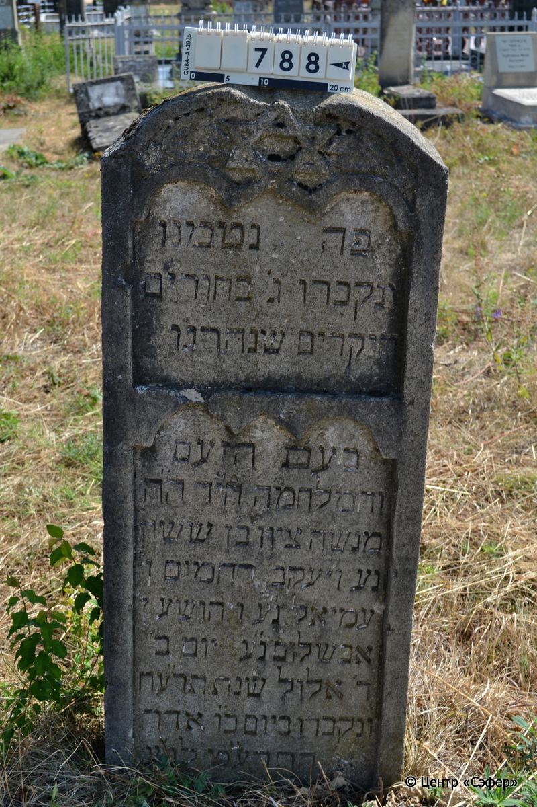
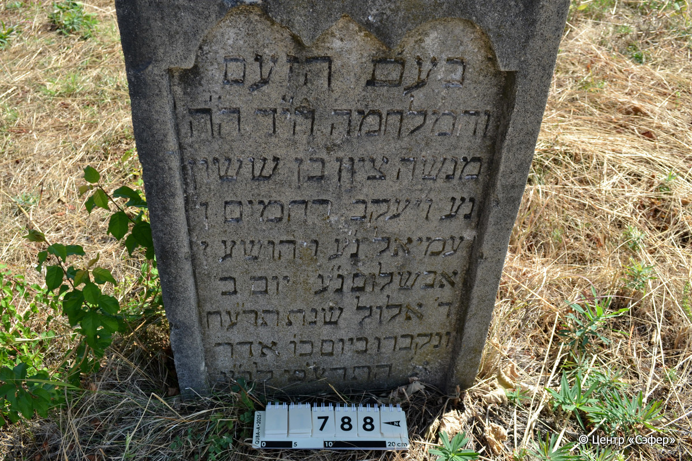
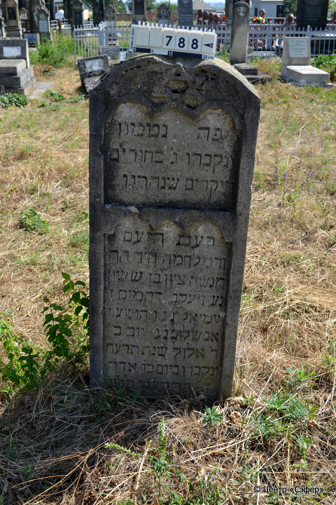

::: {style="font-size: 1em; margin-bottom: 1.2em"}
[Куба (центральное)](../cemeteries/QBA.html) > QBA0788
:::

```{r}
suppressPackageStartupMessages(library(tidyverse))
```


:::: {.columns}

::: {.column width="20%"}

```{r}
#| lightbox:
#|   group: photos





```
:::

::: {.column width="5%"}
:::

::: {.column width="74%"}

::: {.name-style}
Менаше Цион, сын Сасона
:::

::: {style="font-size: 1.2em;"}
מנשה ציון בן ששון
:::

:::: {.columns}
::: {.column width="5%"}
{width=1.3em}
:::

::: {.column style="width: 40%; padding-left: 0.2em;"}
  /  
:::

::: {.column width="5%"}
{width=1.3em}
:::

::: {.column style="width: 50%; padding-left: 0.2em;"}
12.08.1918* / 04.El.5678
:::

::::


::: {.panel-tabset}

#### Эпитафия

```{r}
tibble(`Оригинал` = "פה נטמנו
ונקברו ג׳ בחורים
היקרים שנהרגו
בעת הזעם
והמלחמה הי״ד ה״ה
מנשה ציון בן ששון
נע ויעקב רחמים ן׳
עמיאל נ״ע ויהושע ן׳
אבשלום נ״ע יום ב׳
ד׳ אלול שנת תר״עח
ונקברו ביום כ״ו אדר
א׳ התרע״ט לב״ע",
       `Перевод` = "Здесь сокрыты и похоронены
трое юношей
дорогих, которые были убиты
во время гнева
и войны, да отомстит Господь за их кровь. Г-н
Менаше Цион, сын Сасона,
душа его в раю, и Яаков Рахамим, сын
Амиэля, душа его в раю, и Йехоше, сын
Авшалома, душа его в раю. Понедельник,
4 элула года 678,
и были похоронены 26 адара-I
5679 года от сотворения мира.") |>
  mutate(`Оригинал` = str_split(`Оригинал`, "
"),
         `Перевод` = str_split(`Перевод`, "
")) |>
  unnest_longer(c(`Оригинал`, `Перевод`)) |> 
  mutate(id = 1:n()) |> 
  relocate(id, .before = Перевод) |> 
  rename(` ` = id) |> 
  knitr::kable(align = c("r", "c", "l"))
```

|||
|-|---|
|**Примечания**| |
|**Язык**      |иврит    |
|**Метки**     |     |
: {tbl-colwidths="[25,75]"}

#### Памятник

|||
|-|---|
|**Тип памятника**   |стела                                                                         |
|**Материал**        |известняк (следы эрозии, сколы)                                                     |
|**Размеры**         |132×50×19  --- стела                                                                        |
|**Тип декора**      |архитектурно-орнаментальный, растительный, традиционная символика                                                                        |
|**Элементы декора** |округлое завершение со звездой Давида и растительным мотивом, две фигурные вставки для текста                                                                          |
|**Координаты**      |[41.37107656, 48.50886044](https://www.google.com/maps/place/41.37107656, 48.50886044)                    |
: {tbl-colwidths="[25,75]"}

#### Источник

|||
|-|---|
|**Место хранения**        |Архив полевых исследований Центра «Сэфер»     |
|**Контакты**              |students@sefer.ru    |
|**Ссылка**                |https://sfira.org        |
|**Исходный ID**           |  |
|**Условия использования** |[CC BY-NC 4.0](https://creativecommons.org/licenses/by-nc/4.0/deed.ru)     |
: {tbl-colwidths="[25,75]"}

:::

:::

::::

