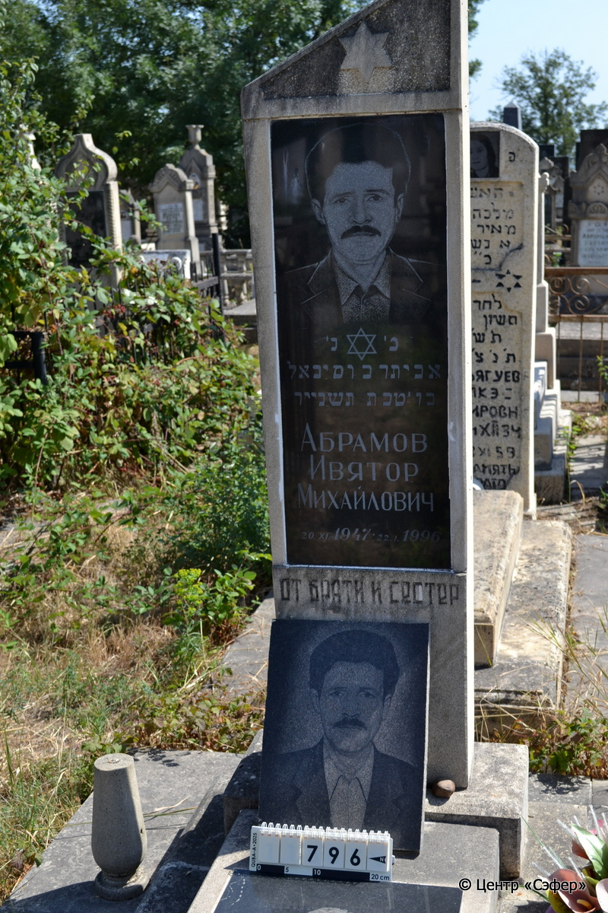
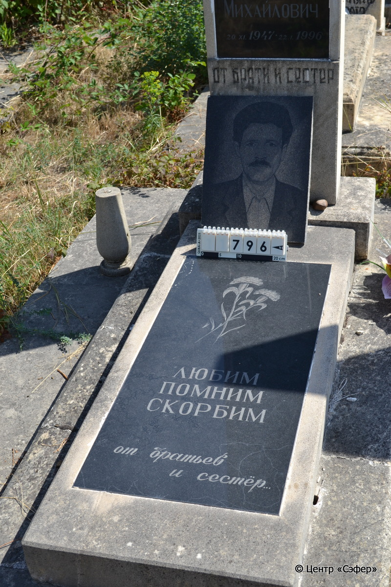
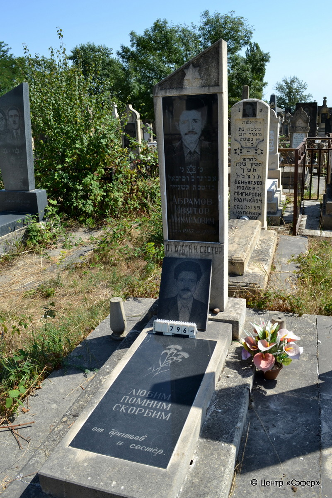

::: {style="font-size: 1em; margin-bottom: 1.2em"}
[Куба (центральное)](../cemeteries/QBA.html) > QBA0796
:::

```{r}
suppressPackageStartupMessages(library(tidyverse))
```


:::: {.columns}

::: {.column width="20%"}

```{r}
#| lightbox:
#|   group: photos





```
:::

::: {.column width="5%"}
:::

::: {.column width="74%"}

::: {.name-style}
АБРАМОВ Эвьятар, сын Михаэля (Ивятор Михайлович)
:::

::: {style="font-size: 1.2em;"}
אביתר בן מיכאל
:::

:::: {.columns}
::: {.column width="5%"}
{width=1.3em}
:::

::: {.column style="width: 40%; padding-left: 0.2em;"}
20.11.1947 /  
:::

::: {.column width="5%"}
{width=1.3em}
:::

::: {.column style="width: 50%; padding-left: 0.2em;"}
22.01.1996 / 26.Te.5756
:::

::::


::: {.panel-tabset}

#### Эпитафия

```{r}
tibble(`Оригинал` = "כ׳ נ׳
אביתר בו םיכאל
כו׳ טבת תשנייו
Абрамов
Ивятор
Михайлович
20.XI.1947 - 22.I.1996
от брати и сестер
снизу
Любим
Помним
Скорбим
от братьев
и сестёр...",
       `Перевод` = "Здесь похоронен
Эвьятар, сын Михаэля.
26 тевета 756 года.
Абрамов
Ивятор
Михайлович
20.XI.1947 - 22.I.1996
от брата и сестер

Любим
Помним
Скорбим
от братьев
и сестёр…") |>
  mutate(`Оригинал` = str_split(`Оригинал`, "
"),
         `Перевод` = str_split(`Перевод`, "
")) |>
  unnest_longer(c(`Оригинал`, `Перевод`)) |> 
  mutate(id = 1:n()) |> 
  relocate(id, .before = Перевод) |> 
  rename(` ` = id) |> 
  knitr::kable(align = c("r", "c", "l"))
```

|||
|-|---|
|**Примечания**| |
|**Язык**      |иврит, русский    |
|**Метки**     |     |
: {tbl-colwidths="[25,75]"}

#### Памятник

|||
|-|---|
|**Тип памятника**   |L-образный                                                                         |
|**Материал**        |песчаник, гранит (гранитные вставки на стеле и плите, следы эрозии)                                                     |
|**Размеры**         |159×58×29  --- стела; 10×49×125  --- плита; 9×78×174  --- основание                                                                        |
|**Тип декора**      |архитектурно-орнаментальный, растительный, традиционная символика                                                                        |
|**Элементы декора** |скошенное завершение со звездой Давида, фотопортрет и звезда Давида на вставке, цветы на плите                                                                          |
|**Координаты**      |[41.37116618, 48.50888026](https://www.google.com/maps/place/41.37116618, 48.50888026)                    |
: {tbl-colwidths="[25,75]"}

#### Источник

|||
|-|---|
|**Место хранения**        |Архив полевых исследований Центра «Сэфер»     |
|**Контакты**              |students@sefer.ru    |
|**Ссылка**                |https://sfira.org        |
|**Исходный ID**           |  |
|**Условия использования** |[CC BY-NC 4.0](https://creativecommons.org/licenses/by-nc/4.0/deed.ru)     |
: {tbl-colwidths="[25,75]"}

:::

:::

::::

