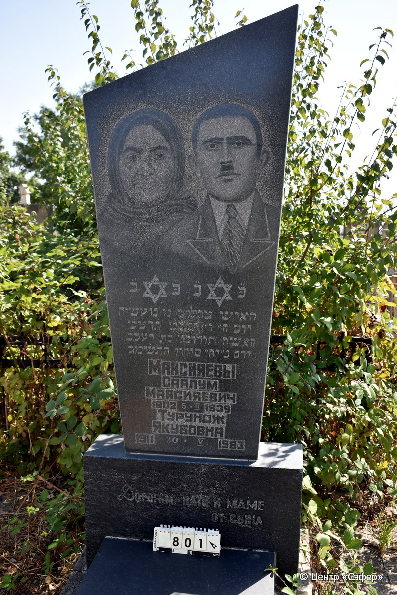
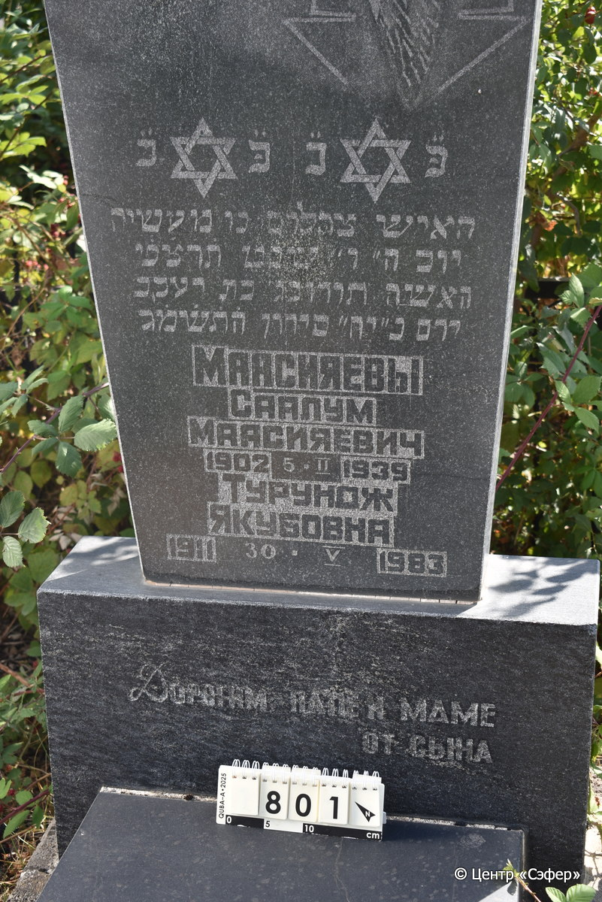
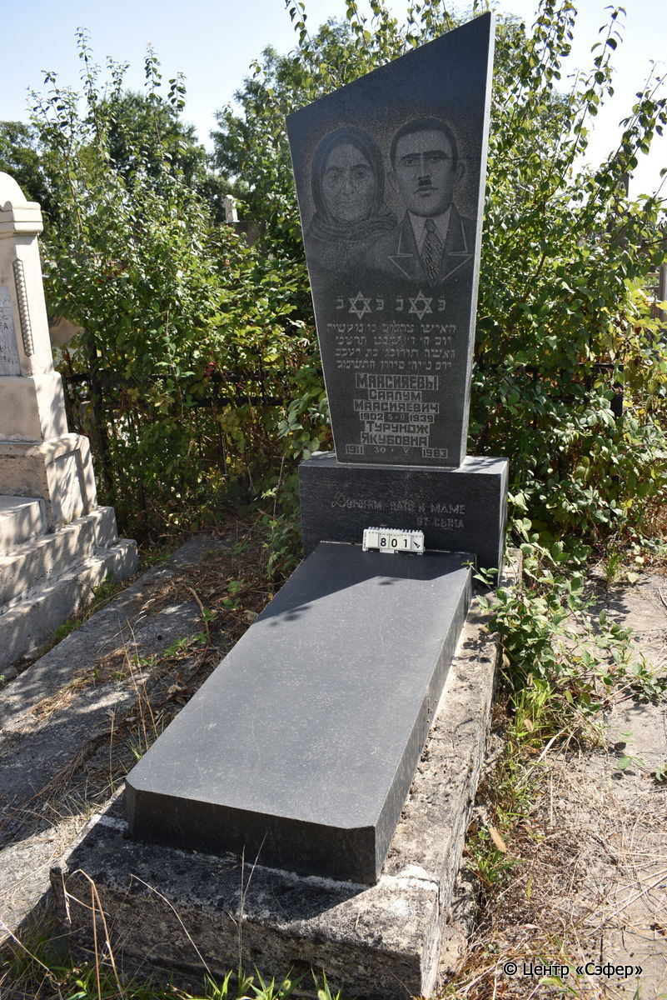

::: {style="font-size: 1em; margin-bottom: 1.2em"}
[Куба (центральное)](../cemeteries/QBA.html) > QBA0801
:::

```{r}
suppressPackageStartupMessages(library(tidyverse))
```


:::: {.columns}

::: {.column width="20%"}

```{r}
#| lightbox:
#|   group: photos





```
:::

::: {.column width="5%"}
:::

::: {.column width="74%"}

::: {.name-style}
МААСИЯЕВ Цахалом, сын Маасии (Саалум Маасияевич)
:::

::: {style="font-size: 1.2em;"}
צהלום בן מעשיה
:::

:::: {.columns}
::: {.column width="5%"}
{width=1.3em}
:::

::: {.column style="width: 40%; padding-left: 0.2em;"}
-.-.1902 /  
:::

::: {.column width="5%"}
{width=1.3em}
:::

::: {.column style="width: 50%; padding-left: 0.2em;"}
05.02.1939 / 06.Sh.5699
:::

::::

---

::: {.name-style}
МААСИЯЕВА Турунож Якубовна
:::

::: {style="font-size: 1.2em;"}

:::

:::: {.columns}
::: {.column width="5%"}
{width=1.3em}
:::

::: {.column style="width: 40%; padding-left: 0.2em;"}
-.-.1911 /  
:::

::: {.column width="5%"}
{width=1.3em}
:::

::: {.column style="width: 50%; padding-left: 0.2em;"}
30.05.1983 / 18.Si.5743
:::

::::


::: {.panel-tabset}

#### Эпитафия

```{r}
tibble(`Оригинал` = "פ״נ פ״נ
האיש צהלום בן מעשיה
יום ה״ ו״ שבט תרצ׳ט
האשה תורונג׳ בת יעקב
יום ב״ יח״ סיוון ה֗ת֗ש֗מ֗ג֗
Маасияевы
Саалум
Маасияевич
1902 5 II 1939
Турунож
Якубовна
1911 30 V 1983
Дорогим папе и маме
от сына",
       `Перевод` = "Здесь похоронены
человек Цахалом, сын Маасии,
четверг, 6 швата 699 года,
и женщина Турунож, дочь Яакова,
понедельник, 18 сивана 5743 года.
Маасияевы
Саалум
Маасияевич
1902 5 II 1939
Турунож
Якубовна
1911 30 V 1983
Дорогим папе и маме
от сына") |>
  mutate(`Оригинал` = str_split(`Оригинал`, "
"),
         `Перевод` = str_split(`Перевод`, "
")) |>
  unnest_longer(c(`Оригинал`, `Перевод`)) |> 
  mutate(id = 1:n()) |> 
  relocate(id, .before = Перевод) |> 
  rename(` ` = id) |> 
  knitr::kable(align = c("r", "c", "l"))
```

|||
|-|---|
|**Примечания**| |
|**Язык**      |иврит, русский    |
|**Метки**     |     |
: {tbl-colwidths="[25,75]"}

#### Памятник

|||
|-|---|
|**Тип памятника**   |L-образный                                                                         |
|**Материал**        |известняк (цементный раствор)                                                     |
|**Размеры**         |179×71×20  --- стела; 16×56×139  --- плита; 25×92×204  --- основание                                                                        |
|**Тип декора**      |архитектурно-орнаментальный, традиционная символика                                                                        |
|**Элементы декора** |два фотопортрета и две звёзды Давида                                                                          |
|**Координаты**      |[41.37119815, 48.50889859](https://www.google.com/maps/place/41.37119815, 48.50889859)                    |
: {tbl-colwidths="[25,75]"}

#### Источник

|||
|-|---|
|**Место хранения**        |Архив полевых исследований Центра «Сэфер»     |
|**Контакты**              |students@sefer.ru    |
|**Ссылка**                |https://sfira.org        |
|**Исходный ID**           |  |
|**Условия использования** |[CC BY-NC 4.0](https://creativecommons.org/licenses/by-nc/4.0/deed.ru)     |
: {tbl-colwidths="[25,75]"}

:::

:::

::::

