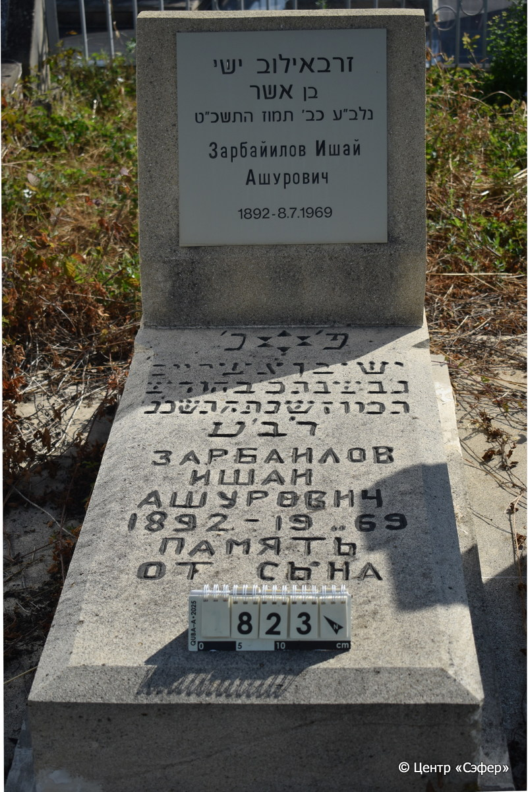
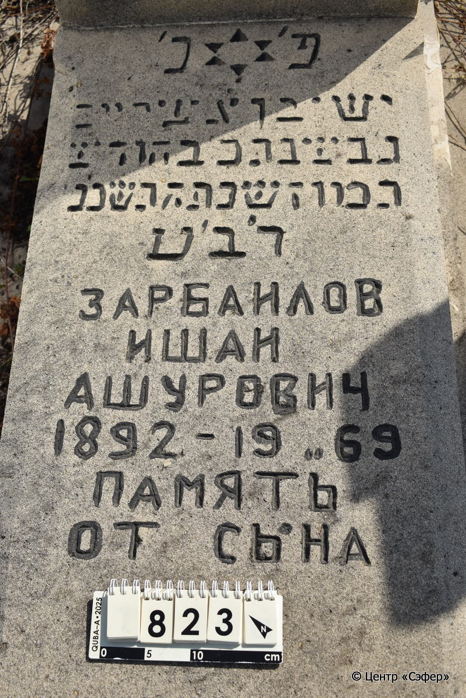
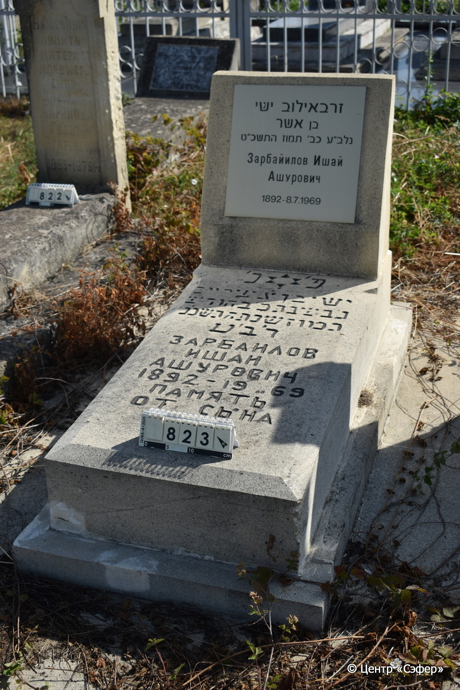

::: {style="font-size: 1em; margin-bottom: 1.2em"}
[Куба (центральное)](../cemeteries/QBA.html) > QBA0823
:::

```{r}
suppressPackageStartupMessages(library(tidyverse))
```


:::: {.columns}

::: {.column width="20%"}

```{r}
#| lightbox:
#|   group: photos





```
:::

::: {.column width="5%"}
:::

::: {.column width="74%"}

::: {.name-style}
ЗАРБАЙИЛОВ Иши, сын Ашера (Ишай Ашурович)
:::

::: {style="font-size: 1.2em;"}
זרבאילוב ישי בן אשר
:::

:::: {.columns}
::: {.column width="5%"}
{width=1.3em}
:::

::: {.column style="width: 40%; padding-left: 0.2em;"}
-.-.1892 /  
:::

::: {.column width="5%"}
{width=1.3em}
:::

::: {.column style="width: 50%; padding-left: 0.2em;"}
08.07.1969 / 20.Ta.5729
:::

::::


::: {.panel-tabset}

#### Эпитафия

```{r}
tibble(`Оригинал` = "זרבאילוב ישי
בן אשר
נלב״ע כב׳ תמוז התשכ״ט
Зарбайилов Ишай
Ашурович
1892 - 8.7.1969
снизу
פ׳ נ׳
ישי בן אשר יום
ג׳ בשבת כ׳ בחודש
תמוז שנת התשכ׳ט
לב׳ע
Зарбаилов
Ишаи
Ашурович
1892 - 1969 
Память
от сына",
       `Перевод` = "Зарбаилов Ишай,
сын Ашера.
Ушел в дом вечности 22 таммуза 5729 года.
Зарбайилов Ишай
Ашурович
1892 - 8.7.1969

Здесь покоится
Ишай, сын Ашера.
Вторник, 20 число месяца
таммуз года 5729
от сотворения мира.
Зарбаилов
Ишаи
Ашурович
1892 - 1969 
Память
от сына") |>
  mutate(`Оригинал` = str_split(`Оригинал`, "
"),
         `Перевод` = str_split(`Перевод`, "
")) |>
  unnest_longer(c(`Оригинал`, `Перевод`)) |> 
  mutate(id = 1:n()) |> 
  relocate(id, .before = Перевод) |> 
  rename(` ` = id) |> 
  knitr::kable(align = c("r", "c", "l"))
```

|||
|-|---|
|**Примечания**| |
|**Язык**      |иврит, русский    |
|**Метки**     |     |
: {tbl-colwidths="[25,75]"}

#### Памятник

|||
|-|---|
|**Тип памятника**   |L-образный                                                                         |
|**Материал**        |известняк, другое (следы ремонта, новая пластиковая табличка, следы цементного раствора)                                                     |
|**Размеры**         |77×55×25  --- стела; 20×58×107  --- плита; 10×72×147  --- основание                                                                        |
|**Тип декора**      |традиционная символика                                                                        |
|**Элементы декора** |звезда Давида                                                                          |
|**Координаты**      |[41.37108185, 48.50900456](https://www.google.com/maps/place/41.37108185, 48.50900456)                    |
: {tbl-colwidths="[25,75]"}

#### Источник

|||
|-|---|
|**Место хранения**        |Архив полевых исследований Центра «Сэфер»     |
|**Контакты**              |students@sefer.ru    |
|**Ссылка**                |https://sfira.org        |
|**Исходный ID**           |  |
|**Условия использования** |[CC BY-NC 4.0](https://creativecommons.org/licenses/by-nc/4.0/deed.ru)     |
: {tbl-colwidths="[25,75]"}

:::

:::

::::

