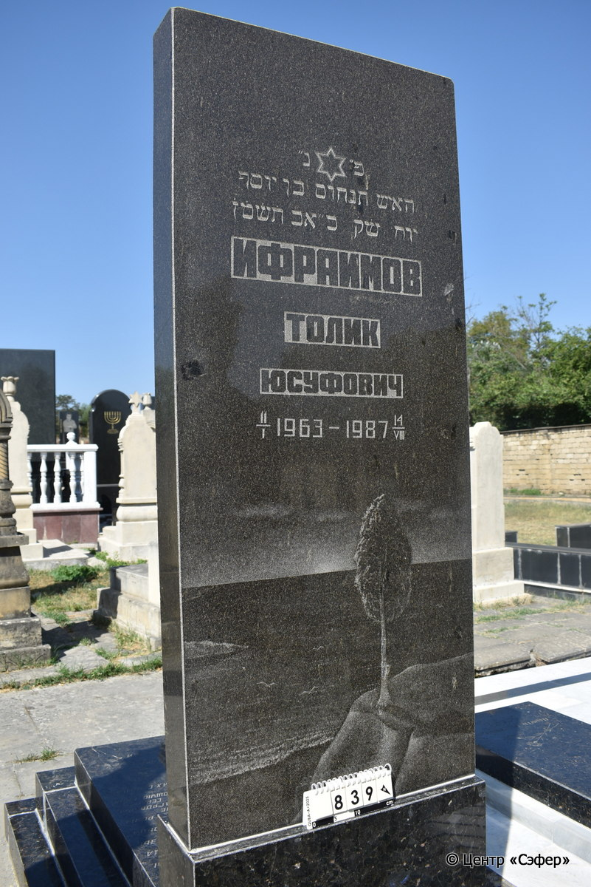
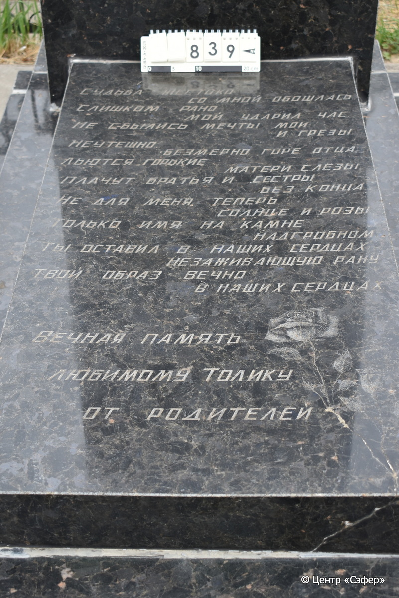
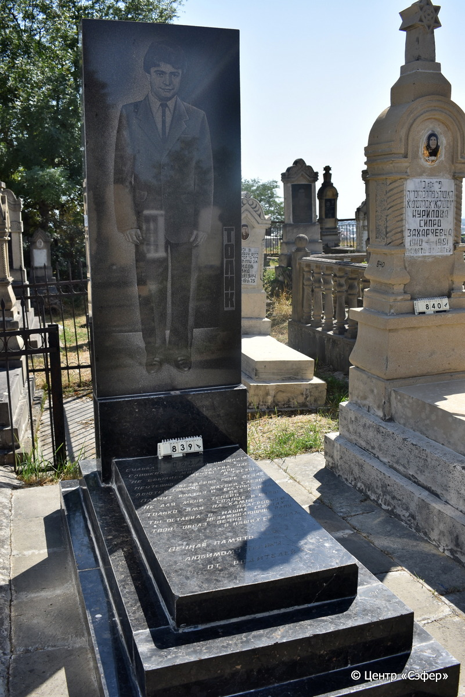

::: {style="font-size: 1em; margin-bottom: 1.2em"}
[Куба (центральное)](../cemeteries/QBA.html) > QBA0839
:::

```{r}
suppressPackageStartupMessages(library(tidyverse))
```


:::: {.columns}

::: {.column width="20%"}

```{r}
#| lightbox:
#|   group: photos





```
:::

::: {.column width="5%"}
:::

::: {.column width="74%"}

::: {.name-style}
Танхум, сын Йосефа (Толик)
:::

::: {style="font-size: 1.2em;"}
תנחום בן יוסף
:::

:::: {.columns}
::: {.column width="5%"}
{width=1.3em}
:::

::: {.column style="width: 40%; padding-left: 0.2em;"}
11.01.1963 /  
:::

::: {.column width="5%"}
{width=1.3em}
:::

::: {.column style="width: 50%; padding-left: 0.2em;"}
14.08.1987 / 20.Av.5747
:::

::::


::: {.panel-tabset}

#### Эпитафия

```{r}
tibble(`Оригинал` = "ТОЛИК
снизу
СУДЬБА ЖЕСТОКО
СО МНОЙ ОБОШЛАСЬ. 
СЛИШКОМ РАНО
МОЙ УДАРИЛ ЧАС. 
НЕ СБЫЛИСЬ МЕЧТЫ МОИ
И ГРЁЗЫ. 
НЕУТЕШНО, 
БЕЗМЕРНО ГОРЕ ОТЦА. 
ЛЬЮТСЯ ГОРЬКИЕ
МАТЕРИ СЛЁЗЫ
ПЛАЧУТ БРАТЬЯ И СЕСТРЫ
БЕЗ КОНЦА.
НЕ ДЛЯ МЕНЯ ТЕПЕРЬ
 СОЛНЦЕ И РОЗЫ.
ТОЛЬКО ИМЯ НА КАМНЕ
НАДГРОБНОМ.
ТЫ ОСТАВИЛ В НАШИХ СЕРДЦАХ 
НЕЗАЖИВАЮЩУЮ РАНУ. 
ТВОЙ ОБРАЗ ВЕЧНО
В НАШИХ СЕРДЦАХ. 
ВЕЧНАЯ ПАМЯТЬ 
ЛЮБИМОМУ ТОЛИКУ
ОТ РОДИТЕЛЕЙ

обратная сторона
פ״ נ״
האיש תנחום בן יוסף
יום ש֗ק֗ כ״ אב ת֗ש֗מ֗ז֗
ИФРАИМОВ
ТОЛИК
ЮСУФОВИЧ
11/I 1963 - 1987 14/VIII",
       `Перевод` = "ТОЛИК

СУДЬБА ЖЕСТОКО
СО МНОЙ ОБОШЛАСЬ. 
СЛИШКОМ РАНО
МОЙ УДАРИЛ ЧАС. 
НЕ СБЫЛИСЬ МЕЧТЫ МОИ
И ГРЁЗЫ. 
НЕУТЕШНО, 
БЕЗМЕРНО ГОРЕ ОТЦА. 
ЛЬЮТСЯ ГОРЬКИЕ
МАТЕРИ СЛЁЗЫ,
ПЛАЧУТ БРАТЬЯ И СЕСТРЫ
БЕЗ КОНЦА.
НЕ ДЛЯ МЕНЯ ТЕПЕРЬ
СОЛНЦЕ И РОЗЫ.
ТОЛЬКО ИМЯ НА КАМНЕ
НАДГРОБНОМ.
ТЫ ОСТАВИЛ В НАШИХ СЕРДЦАХ 
НЕЗАЖИВАЮЩУЮ РАНУ. 
ТВОЙ ОБРАЗ ВЕЧНО
В НАШИХ СЕРДЦАХ. 
ВЕЧНАЯ ПАМЯТЬ 
ЛЮБИМОМУ ТОЛИКУ
ОТ РОДИТЕЛЕЙ

_RV_
Здесь покоится
человек Танхум, сын Йосефа, 
день святой субботы, 20 ава 747 года.
ИФРАИМОВ
ТОЛИК
ЮСУФОВИЧ
11/I 1963 - 1987 14/VIII") |>
  mutate(`Оригинал` = str_split(`Оригинал`, "
"),
         `Перевод` = str_split(`Перевод`, "
")) |>
  unnest_longer(c(`Оригинал`, `Перевод`)) |> 
  mutate(id = 1:n()) |> 
  relocate(id, .before = Перевод) |> 
  rename(` ` = id) |> 
  knitr::kable(align = c("r", "c", "l"))
```

|||
|-|---|
|**Примечания**| |
|**Язык**      |иврит, русский    |
|**Метки**     |     |
: {tbl-colwidths="[25,75]"}

#### Памятник

|||
|-|---|
|**Тип памятника**   |L-образный                                                                         |
|**Материал**        |габбро-диорит, лабрадорит (цементный раствор, трещины)                                                     |
|**Размеры**         |203×70×22  --- стела; 11×60×120  --- плита; 29×115×193  --- основание                                                                        |
|**Тип декора**      |растительный, зооморфный, традиционная символика                                                                        |
|**Элементы декора** |две розы на плите, портрет в полный рост на лицевой стороне, на обратной пейзаж с крутым берегом моря и одиноким деревом, птицы, звезда Давида                                                                          |
|**Координаты**      |[41.37126057, 48.50897176](https://www.google.com/maps/place/41.37126057, 48.50897176)                    |
: {tbl-colwidths="[25,75]"}

#### Источник

|||
|-|---|
|**Место хранения**        |Архив полевых исследований Центра «Сэфер»     |
|**Контакты**              |students@sefer.ru    |
|**Ссылка**                |https://sfira.org        |
|**Исходный ID**           |  |
|**Условия использования** |[CC BY-NC 4.0](https://creativecommons.org/licenses/by-nc/4.0/deed.ru)     |
: {tbl-colwidths="[25,75]"}

:::

:::

::::

