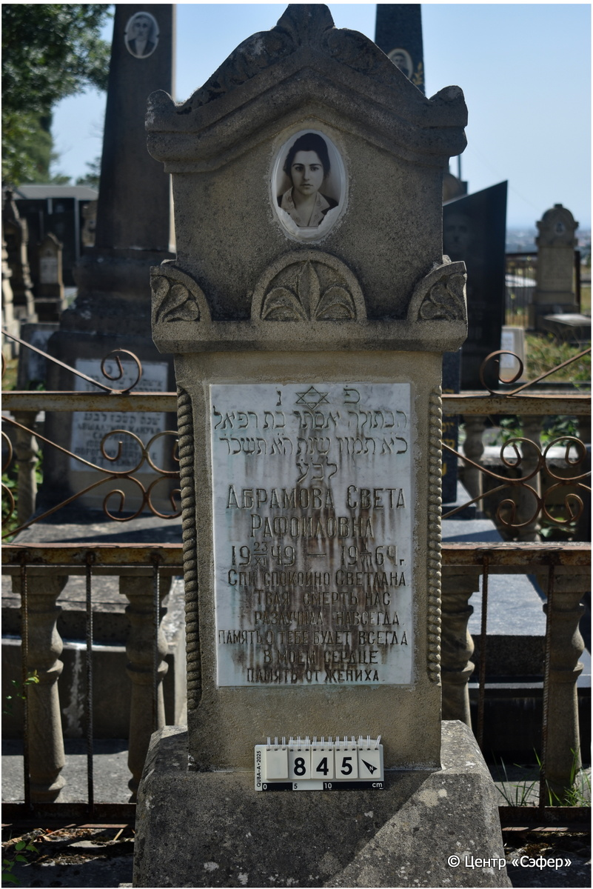
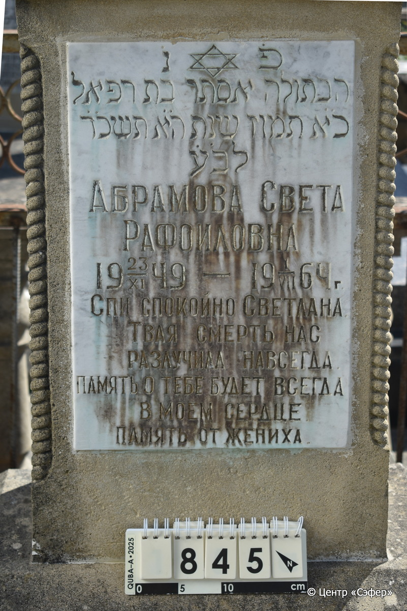
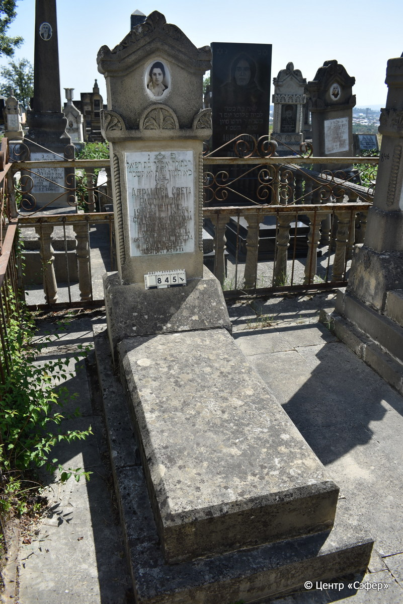

::: {style="font-size: 1em; margin-bottom: 1.2em"}
[Куба (центральное)](../cemeteries/QBA.html) > QBA0845
:::

```{r}
suppressPackageStartupMessages(library(tidyverse))
```


:::: {.columns}

::: {.column width="20%"}

```{r}
#| lightbox:
#|   group: photos





```
:::

::: {.column width="5%"}
:::

::: {.column width="74%"}

::: {.name-style}
АБРАМОВА Эстер, дочь Рафаэля (Света Рафоиловна)
:::

::: {style="font-size: 1.2em;"}
אסתר בת רפאל
:::

:::: {.columns}
::: {.column width="5%"}
{width=1.3em}
:::

::: {.column style="width: 40%; padding-left: 0.2em;"}
23.11.1949 /  
:::

::: {.column width="5%"}
{width=1.3em}
:::

::: {.column style="width: 50%; padding-left: 0.2em;"}
01.07.1964 / 21.Ta.5724
:::

::::


::: {.panel-tabset}

#### Эпитафия

```{r}
tibble(`Оригинал` = "פ֗ נ֗
הבתולה אסתר בת רפאל
כ֗א֗ תמוז שנת ה֗א֗ תשכ״ד
לב״ ע
Абрамова Света
Рафоиловна
 23/XI 1949 -  1/VII 1964 Г.
Спи спокойно Светлана.
Твая смерть нас 
разлучила навсегда.
Память о тебе будет всегда
в моем сердце.
Память от жениха.",
       `Перевод` = "Здесь покоится
девушка Эстер, дочь Рафаэля.
21 таммуза года 5724
от сотворения мира.
Абрамова Света
Рафоиловна
 23/XI 1949 -  1/VII 1964 Г.
Спи спокойно Светлана.
Твоя смерть нас 
разлучила навсегда.
Память о тебе будет всегда
в моем сердце.
Память от жениха.") |>
  mutate(`Оригинал` = str_split(`Оригинал`, "
"),
         `Перевод` = str_split(`Перевод`, "
")) |>
  unnest_longer(c(`Оригинал`, `Перевод`)) |> 
  mutate(id = 1:n()) |> 
  relocate(id, .before = Перевод) |> 
  rename(` ` = id) |> 
  knitr::kable(align = c("r", "c", "l"))
```

|||
|-|---|
|**Примечания**| |
|**Язык**      |иврит, русский    |
|**Метки**     |     |
: {tbl-colwidths="[25,75]"}

#### Памятник

|||
|-|---|
|**Тип памятника**   |L-образный                                                                         |
|**Материал**        |известняк, мрамор (керамический медальон с фото, мраморная вставка для текста, цементный раствор, следы эрозии, сколы)                                                     |
|**Размеры**         |160×59×50  --- стела; 17×55×113  --- плита; 19×75×177  --- основание                                                                        |
|**Тип декора**      |архитектурно-орнаментальный, растительный, традиционная символика                                                                        |
|**Элементы декора** |треугольное завершение с волютами и растительными мотивами, конек, пояс с пальметками, витые полуколонны, звезда Давида на вставке для текста, фотопортрет на медальоне                                                                          |
|**Координаты**      |[41.37119861, 48.50898579](https://www.google.com/maps/place/41.37119861, 48.50898579)                    |
: {tbl-colwidths="[25,75]"}

#### Источник

|||
|-|---|
|**Место хранения**        |Архив полевых исследований Центра «Сэфер»     |
|**Контакты**              |students@sefer.ru    |
|**Ссылка**                |https://sfira.org        |
|**Исходный ID**           |  |
|**Условия использования** |[CC BY-NC 4.0](https://creativecommons.org/licenses/by-nc/4.0/deed.ru)     |
: {tbl-colwidths="[25,75]"}

:::

:::

::::

