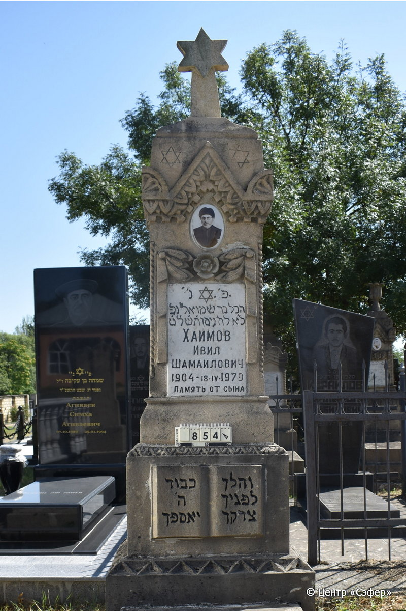
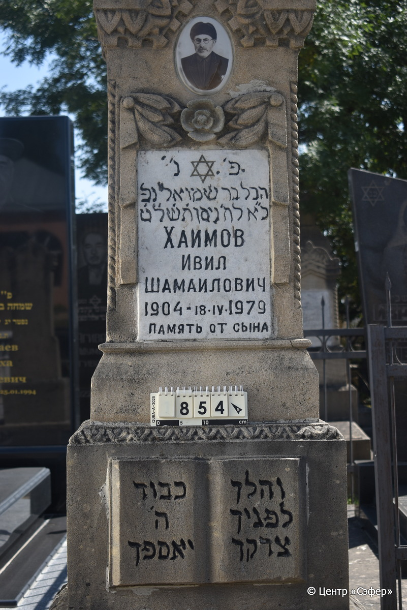
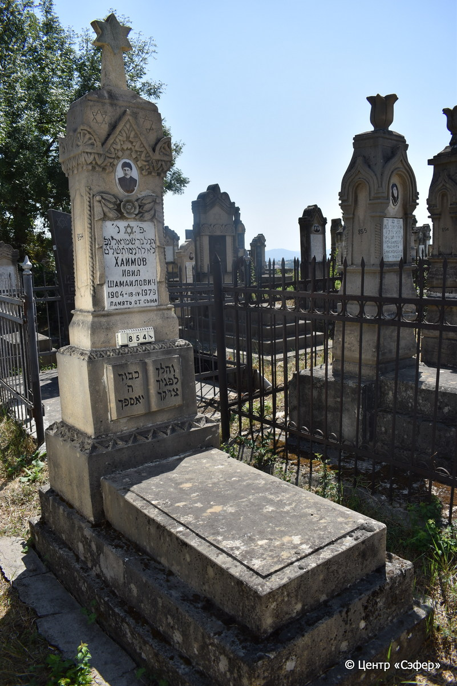

::: {style="font-size: 1em; margin-bottom: 1.2em"}
[Куба (центр.) Азербайджан](../cemeteries/QBA.html) > QBA0854
:::

```{r}
suppressPackageStartupMessages(library(tidyverse))
```


:::: {.columns}

::: {.column width="20%"}

```{r}
#| lightbox:
#|   group: photos





```
:::

::: {.column width="5%"}
:::

::: {.column width="74%"}

::: {.name-style}
ХАИМОВ Гевель, сын Шмуэля (Ивил Шамаилович)
:::

::: {style="font-size: 1.2em;"}
הבל בן שמואל
:::

:::: {.columns}
::: {.column width="5%"}
{width=1.3em}
:::

::: {.column style="width: 40%; padding-left: 0.2em;"}
-.-.1904 /  
:::

::: {.column width="5%"}
{width=1.3em}
:::

::: {.column style="width: 50%; padding-left: 0.2em;"}
18.04.1979 / 01.Ni.5739
:::

::::


::: {.panel-tabset}

#### Эпитафия

```{r}
tibble(`Оригинал` = "פ׳ נ׳
הבל בר שמואל נפ
כ״ א לח׳ ניסן ת֗ש֗ל֗ט֗
ХАИМОВ
ИВИЛ
ШАМАИЛОВИЧ
1904 - 18.IV.1979
ПАМЯТЬ ОТ СЫНА

справа
והלך
לפניך
צדקך

слева
כבוד
ה׳
יאספך*",
       `Перевод` = "Здесь покоится
Хевель, дочь Шимона. Скончалась
21 числа месяца нисан 739 года.
ХАИМОВ
ИВИЛ
ШАМАИЛОВИЧ
1904 - 18.IV.1979
ПАМЯТЬ ОТ СЫНА


И пойдет
пред тобою
правда твоя,


слава
Господня
будет сопровождать тебя.") |>
  mutate(`Оригинал` = str_split(`Оригинал`, "
"),
         `Перевод` = str_split(`Перевод`, "
")) |>
  unnest_longer(c(`Оригинал`, `Перевод`)) |> 
  mutate(id = 1:n()) |> 
  relocate(id, .before = Перевод) |> 
  rename(` ` = id) |> 
  knitr::kable(align = c("r", "c", "l"))
```

|||
|-|---|
|**Примечания**|*Цит. Ис. 58:8|
|**Язык**      |иврит, русский    |
|**Метки**     |     |
: {tbl-colwidths="[25,75]"}

#### Памятник

|||
|-|---|
|**Тип памятника**   |L-образный                                                                         |
|**Материал**        |известняк, мрамор (мраморная вставка для текста, керамический медальон с фото, следы эрозии, цементный раствор сколы)                                                     |
|**Размеры**         |223×75×57  --- стела; 21×64×109  --- плита; 36×95×190  --- основание                                                                        |
|**Тип декора**      |архитектурно-орнаментальный, растительный, традиционная символика                                                                        |
|**Элементы декора** |архитектурное навершие в виде звезды Давида на подставке, две звезды Давида, орнаментальный пояс ся растительными геометрическими мотивами и пальметками, витые полуколонны, гирлянды из лент и листьев с цветком посередине, рельефное изображение книги, фотопортрет на медальоне, звезда Давида на вставке для текста                                                                          |
|**Координаты**      |[41.37130374, 48.50900274](https://www.google.com/maps/place/41.37130374, 48.50900274)                    |
: {tbl-colwidths="[25,75]"}

#### Источник

|||
|-|---|
|**Место хранения**        |Архив полевых исследований Центра «Сэфер»     |
|**Контакты**              |students@sefer.ru    |
|**Ссылка**                |https://sfira.org        |
|**Исходный ID**           |  |
|**Условия использования** |[CC BY-NC 4.0](https://creativecommons.org/licenses/by-nc/4.0/deed.ru)     |
: {tbl-colwidths="[25,75]"}

:::

:::

::::

