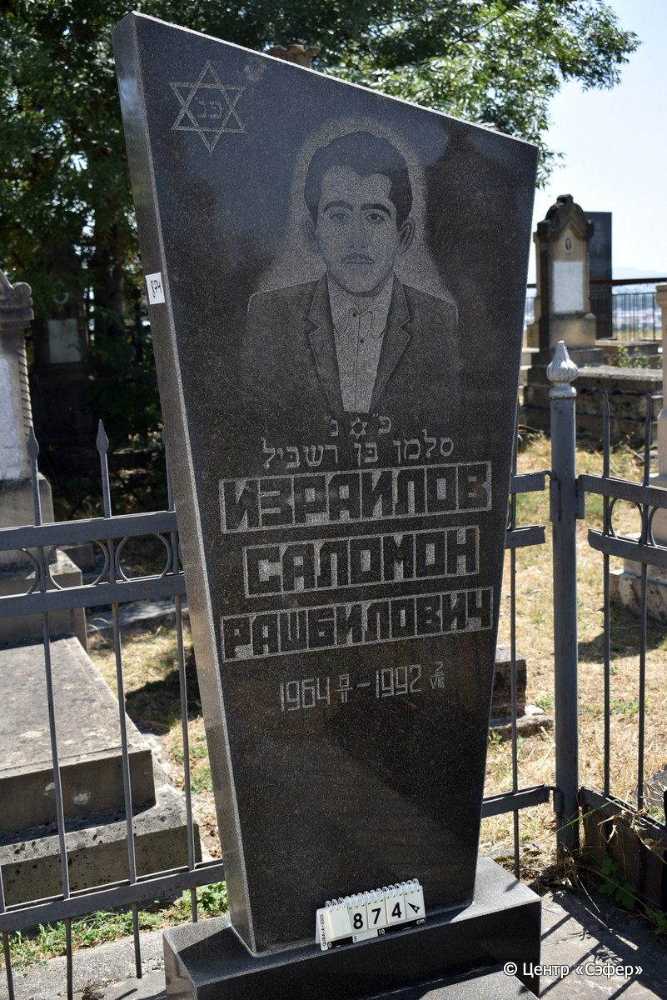
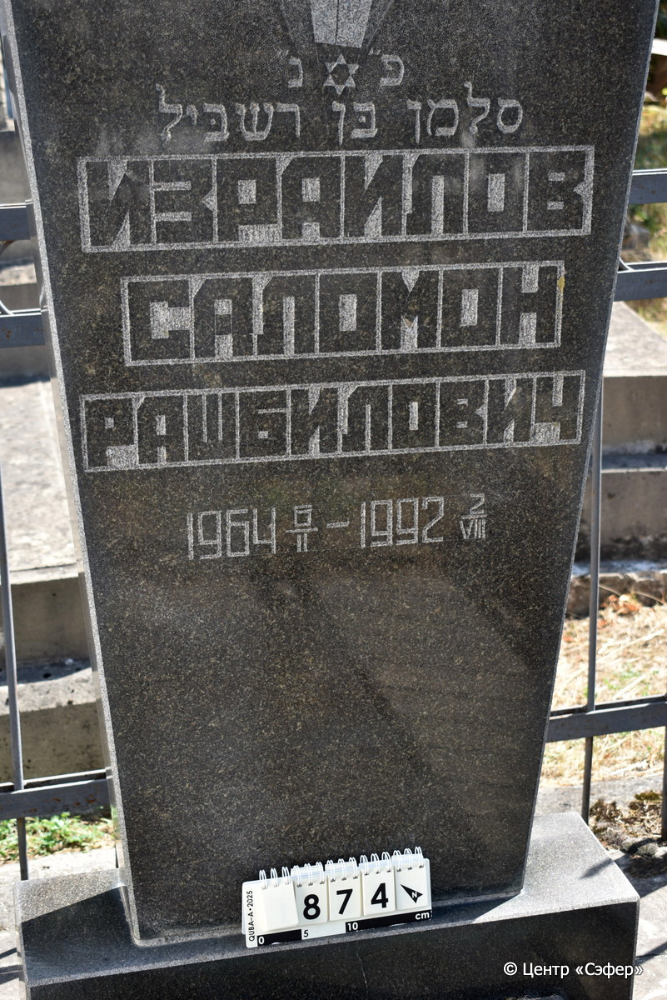
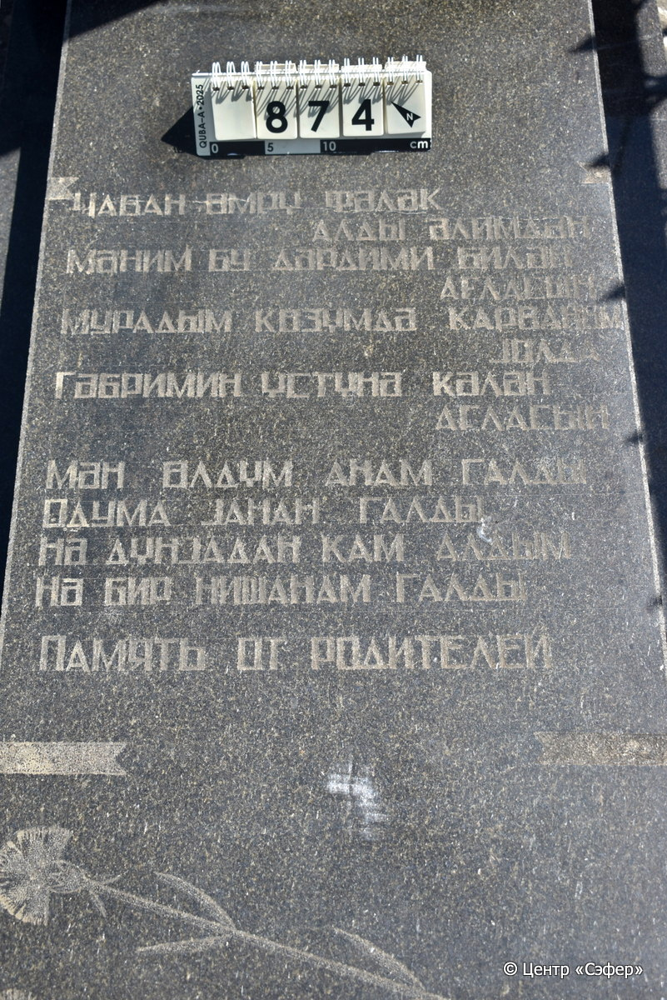
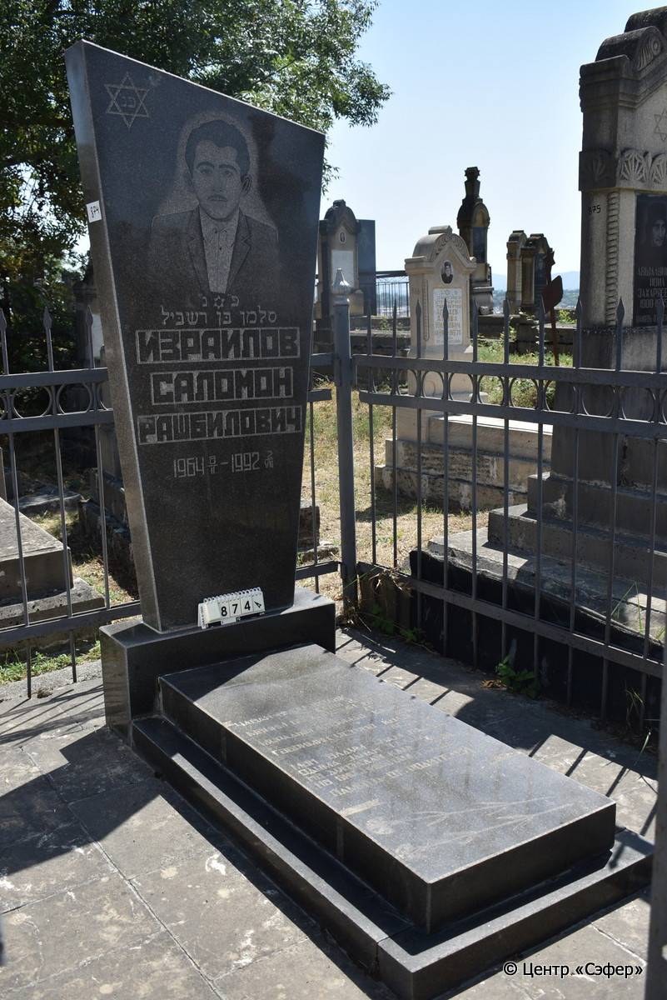

::: {style="font-size: 1em; margin-bottom: 1.2em"}
[Куба (центральное)](../cemeteries/QBA.html) > QBA0874
:::

```{r}
suppressPackageStartupMessages(library(tidyverse))
```


:::: {.columns}

::: {.column width="20%"}

```{r}
#| lightbox:
#|   group: photos






```
:::

::: {.column width="5%"}
:::

::: {.column width="74%"}

::: {.name-style}
ИЗРАИЛОВ Салман, сын Рашбила (Саломон Рашбилович)
:::

::: {style="font-size: 1.2em;"}
סלמן בן רשביל
:::

:::: {.columns}
::: {.column width="5%"}
{width=1.3em}
:::

::: {.column style="width: 40%; padding-left: 0.2em;"}
06.02.1964 /  
:::

::: {.column width="5%"}
{width=1.3em}
:::

::: {.column style="width: 50%; padding-left: 0.2em;"}
02.08.1992 /  
:::

::::


::: {.panel-tabset}

#### Эпитафия

```{r}
tibble(`Оригинал` = "сверху
פ״ נ״
סלמן בּן רשבּיל
Израилов
Саломон
Рашбилович
1964 6/II – 1992 2/VIII

снизу
Ҹабан өмрү фәләк
алды әлимдән
Мәним бу дәрдими билән
ағласын
мурадым ҝөзүмдә карваным
jолда
Гәбримин үстүнә ҝәлән
ағласын
Мән өлдүм анам галды
Одума jанан галды
Нә дүнjадан кам алдым
Нә бир нишанам галды

Память от родителей",
       `Перевод` = "
Здесь покоится
Саломон, сын Рашбила.
Израилов
Саломон
Рашбилович
1964 6/II – 1992 2/VIII

 
Бог забрал мою 
молодую жизнь.
Если кто узнает о моей жизни, 
пусть заплачет!
Все мои мечты остались в пути
надежды.
Кто посетит мою могилу,
пусть заплачет!
Я умер, а моя мама осталась жить, 
горюя обо мне.
Я не забрал из этого мира с собой ничего,
Даже след мой не забрал я с собой....

Память от родителей") |>
  mutate(`Оригинал` = str_split(`Оригинал`, "
"),
         `Перевод` = str_split(`Перевод`, "
")) |>
  unnest_longer(c(`Оригинал`, `Перевод`)) |> 
  mutate(id = 1:n()) |> 
  relocate(id, .before = Перевод) |> 
  rename(` ` = id) |> 
  knitr::kable(align = c("r", "c", "l"))
```

|||
|-|---|
|**Примечания**| |
|**Язык**      |иврит, русский, азербайджанский    |
|**Метки**     |     |
: {tbl-colwidths="[25,75]"}

#### Памятник

|||
|-|---|
|**Тип памятника**   |                                                                          |
|**Материал**        |гранит (цементный раствор)                                                     |
|**Размеры**         |190×70×21  --- стела; 11×51×120  --- плита; 8×70×127  --- основание                                                                        |
|**Тип декора**      |архитектурно-орнаментальный, растительный, традиционная символика                                                                        |
|**Элементы декора** |скошенное завершение, фотопортрет с лицевой и оборотной стороны, звезда Давида                                                                          |
|**Координаты**      |[41.37129597, 48.509046](https://www.google.com/maps/place/41.37129597, 48.509046)                    |
: {tbl-colwidths="[25,75]"}

#### Источник

|||
|-|---|
|**Место хранения**        |Архив полевых исследований Центра «Сэфер»     |
|**Контакты**              |students@sefer.ru    |
|**Ссылка**                |https://sfira.org        |
|**Исходный ID**           |  |
|**Условия использования** |[CC BY-NC 4.0](https://creativecommons.org/licenses/by-nc/4.0/deed.ru)     |
: {tbl-colwidths="[25,75]"}

:::

:::

::::

