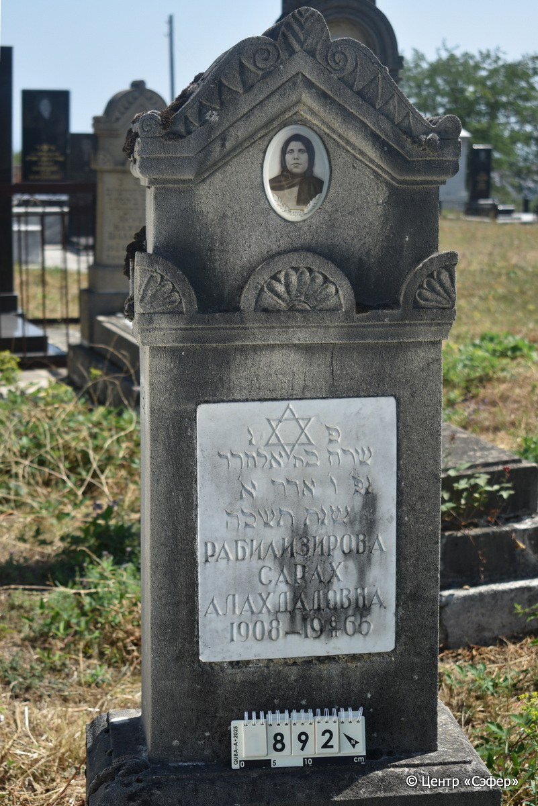
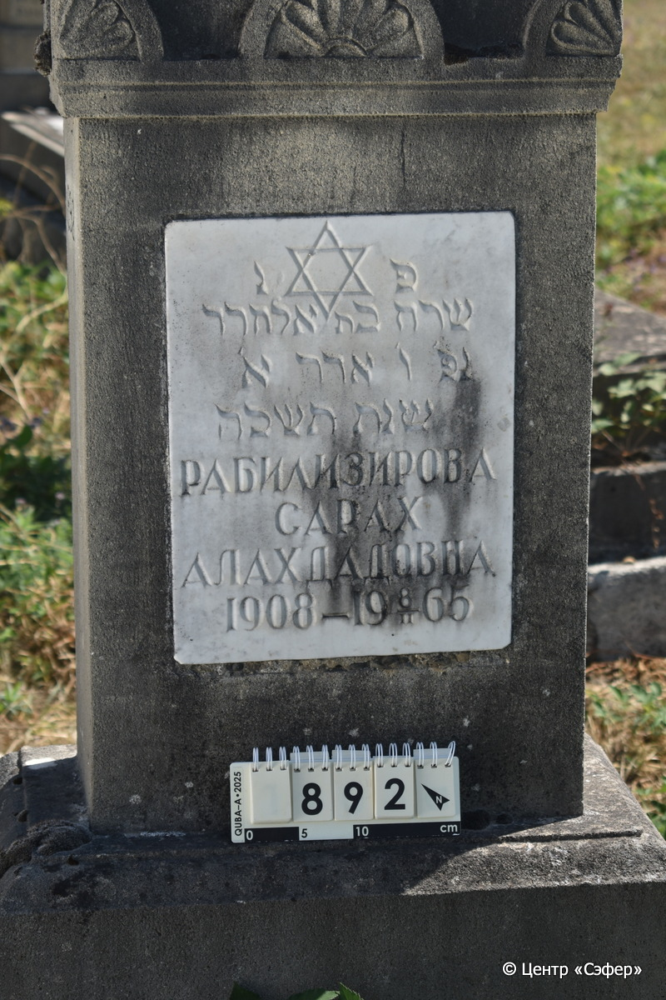
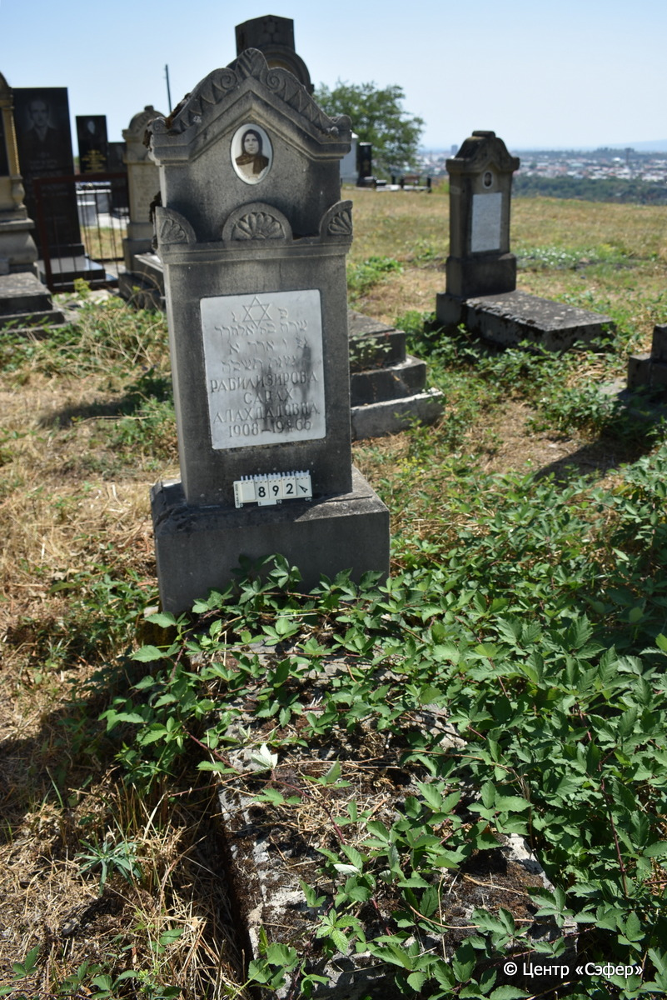

::: {style="font-size: 1em; margin-bottom: 1.2em"}
[Куба (центральное)](../cemeteries/QBA.html) > QBA0892
:::

```{r}
suppressPackageStartupMessages(library(tidyverse))
```


:::: {.columns}

::: {.column width="20%"}

```{r}
#| lightbox:
#|   group: photos





```
:::

::: {.column width="5%"}
:::

::: {.column width="74%"}

::: {.name-style}
РАБИЛИЗИРОВА Серах, дочь Эльхадада (Сарах Алахдадовна)
:::

::: {style="font-size: 1.2em;"}
שרח בת אלחדד
:::

:::: {.columns}
::: {.column width="5%"}
{width=1.3em}
:::

::: {.column style="width: 40%; padding-left: 0.2em;"}
-.-.1908 /  
:::

::: {.column width="5%"}
{width=1.3em}
:::

::: {.column style="width: 50%; padding-left: 0.2em;"}
08.02.1965 / 06.Ad1.5725
:::

::::


::: {.panel-tabset}

#### Эпитафия

```{r}
tibble(`Оригинал` = "פ נ
שרח בת אלחדד
נפ׳ ו׳ אדר א׳
שנת תשכה
РАБИЛИЗИРОВА
САРАХ
АЛАХДАДОВНА
1908- 8/II 1965",
       `Перевод` = "Здесь покоится
Сарах, дочь Эльхадада.
Скончалась 6 адара-I
года 725.
РАБИЛИЗИРОВА
САРАХ
АЛАХДАДОВНА
1908- 8/II 1965") |>
  mutate(`Оригинал` = str_split(`Оригинал`, "
"),
         `Перевод` = str_split(`Перевод`, "
")) |>
  unnest_longer(c(`Оригинал`, `Перевод`)) |> 
  mutate(id = 1:n()) |> 
  relocate(id, .before = Перевод) |> 
  rename(` ` = id) |> 
  knitr::kable(align = c("r", "c", "l"))
```

|||
|-|---|
|**Примечания**| |
|**Язык**      |иврит, русский    |
|**Метки**     |     |
: {tbl-colwidths="[25,75]"}

#### Памятник

|||
|-|---|
|**Тип памятника**   |L-образный                                                                         |
|**Материал**        |известняк, мрамор (керамический медальон с портретом, мраморная вставка для текста, цементный раствор, следы эрозии, сколы)                                                     |
|**Размеры**         |160×63×36  --- стела; 20×56×120  --- плита; 17×75×170  --- основание                                                                        |
|**Тип декора**      |архитектурно-орнаментальный, растительный, традиционная символика                                                                        |
|**Элементы декора** |треугольное завершение с волютами и растительными мотивами, конек, пояс с пальметками, звезда Давида на вставке, фотопортрет на медальоне с растительным орнаментом                                                                          |
|**Координаты**      |[41.37119057, 48.50910468](https://www.google.com/maps/place/41.37119057, 48.50910468)                    |
: {tbl-colwidths="[25,75]"}

#### Источник

|||
|-|---|
|**Место хранения**        |Архив полевых исследований Центра «Сэфер»     |
|**Контакты**              |students@sefer.ru    |
|**Ссылка**                |https://sfira.org        |
|**Исходный ID**           |  |
|**Условия использования** |[CC BY-NC 4.0](https://creativecommons.org/licenses/by-nc/4.0/deed.ru)     |
: {tbl-colwidths="[25,75]"}

:::

:::

::::

