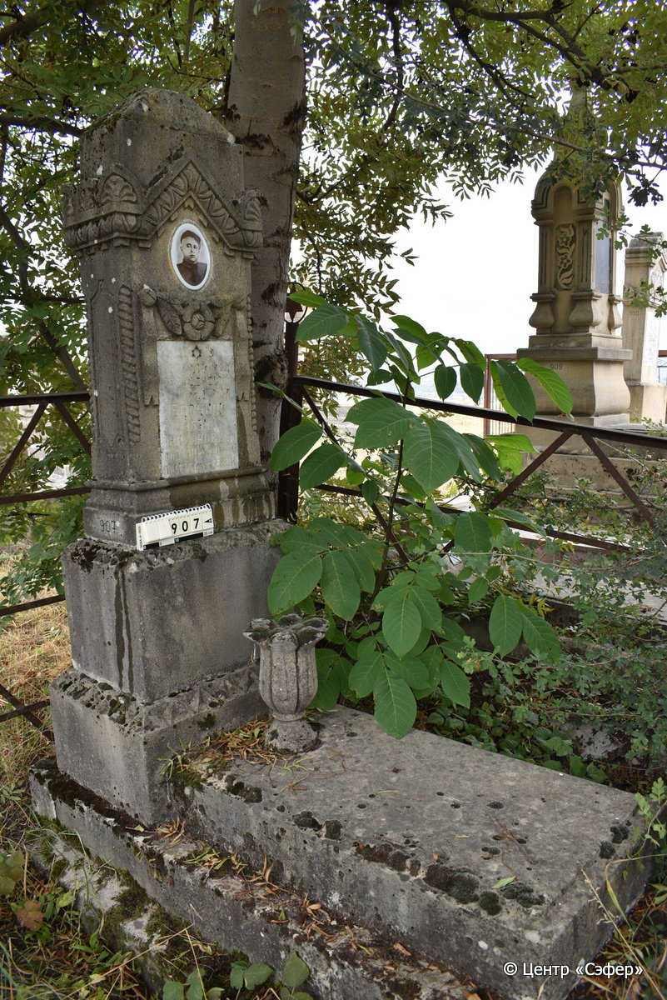
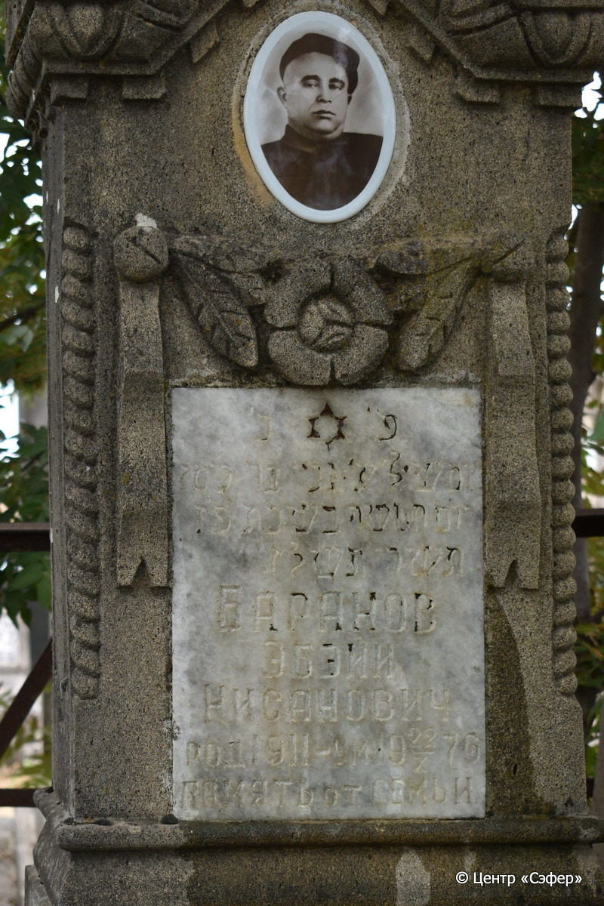

::: {style="font-size: 1em; margin-bottom: 1.2em"}
[Куба (центральное)](../cemeteries/QBA.html) > QBA0907
:::

```{r}
suppressPackageStartupMessages(library(tidyverse))
```


:::: {.columns}

::: {.column width="20%"}

```{r}
#| lightbox:
#|   group: photos




```
:::

::: {.column width="5%"}
:::

::: {.column width="74%"}

::: {.name-style}
БАРАНОВ Абай, сын Нисана (Эбэйи Нисанович)
:::

::: {style="font-size: 1.2em;"}
אביי בן ניסן
:::

:::: {.columns}
::: {.column width="5%"}
{width=1.3em}
:::

::: {.column style="width: 40%; padding-left: 0.2em;"}
-.-.1911 /  
:::

::: {.column width="5%"}
{width=1.3em}
:::

::: {.column style="width: 50%; padding-left: 0.2em;"}
22.10.1976 / 27.Ti.5737
:::

::::


::: {.panel-tabset}

#### Эпитафия

```{r}
tibble(`Оригинал` = "פ׳ נ׳
יום ש׳ל׳ע׳ אביי בר ניסן
יום חמשה בשבת כ״ז
תשרי תשלז
Баранов
Эбэйи
Нисанович
род. 1911 - ум. 1976 22/X
Память от семьи",
       `Перевод` = "Здесь покоится.
День, когда ушел навеки Абай, сын Нисана,
четверг, 27
тишрея 737 года.
Баранов
Эбэйи
Нисанович
род. 1911 - ум. 1976 22/X
Память от семьи") |>
  mutate(`Оригинал` = str_split(`Оригинал`, "
"),
         `Перевод` = str_split(`Перевод`, "
")) |>
  unnest_longer(c(`Оригинал`, `Перевод`)) |> 
  mutate(id = 1:n()) |> 
  relocate(id, .before = Перевод) |> 
  rename(` ` = id) |> 
  knitr::kable(align = c("r", "c", "l"))
```

|||
|-|---|
|**Примечания**| |
|**Язык**      |иврит, русский    |
|**Метки**     |     |
: {tbl-colwidths="[25,75]"}

#### Памятник

|||
|-|---|
|**Тип памятника**   |L-образный                                                                         |
|**Материал**        |известняк, мрамор (мраморная табличка, керамический медальон с фотопортретом, следы эрозии, следы цементного раствора)                                                     |
|**Размеры**         |200×70×50  --- стела; 15×60×108  --- плита; 32×102×202  --- основание                                                                        |
|**Тип декора**      |                                                                         |
|**Элементы декора** |архитектурное завершение с орнаментальными поясами, верхний из них — с пальметками. Витые полуколонны, гирлянда из лент, листьев и цветка. У основания стелы два геометрических пояса.
Фигурные ниши на боковых сторонах. Звезда Давида на мраморной табличке, портрет в медальоне. Скульптурный бутон на плите.                                                                          |
|**Координаты**      |[41.37129764, 48.50915554](https://www.google.com/maps/place/41.37129764, 48.50915554)                    |
: {tbl-colwidths="[25,75]"}

#### Источник

|||
|-|---|
|**Место хранения**        |Архив полевых исследований Центра «Сэфер»     |
|**Контакты**              |students@sefer.ru    |
|**Ссылка**                |https://sfira.org        |
|**Исходный ID**           |  |
|**Условия использования** |[CC BY-NC 4.0](https://creativecommons.org/licenses/by-nc/4.0/deed.ru)     |
: {tbl-colwidths="[25,75]"}

:::

:::

::::

