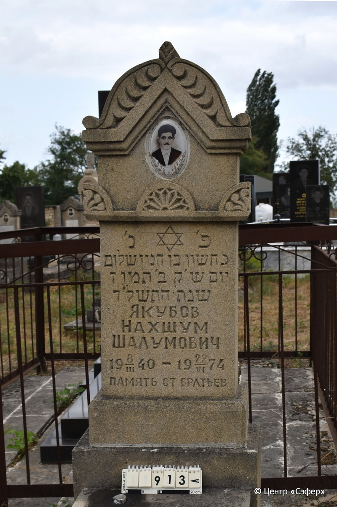
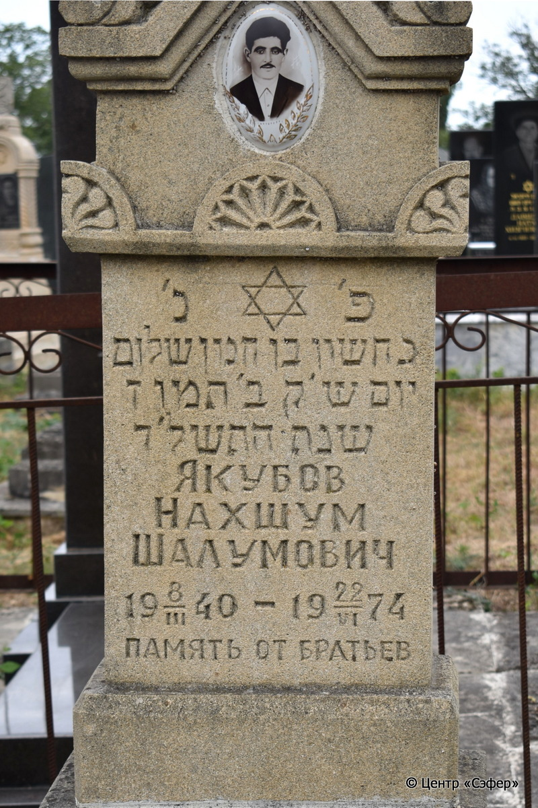
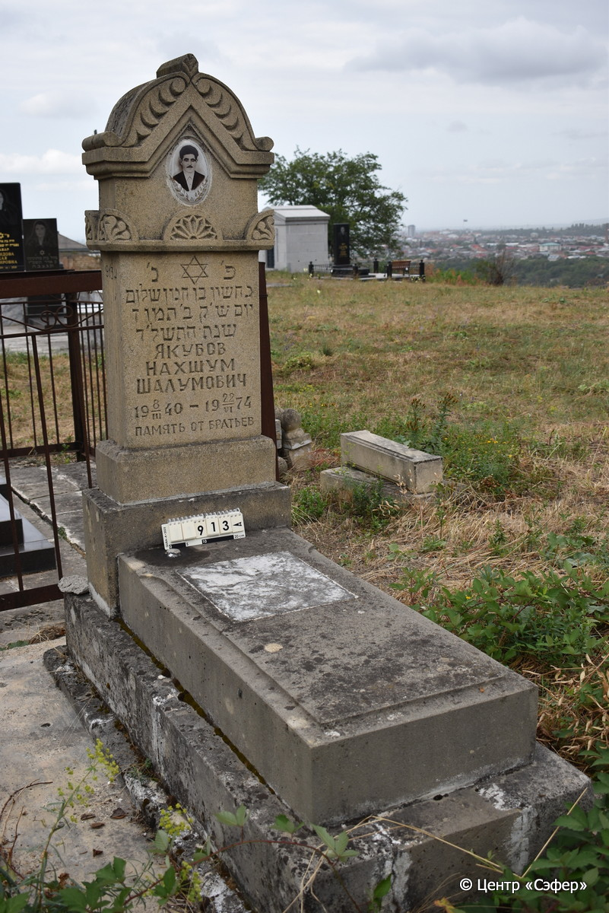

::: {style="font-size: 1em; margin-bottom: 1.2em"}
[Куба (центральное)](../cemeteries/QBA.html) > QBA0913
:::

```{r}
suppressPackageStartupMessages(library(tidyverse))
```


:::: {.columns}

::: {.column width="20%"}

```{r}
#| lightbox:
#|   group: photos





```
:::

::: {.column width="5%"}
:::

::: {.column width="74%"}

::: {.custom-frame}
::: {.name-style}
**ЯКУБОВ Нахшон, сын Хануна Шалома (Нахшум Шалумович)**
:::

::: {style="font-size: 1.2em; color: #929292;"}
נחשון בן חנון שלום
:::

:::: {.columns .date-panel .align-items-center}
::: {.column width="1.5em" .text-center}
{width=1.3em .nolightbox}
:::

::: {.column style="width: fit-content; padding-left: 0.4em; padding-right: 4em;"}
-.-.1940 

[--]{style="color: #929292"}
:::

::: {.column width="1.5em" .text-center}
{width=1.3em .nolightbox}
:::

::: {.column style="width: fit-content; padding-left: 0.4em;"}
22.06.1974 

[02.Ta.5734]{style="color: #929292"}
:::

::::

:::

::: {.panel-tabset}

#### Эпитафия

```{r}
tibble(`Оригинал` = "פ׳ נ׳
נחשון בן חנון שלום
יום ש׳ק ב׳ תמוז
שנת התשל׳ד
Якубов
Нахшум
Шалумович
1940 8/III - 1974 22/VI
Память от братьев",
       `Перевод` = "Здесь покоится
Нахшун, сын Ханун Шалома.
День святой субботы, 2 таммзуа
года 5734.
Якубов
Нахшум
Шалумович
1940 8/III - 1974 22/VI
Память от братьев") |>
  mutate(`Оригинал` = str_split(`Оригинал`, "
"),
         `Перевод` = str_split(`Перевод`, "
")) |>
  unnest_longer(c(`Оригинал`, `Перевод`)) |> 
  mutate(id = 1:n()) |> 
  relocate(id, .before = Перевод) |> 
  rename(` ` = id) |> 
  knitr::kable(align = c("r", "c", "l"))
```

|||
|-|---|
|Примечания| |
|Язык      |иврит, русский    |
|Метки     |     |
: {.striped .custom-table tbl-colwidths="[25,75]"}

#### Памятник

|||
|-|---|
|Тип памятника   |L-образный                                                                         |
|Материал        |песчаник, габбро-диорит, мрамор (следы эрозии, цементный раствор, керамический медальон с фотопортретом, мраморная вставка для текста)                                                     |
|Размеры         |159×58×25  --- стела; 21×54×117  --- плита; 30×81×180  --- основание                                                                        |
|Тип декора      |архитектурно-орнаментальный, растительный, традиционная символика, портретный                                                                        |
|Элементы декора |архитектурное завершение с двумя волютами и растительным элементом, конёк, орнаментальный пояс с пальметками,  портрет на медальоне, звезда Давида на табличке                                                                          |
|Координаты      |[41.37120487, 48.50918485](https://www.google.com/maps/place/41.37120487, 48.50918485)                    |
: {.striped .custom-table tbl-colwidths="[25,75]"}

#### Источник

|                          |                 |
|--------------------------|-----------------|
|Место хранения        |Архив полевых исследований Центра «Сэфер»        |
|Контакты              |students@sefer.ru       |
|Ссылка                |[https://sfira.org](https://sfira.org) |
|Исходный ID           |     |
|Условия использования |[CC BY-NC 4.0](https://creativecommons.org/licenses/by-nc/4.0/deed.ru)        |
: {.striped .custom-table tbl-colwidths="[25,75]"}

:::

:::

::::

