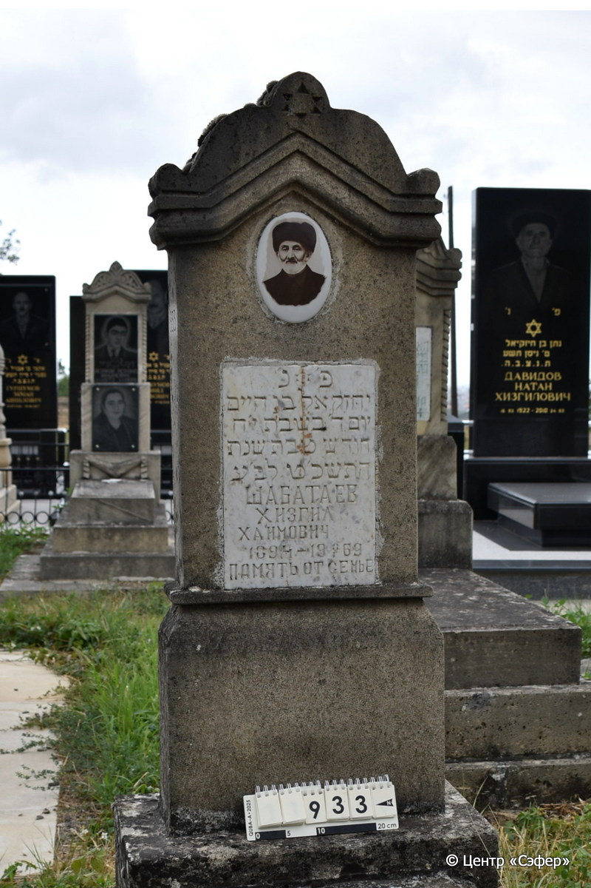
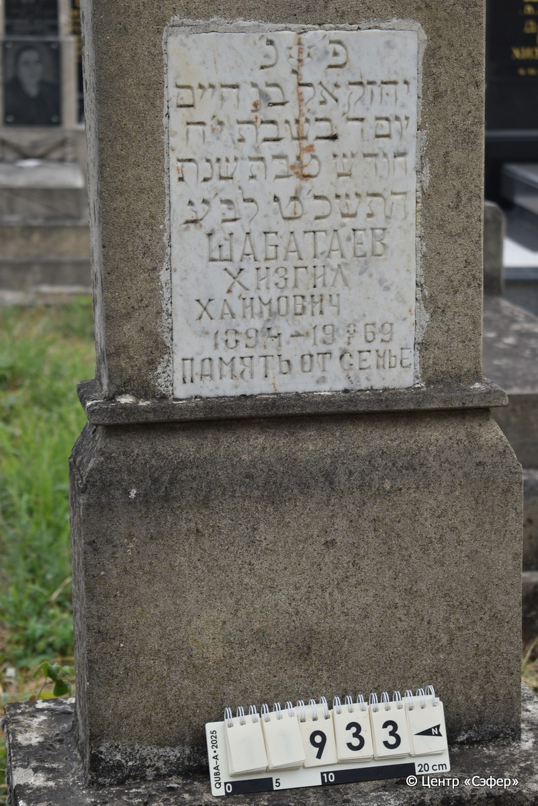
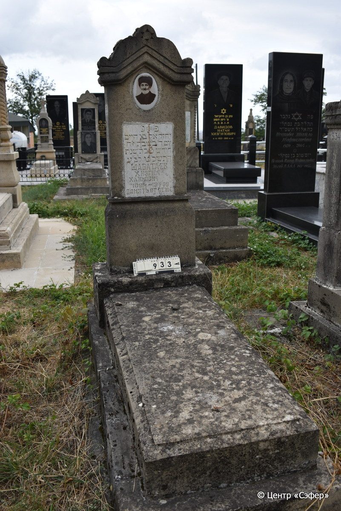

::: {style="font-size: 1em; margin-bottom: 1.2em"}
[Куба (центральное)](../cemeteries/QBA.html) > QBA0933
:::

```{r}
suppressPackageStartupMessages(library(tidyverse))
```


:::: {.columns}

::: {.column width="20%"}

```{r}
#| lightbox:
#|   group: photos





```
:::

::: {.column width="5%"}
:::

::: {.column width="74%"}

::: {.name-style}
ШАБАТАЕВ Йехезкель, сын Хаима (Хизгил Хаимович)
:::

::: {style="font-size: 1.2em;"}
יחזקאל בן חיים
:::

:::: {.columns}
::: {.column width="5%"}
{width=1.3em}
:::

::: {.column style="width: 40%; padding-left: 0.2em;"}
-.-.1894 /  
:::

::: {.column width="5%"}
{width=1.3em}
:::

::: {.column style="width: 50%; padding-left: 0.2em;"}
08.01.1969 / 18.Te.5729
:::

::::


::: {.panel-tabset}

#### Эпитафия

```{r}
tibble(`Оригинал` = "פ׳ נ׳
יחזקאל בנ חיים
יום ד׳ בשבת י׳ח
חודש טבת שנת
התשכ׳ט לב׳ע
Шабатаев
Хизгил
Хаимович
1894 -  8/I 1969
ПАМЯТЬ ОТ СЕМЬЕ",
       `Перевод` = "Здесь покоится
Йехазекель, сын Хаима.
Среда, 18
число месяца тевет, года
5729 от сотворения мира.
Шабатаев
Хизгил
Хаимович
1894 -  8/I 1969
ПАМЯТЬ ОТ СЕМЬЕ") |>
  mutate(`Оригинал` = str_split(`Оригинал`, "
"),
         `Перевод` = str_split(`Перевод`, "
")) |>
  unnest_longer(c(`Оригинал`, `Перевод`)) |> 
  mutate(id = 1:n()) |> 
  relocate(id, .before = Перевод) |> 
  rename(` ` = id) |> 
  knitr::kable(align = c("r", "c", "l"))
```

|||
|-|---|
|**Примечания**| |
|**Язык**      |иврит, русский    |
|**Метки**     |     |
: {tbl-colwidths="[25,75]"}

#### Памятник

|||
|-|---|
|**Тип памятника**   |L-образный                                                                         |
|**Материал**        |известняк, мрамор (следы эрозии, цементный раствор, мраморная вставка для текста, керамический медальон с фото-портетом)                                                     |
|**Размеры**         |147×60×35  --- стела; 20×55×115  --- плита; 33×77×194  --- основание                                                                        |
|**Тип декора**      |архитектурно-орнаментальный, традиционная символика                                                                        |
|**Элементы декора** |звезда Давида на коньке, архитектурное завершение с двумя волютами и коньком, портрет в медальоне, Звезда Давида на табличке                                                                          |
|**Координаты**      |[41.37127261, 48.50928986](https://www.google.com/maps/place/41.37127261, 48.50928986)                    |
: {tbl-colwidths="[25,75]"}

#### Источник

|||
|-|---|
|**Место хранения**        |Архив полевых исследований Центра «Сэфер»     |
|**Контакты**              |students@sefer.ru    |
|**Ссылка**                |https://sfira.org        |
|**Исходный ID**           |  |
|**Условия использования** |[CC BY-NC 4.0](https://creativecommons.org/licenses/by-nc/4.0/deed.ru)     |
: {tbl-colwidths="[25,75]"}

:::

:::

::::

