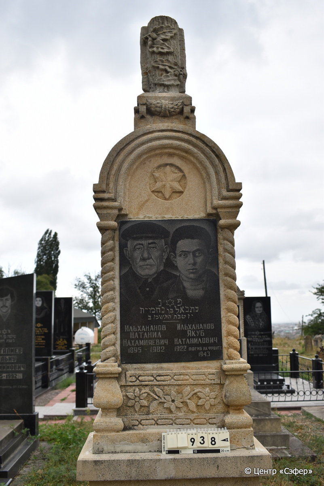
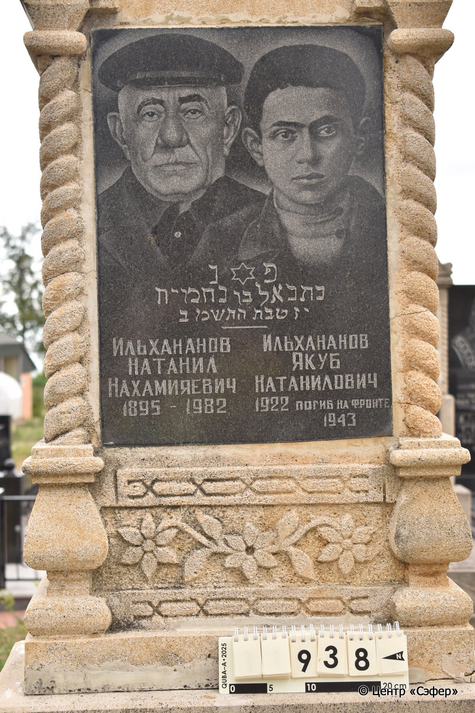
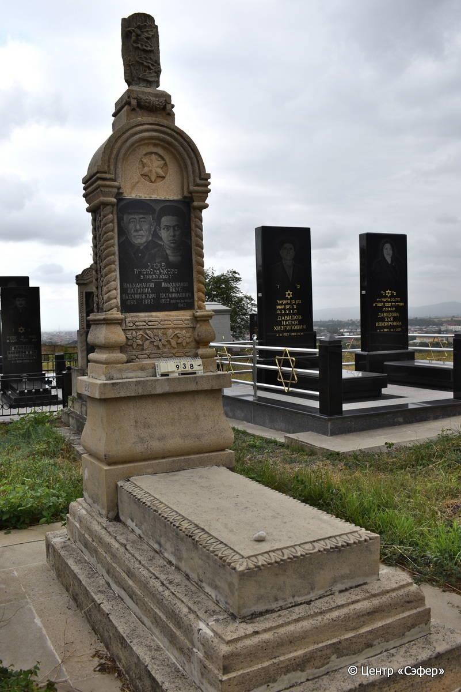

::: {style="font-size: 1em; margin-bottom: 1.2em"}
[Куба (центральное)](../cemeteries/QBA.html) > QBA0938
:::

```{r}
suppressPackageStartupMessages(library(tidyverse))
```


:::: {.columns}

::: {.column width="20%"}

```{r}
#| lightbox:
#|   group: photos





```
:::

::: {.column width="5%"}
:::

::: {.column width="74%"}

::: {.name-style}
ИЛЬХАНАНОВ Натаниэль, сын Нехемьи (Натанил Нахамияевич)
:::

::: {style="font-size: 1.2em;"}
נתנאל בן נחמיה
:::

:::: {.columns}
::: {.column width="5%"}
{width=1.3em}
:::

::: {.column style="width: 40%; padding-left: 0.2em;"}
-.-.1895 /  
:::

::: {.column width="5%"}
{width=1.3em}
:::

::: {.column style="width: 50%; padding-left: 0.2em;"}
-.-.1982 / 17.Te.5742
:::

::::

---

::: {.name-style}
ИЛЬХАНАНОВ Якуб Натанилович
:::

::: {style="font-size: 1.2em;"}

:::

:::: {.columns}
::: {.column width="5%"}
{width=1.3em}
:::

::: {.column style="width: 40%; padding-left: 0.2em;"}
-.-.1922 /  
:::

::: {.column width="5%"}
{width=1.3em}
:::

::: {.column style="width: 50%; padding-left: 0.2em;"}
-.-.1943 /  
:::

::::


::: {.panel-tabset}

#### Эпитафия

```{r}
tibble(`Оригинал` = "פ נ
נתנאל בן נחמיה
יז טבת התשמב
слева
Ильхананов
Натанил
Нахамияевич
1895 - 1982
справа
Ильхананов
Якуб
Натанилович
1922 погиб на фронте
1943",
       `Перевод` = "Здесь покоится
Натаниель, сын Нехемии.
17 тевета 5742 года.

Ильхананов
Натанил
Нахамияевич
1895 - 1982

Ильхананов
Якуб
Натанилович
1922 погиб на фронте в
1943 году") |>
  mutate(`Оригинал` = str_split(`Оригинал`, "
"),
         `Перевод` = str_split(`Перевод`, "
")) |>
  unnest_longer(c(`Оригинал`, `Перевод`)) |> 
  mutate(id = 1:n()) |> 
  relocate(id, .before = Перевод) |> 
  rename(` ` = id) |> 
  knitr::kable(align = c("r", "c", "l"))
```

|||
|-|---|
|**Примечания**| |
|**Язык**      |иврит, русский    |
|**Метки**     |     |
: {tbl-colwidths="[25,75]"}

#### Памятник

|||
|-|---|
|**Тип памятника**   |L-образный                                                                         |
|**Материал**        |известняк, габбро-диорит (цементный раствор, трещины, следы эрозии, вставка с портретом и текстом из темного камня)                                                     |
|**Размеры**         |250×70×42  --- стела; 15×60×115  --- плита; 33×105×200  --- основание                                                                        |
|**Тип декора**      |архитектурно-орнаментальный, растительный, традиционная символика                                                                        |
|**Элементы декора** |навершие в виде фрагмента дерева с дубовыми листьями и желудями, гирлянда, полукруглая арка на витых полуколоннах, звезда Давида, звезда Давида и двойной портрет на вставке, геометрический орнамент и цветы, цветочный орнамент по бокам стелы, растительный орнамент по краям плиты                                                                          |
|**Координаты**      |[41.37129287, 48.50933306](https://www.google.com/maps/place/41.37129287, 48.50933306)                    |
: {tbl-colwidths="[25,75]"}

#### Источник

|||
|-|---|
|**Место хранения**        |Архив полевых исследований Центра «Сэфер»     |
|**Контакты**              |students@sefer.ru    |
|**Ссылка**                |https://sfira.org        |
|**Исходный ID**           |  |
|**Условия использования** |[CC BY-NC 4.0](https://creativecommons.org/licenses/by-nc/4.0/deed.ru)     |
: {tbl-colwidths="[25,75]"}

:::

:::

::::

