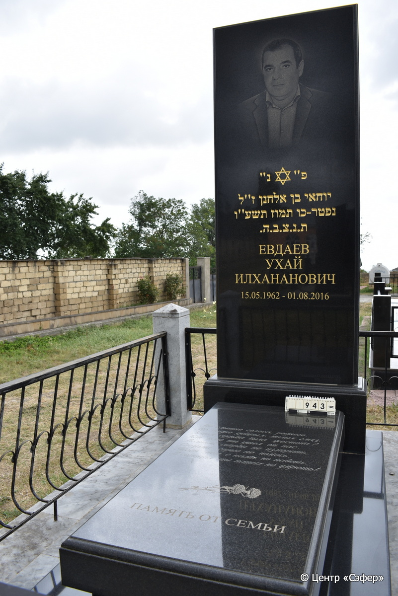
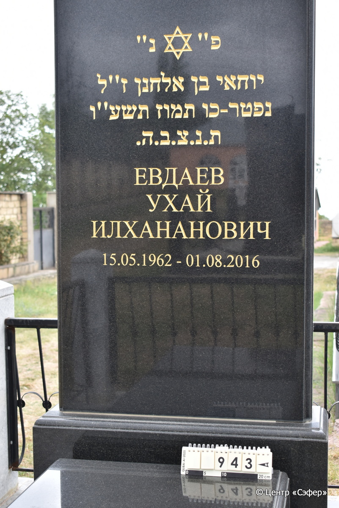
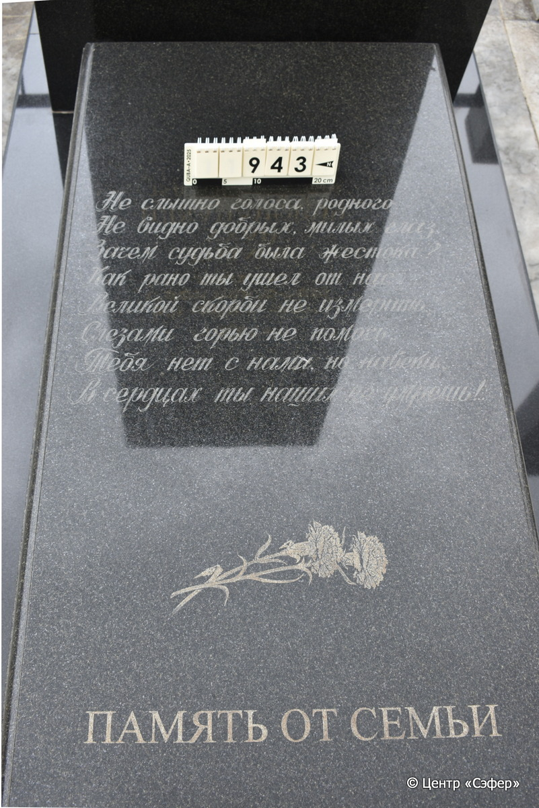
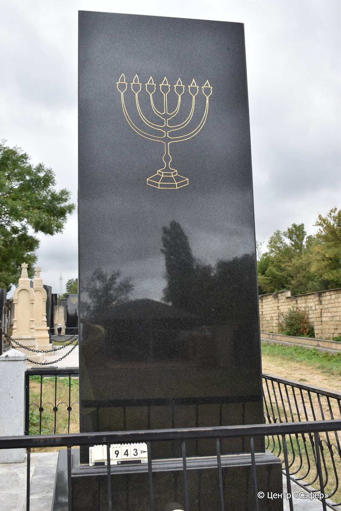

::: {style="font-size: 1em; margin-bottom: 1.2em"}
[Куба (центральное)](../cemeteries/QBA.html) > QBA0943
:::

```{r}
suppressPackageStartupMessages(library(tidyverse))
```


:::: {.columns}

::: {.column width="20%"}

```{r}
#| lightbox:
#|   group: photos






```
:::

::: {.column width="5%"}
:::

::: {.column width="74%"}

::: {.name-style}
ЕВДАЕВ Йохай, сын Эльханана (Ухай Илхананович)
:::

::: {style="font-size: 1.2em;"}
יוחאי בן אלחנן
:::

:::: {.columns}
::: {.column width="5%"}
{width=1.3em}
:::

::: {.column style="width: 40%; padding-left: 0.2em;"}
15.05.1962 /  
:::

::: {.column width="5%"}
{width=1.3em}
:::

::: {.column style="width: 50%; padding-left: 0.2em;"}
01.08.2016 / 26.Ta.5776
:::

::::


::: {.panel-tabset}

#### Эпитафия

```{r}
tibble(`Оригинал` = "פ״ נ״
יוחאי בן אלחנן ז״ל
נפטר - כו תמוז תשע״ו
ת.נ.צ.ב.ה.
Евдаев
Ухай
Илхананович
15.05.1962 - 01.08.2016
снизу
Не слышно голоса, родного,
Не видно добрых, милых глаз.
Зачем судьба была жестока?
Как рано ты ушел от нас.
Великой скорби не измерить...
Слезам горью не помочь,
Тебя нет с нами, но навеки,
В сердцах ты наших не умрешь!..
Память от семьи",
       `Перевод` = "Здесь покоится
Йохай, сын Эльханана, благословенной памяти.
Скончался 26 таммуза 776 года.
Да будет душа его завязана в узле жизни.
Евдаев
Ухай
Илхананович
15.05.1962 - 01.08.2016

Не слышно голоса, родного,
Не видно добрых, милых глаз.
Зачем судьба была жестока?
Как рано ты ушел от нас.
Великой скорби не измерить...
Слезам горью не помочь,
Тебя нет с нами, но навеки,
В сердцах ты наших не умрешь!..
Память от семьи") |>
  mutate(`Оригинал` = str_split(`Оригинал`, "
"),
         `Перевод` = str_split(`Перевод`, "
")) |>
  unnest_longer(c(`Оригинал`, `Перевод`)) |> 
  mutate(id = 1:n()) |> 
  relocate(id, .before = Перевод) |> 
  rename(` ` = id) |> 
  knitr::kable(align = c("r", "c", "l"))
```

|||
|-|---|
|**Примечания**| |
|**Язык**      |иврит, русский    |
|**Метки**     |     |
: {tbl-colwidths="[25,75]"}

#### Памятник

|||
|-|---|
|**Тип памятника**   |L-образный                                                                         |
|**Материал**        |габбро-диорит (цементный раствор)                                                     |
|**Размеры**         |237×90×30  --- стела                                                                        |
|**Тип декора**      |растительный, традиционная символика                                                                        |
|**Элементы декора** |портрет и звезда Давида на стеле, менора с обратной стороны стелы, две гвоздики на плите                                                                          |
|**Координаты**      |[41.37137416, 48.50937298](https://www.google.com/maps/place/41.37137416, 48.50937298)                    |
: {tbl-colwidths="[25,75]"}

#### Источник

|||
|-|---|
|**Место хранения**        |Архив полевых исследований Центра «Сэфер»     |
|**Контакты**              |students@sefer.ru    |
|**Ссылка**                |https://sfira.org        |
|**Исходный ID**           |  |
|**Условия использования** |[CC BY-NC 4.0](https://creativecommons.org/licenses/by-nc/4.0/deed.ru)     |
: {tbl-colwidths="[25,75]"}

:::

:::

::::

