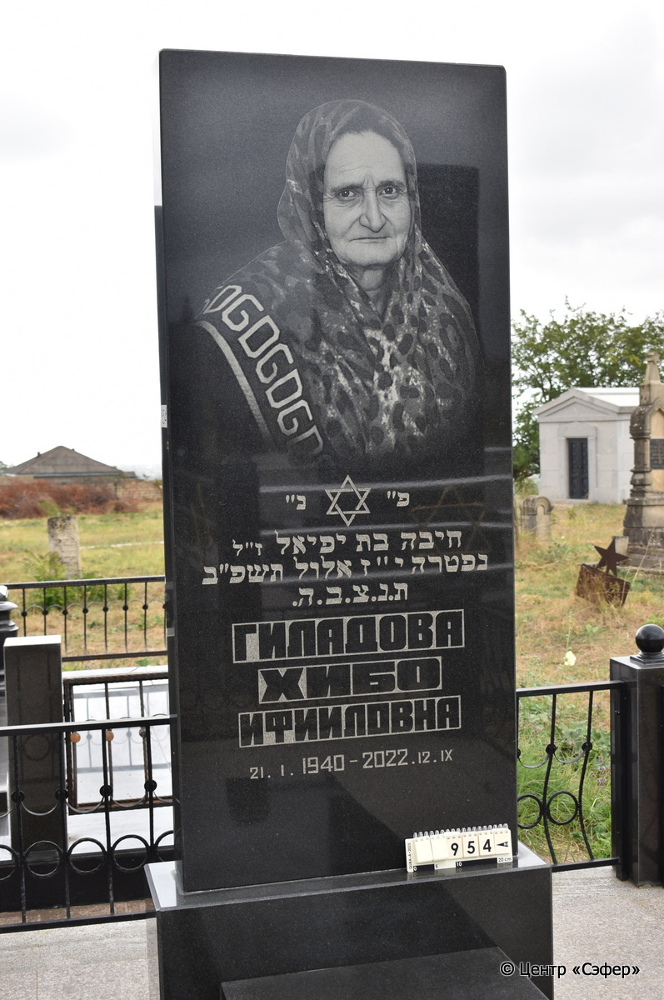
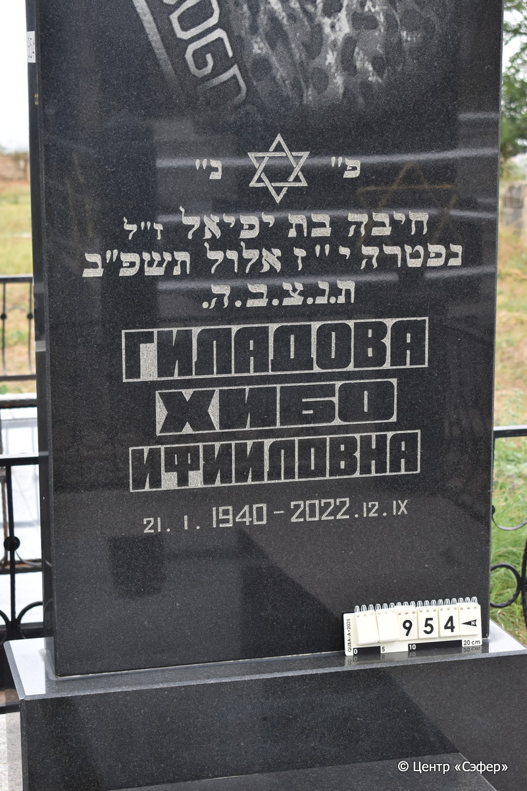
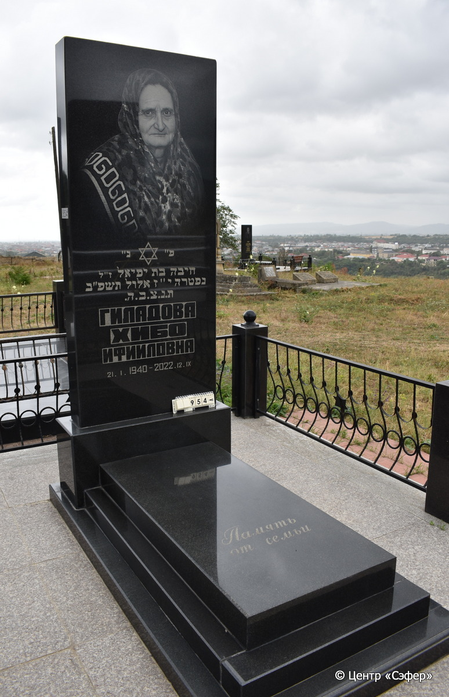

::: {style="font-size: 1em; margin-bottom: 1.2em"}
[Куба (центральное)](../cemeteries/QBA.html) > QBA0954
:::

```{r}
suppressPackageStartupMessages(library(tidyverse))
```


:::: {.columns}

::: {.column width="20%"}

```{r}
#| lightbox:
#|   group: photos





```
:::

::: {.column width="5%"}
:::

::: {.column width="74%"}

::: {.custom-frame}
::: {.name-style}
**ГИЛАДОВА Хиба, дочь Йефиэля (Хибо Ифииловна)**
:::

::: {style="font-size: 1.2em; color: #929292;"}
חיבה בת יפיאל
:::

:::: {.columns .date-panel .align-items-center}
::: {.column width="1.5em" .text-center}
{width=1.3em .nolightbox}
:::

::: {.column style="width: fit-content; padding-left: 0.4em; padding-right: 4em;"}
21.01.1940 

[--]{style="color: #929292"}
:::

::: {.column width="1.5em" .text-center}
{width=1.3em .nolightbox}
:::

::: {.column style="width: fit-content; padding-left: 0.4em;"}
12.09.2022 

[17.El.5782]{style="color: #929292"}
:::

::::

:::

::: {.panel-tabset}

#### Эпитафия

```{r}
tibble(`Оригинал` = "сверху
פ״ נ״
חיבה בת יפיאל ז״ל
נפטרה י״ז אלול תשפ״ב
ת.נ.צ.ב.ה.
Гиладова
Хибо
Ифииловна
21.I.1940 – 2022.12.IX

снизу
Память
от семьи",
       `Перевод` = "_T_
Здесь покоится
Хиба, лочь Йефиэля, благословенной памяти.
Скончалась 17 элула 782 года.
Да будет душа ее завязана в узле жизни.
Гиладова
Хибо
Ифииловна
21.I.1940 – 2022.12.IX

_B_
Память
от семьи") |>
  mutate(`Оригинал` = str_split(`Оригинал`, "
"),
         `Перевод` = str_split(`Перевод`, "
")) |>
  unnest_longer(c(`Оригинал`, `Перевод`)) |> 
  mutate(id = 1:n()) |> 
  relocate(id, .before = Перевод) |> 
  rename(` ` = id) |> 
  knitr::kable(align = c("r", "c", "l"))
```

|||
|-|---|
|Примечания| |
|Язык      |иврит, русский    |
|Метки     |     |
: {.striped .custom-table tbl-colwidths="[25,75]"}

#### Памятник

|||
|-|---|
|Тип памятника   |L-образный                                                                         |
|Материал        |габбро-диорит (цементный раствор)                                                     |
|Размеры         |220×90×30  --- стела                                                                        |
|Тип декора      |традиционная символика                                                                        |
|Элементы декора |потрет и звезда Давида на стеле                                                                          |
|Координаты      |[41.3712859, 48.50946152](https://www.google.com/maps/place/41.3712859, 48.50946152)                    |
: {.striped .custom-table tbl-colwidths="[25,75]"}

#### Источник

|                          |                 |
|--------------------------|-----------------|
|Место хранения        |Архив полевых исследований Центра «Сэфер»        |
|Контакты              |students@sefer.ru       |
|Ссылка                |[https://sfira.org](https://sfira.org) |
|Исходный ID           |     |
|Условия использования |[CC BY-NC 4.0](https://creativecommons.org/licenses/by-nc/4.0/deed.ru)        |
: {.striped .custom-table tbl-colwidths="[25,75]"}

:::

:::

::::

