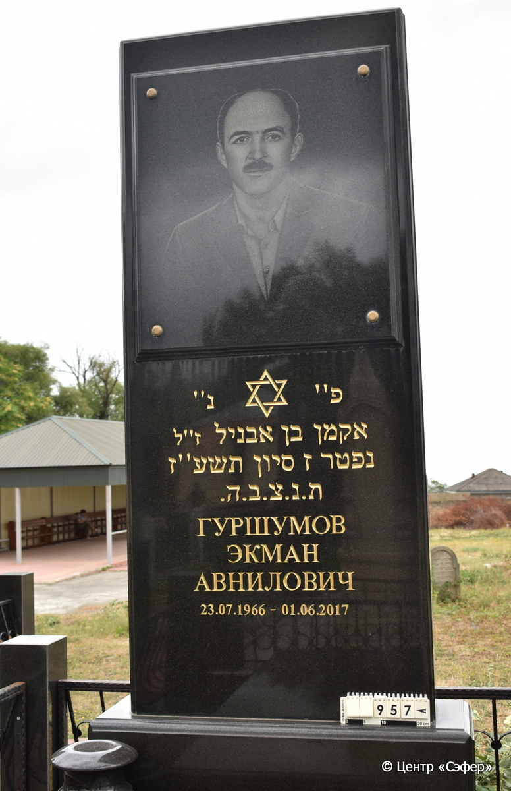
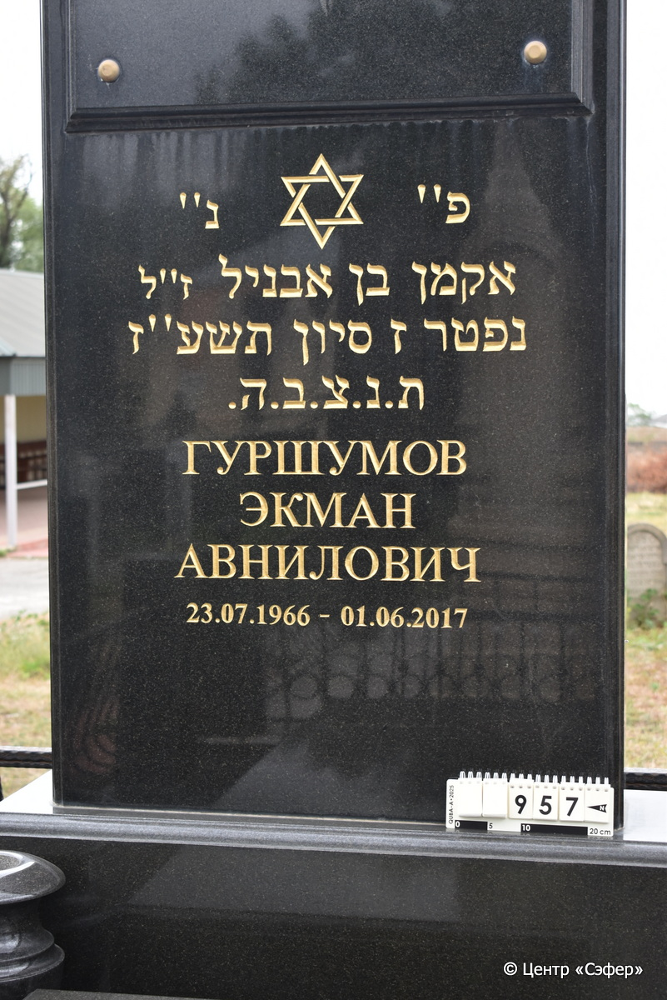
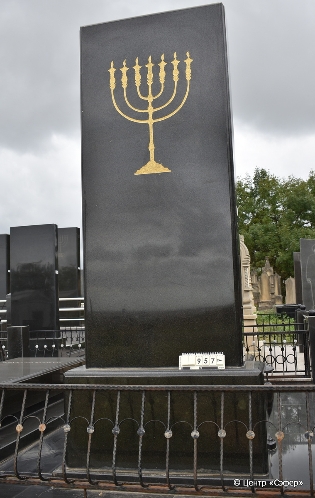
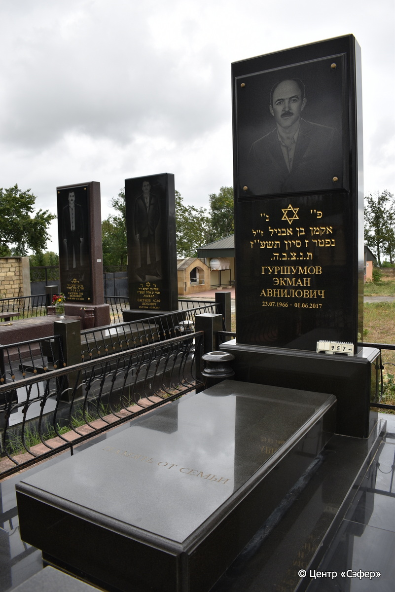

::: {style="font-size: 1em; margin-bottom: 1.2em"}
[Куба (центральное)](../cemeteries/QBA.html) > QBA0957
:::

```{r}
suppressPackageStartupMessages(library(tidyverse))
```


:::: {.columns}

::: {.column width="20%"}

```{r}
#| lightbox:
#|   group: photos






```
:::

::: {.column width="1.5em"}
:::

::: {.column width="74%"}

::: {.custom-frame}
::: {.name-ru-style}
**ГУРШУМОВ Экман, сын Авнила (Авнилович)**
:::

::: {.name-he-style}
אקמן בן אבניל
:::

:::: {.columns .date-panel style="display: flex; align-items: top; margin-top: 0.8em;"}
::: {.column .text-center style="width: fit-content; flex: 0 0 auto;"}
{width=1.5em .nolightbox}
:::

::: {.column style="flex: 0 0 auto; width: fit-content; padding-left: 0.8em; padding-right: 3.5em;"}
23.07.1966 

[--]{style="color: #929292"}
:::

::: {.column .text-center style="width: fit-content; flex: 0 0 auto;"}
{width=1.5em .nolightbox}
:::

::: {.column style="flex: 0 0 auto; width: fit-content; padding-left: 0.8em;"}
01.06.2017 

[07.Si.5777]{style="color: #929292"}
:::

::::

:::

::: {.panel-tabset}

#### Эпитафия

```{r}
tibble(`Оригинал` = "сверху
פ״ נ״
אקמן בן אבניל ז״ל
נפטר ז סיון תשע״ז
ת.נ.צ.ב.ה.
Гуршумов
Экман
Авнилович
23.07.1966 – 01.06.2017

снизу
Память от семьи",
       `Перевод` = "_T_
Здесь покоится
Экман, сын Авнила, благословенной памяти.
Скончался 7 сивана 777 года.
Да будет душа его завязана в узле жизни.
Гуршумов
Экман
Авнилович
23.07.1966 – 01.06.2017

_B_
Память от семьи") |>
  mutate(`Оригинал` = str_split(`Оригинал`, "
"),
         `Перевод` = str_split(`Перевод`, "
")) |>
  unnest_longer(c(`Оригинал`, `Перевод`)) |> 
  mutate(id = 1:n()) |> 
  relocate(id, .before = Перевод) |> 
  rename(` ` = id) |> 
  knitr::kable(align = c("r", "c", "l"))
```

---
::: {.custom-table-wrap}
::: {.list-table .borderless header-rows=0 aligns="l,l" tbl-colwidths="[21,79]"}
- - Примечания
  -  

- - Язык
  - иврит, русский

- - Метки
  -  
:::
:::

#### Памятник

::: {.custom-table-wrap}
::: {.list-table .borderless header-rows=0 aligns="l,l" tbl-colwidths="[21,79]"}
- - Тип памятника
  - L-образный

- - Материал
  - габбро-диорит, металл (цементный раствор, панель на металлических креплениях с портретом)

- - Размеры
  - 265×110×40  --- стела

- - Тип декора
  - архитектурно-орнаментальный, традиционная символика, портретный

- - Элементы декора
  - ваза, портрет и звезда Давида на стеле, менора с обратной стороны

- - Координаты
  - 41.3713203, 48.50950878 [Показать на карте](https://www.google.com/maps/place/41.3713203, 48.50950878){style="margin-left: 1em"}
:::
:::

#### Источник

::: {.custom-table-wrap}
::: {.list-table .borderless header-rows=0 aligns="l,l" tbl-colwidths="[21,79]"}
- - Место хранения
  - Архив полевых исследований Центра «Сэфер»

- - Контакты
  - students@sefer.ru

- - Ссылка
  - [https://sfira.org](https://sfira.org)

- - Исходный ID
  -  

- - Условия использования
  - [CC BY-NC 4.0](https://creativecommons.org/licenses/by-nc/4.0/deed.ru)
:::
:::

:::

:::

::::

