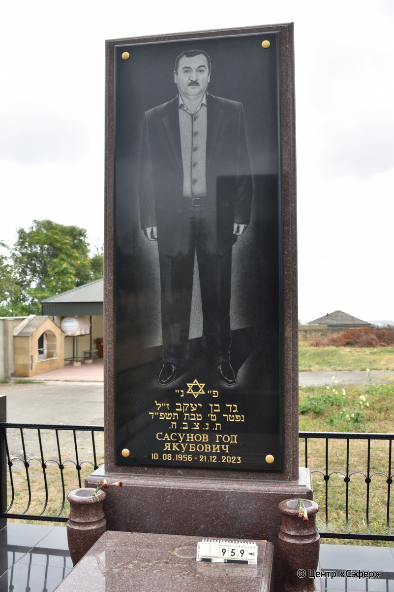
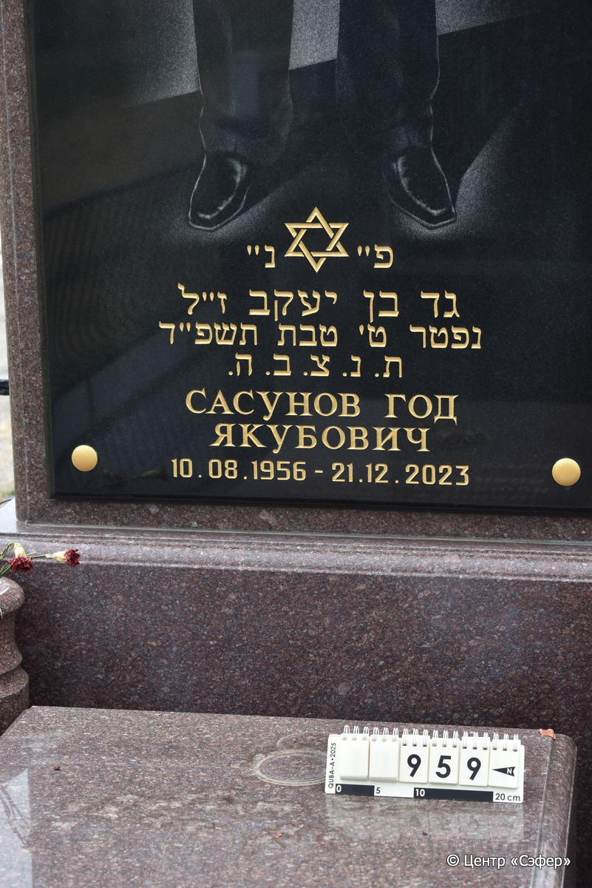
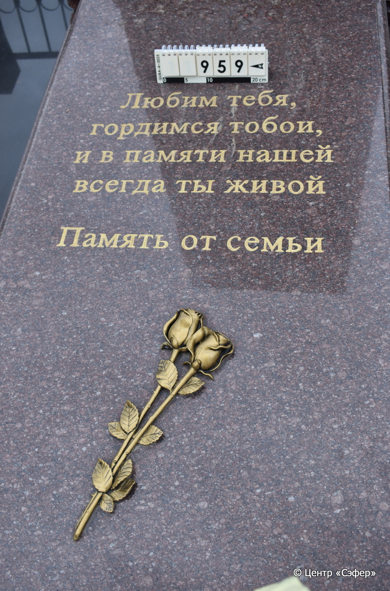
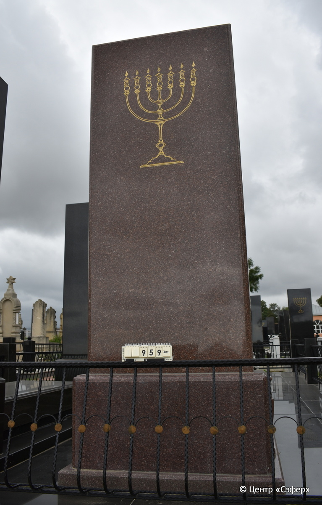
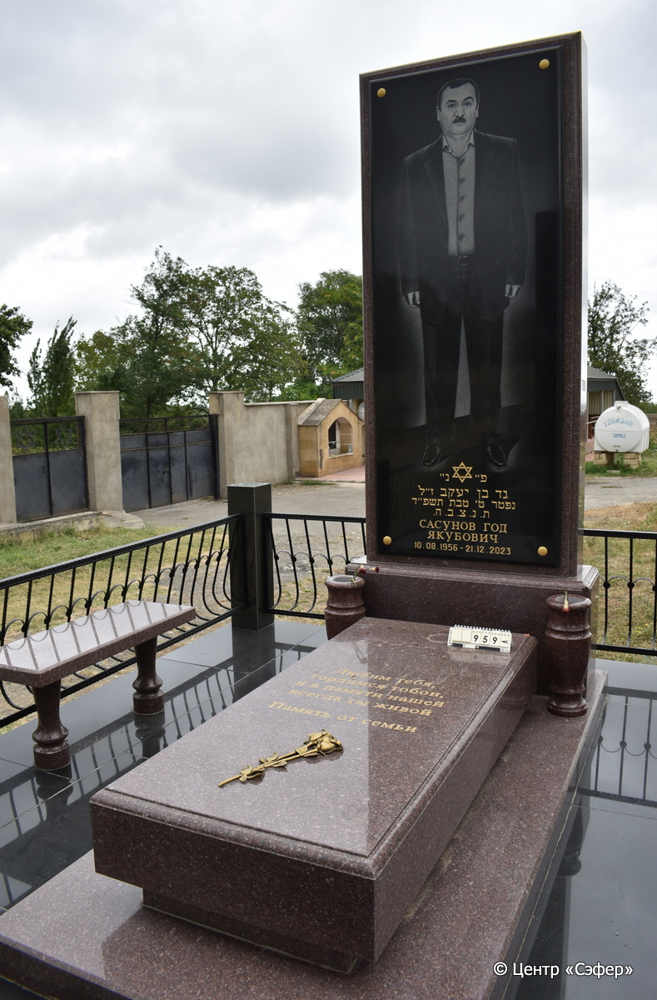

::: {style="font-size: 1em; margin-bottom: 1.2em"}
[Куба (центральное)](../cemeteries/QBA.html) > QBA0959
:::

```{r}
suppressPackageStartupMessages(library(tidyverse))
```


:::: {.columns}

::: {.column width="20%"}

```{r}
#| lightbox:
#|   group: photos







```
:::

::: {.column width="5%"}
:::

::: {.column width="74%"}

::: {.name-style}
САСУНОВ Гад, сын Яакова (Год Якубович)
:::

::: {style="font-size: 1.2em;"}
גד בן יעקב
:::

:::: {.columns}
::: {.column width="5%"}
{width=1.3em}
:::

::: {.column style="width: 40%; padding-left: 0.2em;"}
10.08.1956 /  
:::

::: {.column width="5%"}
{width=1.3em}
:::

::: {.column style="width: 50%; padding-left: 0.2em;"}
21.12.2023 / 09.Te.5784
:::

::::


::: {.panel-tabset}

#### Эпитафия

```{r}
tibble(`Оригинал` = "сверху
פ״ נ״
גד בן יעקב ז״ל
נפטר ט׳ טבת תשפ״ד
ת.נ.צ.ב.ה.
Сасунов Год
Якубович
10.08.1956 – 21.12.2023

снизу
Любим тебя,
гордимся тобой,
и в памяти нашей
всегда ты живой
Память от семьи",
       `Перевод` = "
Здесь покоится
Гад, сын Яакова, благословенной памяти.
Скончался 9 тевета 784 года.
Да будет душа его завязана в узле жизни.
Сасунов Год
Якубович
10.08.1956 – 21.12.2023

 
Любим тебя,
гордимся тобой,
и в памяти нашей
всегда ты живой.
Память от семьи.") |>
  mutate(`Оригинал` = str_split(`Оригинал`, "
"),
         `Перевод` = str_split(`Перевод`, "
")) |>
  unnest_longer(c(`Оригинал`, `Перевод`)) |> 
  mutate(id = 1:n()) |> 
  relocate(id, .before = Перевод) |> 
  rename(` ` = id) |> 
  knitr::kable(align = c("r", "c", "l"))
```

|||
|-|---|
|**Примечания**| |
|**Язык**      |иврит, русский    |
|**Метки**     |     |
: {tbl-colwidths="[25,75]"}

#### Памятник

|||
|-|---|
|**Тип памятника**   |L-образный                                                                         |
|**Материал**        |габбро-диорит (цементный раствор)                                                     |
|**Размеры**         |284×113×40  --- стела; 37×80×180  --- плита; 13×125×265  --- основание                                                                        |
|**Тип декора**      |традиционная символика, растительный                                                                        |
|**Элементы декора** |звезда Давида и фотопортрет на лицевой стороне,менора на оборотной стороне, ваза , цветы на плите                                                                          |
|**Координаты**      |[41.3713724, 48.50953841](https://www.google.com/maps/place/41.3713724, 48.50953841)                    |
: {tbl-colwidths="[25,75]"}

#### Источник

|||
|-|---|
|**Место хранения**        |Архив полевых исследований Центра «Сэфер»     |
|**Контакты**              |students@sefer.ru    |
|**Ссылка**                |https://sfira.org        |
|**Исходный ID**           |  |
|**Условия использования** |[CC BY-NC 4.0](https://creativecommons.org/licenses/by-nc/4.0/deed.ru)     |
: {tbl-colwidths="[25,75]"}

:::

:::

::::

