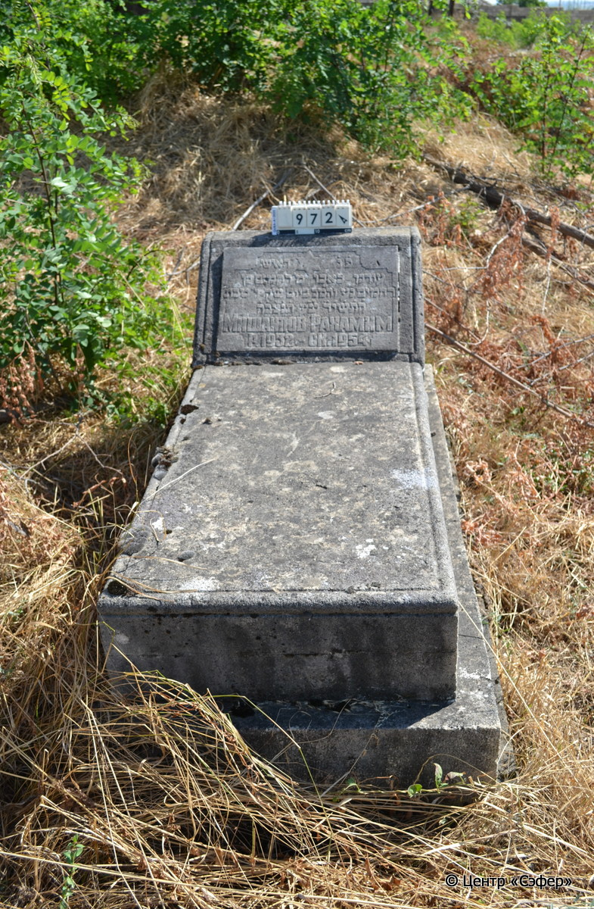
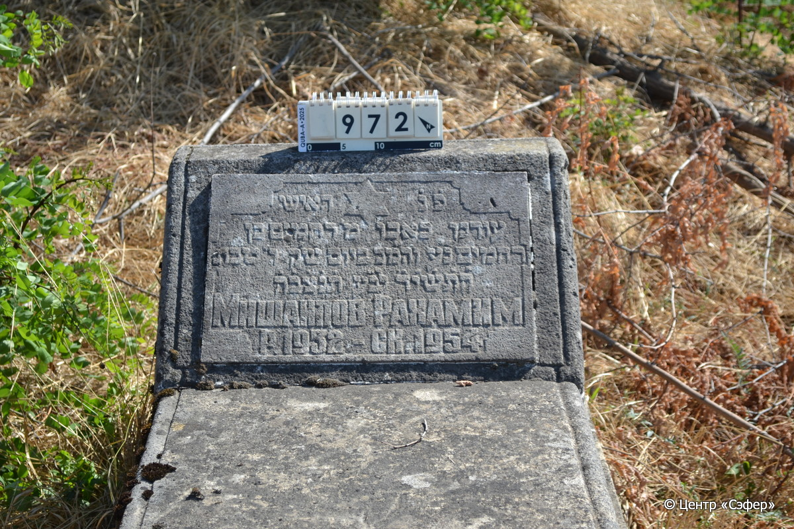
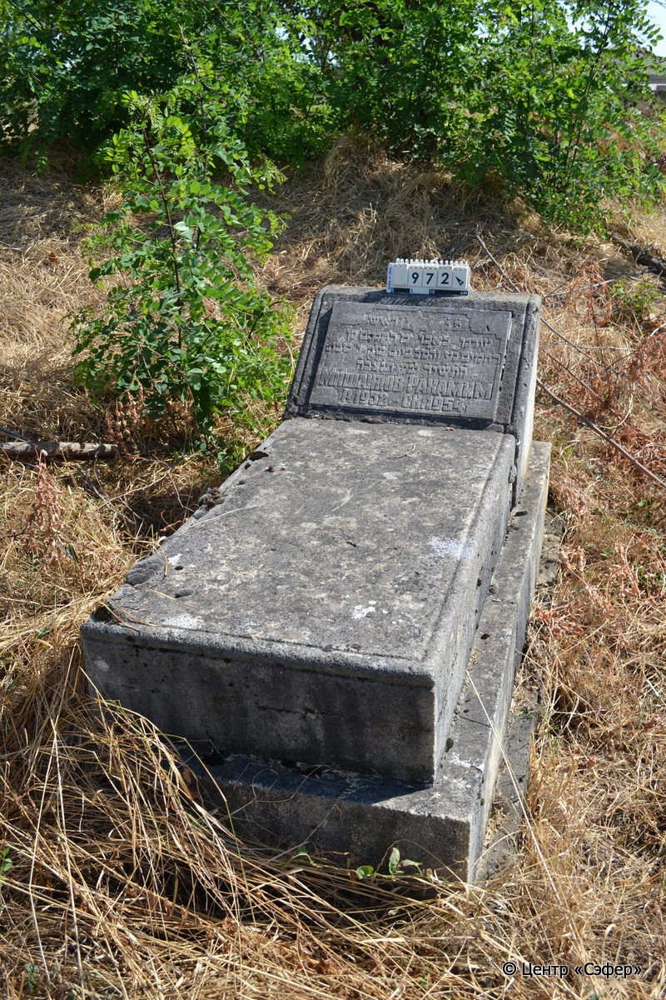

::: {style="font-size: 1em; margin-bottom: 1.2em"}
[Куба (центральное)](../cemeteries/QBA.html) > QBA0972
:::

```{r}
suppressPackageStartupMessages(library(tidyverse))
```


:::: {.columns}

::: {.column width="20%"}

```{r}
#| lightbox:
#|   group: photos





```
:::

::: {.column width="5%"}
:::

::: {.column width="74%"}

::: {.name-style}
МИШАИЛОВ Рахамим, сын Рахамима (Рахамим)
:::

::: {style="font-size: 1.2em;"}
רחמים בן רחמים
:::

:::: {.columns}
::: {.column width="5%"}
{width=1.3em}
:::

::: {.column style="width: 40%; padding-left: 0.2em;"}
-.-.1952 /  
:::

::: {.column width="5%"}
{width=1.3em}
:::

::: {.column style="width: 50%; padding-left: 0.2em;"}
-.-.1954 / 06.Te.5714
:::

::::


::: {.panel-tabset}

#### Эпитафия

```{r}
tibble(`Оригинал` = "פ֗נ֗ האיש
עודנו באבו מ׳ רחמים בן
רחמים נ׳ע והמ֗כ  ביום ש׳ק ו׳ טבת
ה֗ת֗ש֗י֗ד֗ לב׳ע ת֗נ֗צ֗ב֗ה֗
Мишаилов Рахамим
р. 1952 - ск. 1954",
       `Перевод` = "Здесь покоится
человек, сорванный еще в расцвете, г-н Рахамим, сын
Рахамима, душа его в раю, и благословен его покой. В день святой субботы, 6 тевета
5714 года от сотворения мира. Да будет душа его завязана в узле жизни.
Мишаилов Рахамим,
родился в 1952 г., скончался в 1954 г.") |>
  mutate(`Оригинал` = str_split(`Оригинал`, "
"),
         `Перевод` = str_split(`Перевод`, "
")) |>
  unnest_longer(c(`Оригинал`, `Перевод`)) |> 
  mutate(id = 1:n()) |> 
  relocate(id, .before = Перевод) |> 
  rename(` ` = id) |> 
  knitr::kable(align = c("r", "c", "l"))
```

|||
|-|---|
|**Примечания**| |
|**Язык**      |иврит, русский    |
|**Метки**     |     |
: {tbl-colwidths="[25,75]"}

#### Памятник

|||
|-|---|
|**Тип памятника**   |L-образный                                                                         |
|**Материал**        |известняк, мрамор (следы эрозии, сколы)                                                     |
|**Размеры**         |44×57×38  --- стела; 20×56×98  --- плита; 30×81×169  --- основание                                                                        |
|**Тип декора**      |                                                                         |
|**Элементы декора** |                                                                           |
|**Координаты**      |[41.37109892, 48.50994282](https://www.google.com/maps/place/41.37109892, 48.50994282)                    |
: {tbl-colwidths="[25,75]"}

#### Источник

|||
|-|---|
|**Место хранения**        |Архив полевых исследований Центра «Сэфер»     |
|**Контакты**              |students@sefer.ru    |
|**Ссылка**                |https://sfira.org        |
|**Исходный ID**           |  |
|**Условия использования** |[CC BY-NC 4.0](https://creativecommons.org/licenses/by-nc/4.0/deed.ru)     |
: {tbl-colwidths="[25,75]"}

:::

:::

::::

