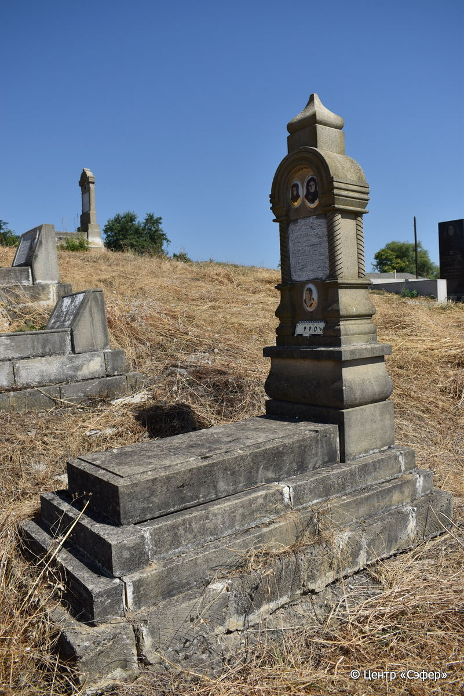
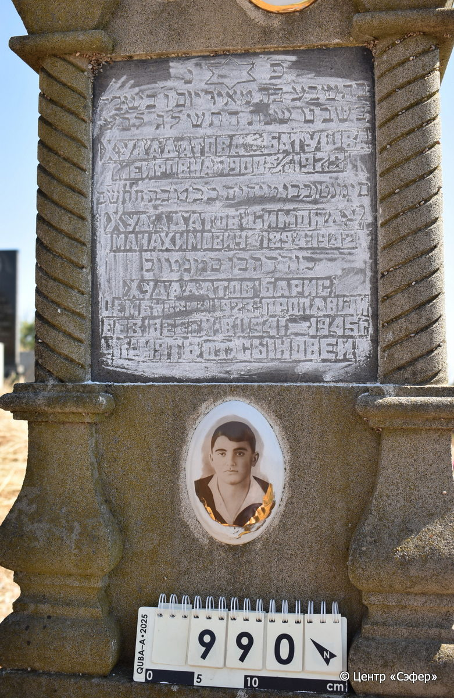

::: {style="font-size: 1em; margin-bottom: 1.2em"}
[Куба (центральное)](../cemeteries/QBA.html) > QBA0990
:::

```{r}
suppressPackageStartupMessages(library(tidyverse))
```


:::: {.columns}

::: {.column width="20%"}

```{r}
#| lightbox:
#|   group: photos




```
:::

::: {.column width="5%"}
:::

::: {.column width="74%"}

::: {.name-style}
ХУДАДАТОВА Бат-Шева, дочь Меира (Батушва Меировна)
:::

::: {style="font-size: 1.2em;"}
בתשבע בת מאיר
:::

:::: {.columns}
::: {.column width="5%"}
{width=1.3em}
:::

::: {.column style="width: 40%; padding-left: 0.2em;"}
-.-.1900 /  
:::

::: {.column width="5%"}
{width=1.3em}
:::

::: {.column style="width: 50%; padding-left: 0.2em;"}
05.01.1973 / 02.Sh.5733
:::

::::

---

::: {.name-style}
ХУДАДАТОВ Симан Тов, сын Менахема (Симонду Манахимович)
:::

::: {style="font-size: 1.2em;"}
סימנטוב בן מנחם
:::

:::: {.columns}
::: {.column width="5%"}
{width=1.3em}
:::

::: {.column style="width: 40%; padding-left: 0.2em;"}
-.-.1894 /  
:::

::: {.column width="5%"}
{width=1.3em}
:::

::: {.column style="width: 50%; padding-left: 0.2em;"}
-.-.1942 / 22.Te.5702
:::

::::

---

::: {.name-style}
ХУДАДАТОВ Худадат, сын Симана Това (Борис Семенович)
:::

::: {style="font-size: 1.2em;"}
כודדת בן סימנטוב
:::

:::: {.columns}
::: {.column width="5%"}
{width=1.3em}
:::

::: {.column style="width: 40%; padding-left: 0.2em;"}
-.-.1923 /  
:::

::: {.column width="5%"}
{width=1.3em}
:::

::: {.column style="width: 50%; padding-left: 0.2em;"}
-.-.1941/1945 /  
:::

::::


::: {.panel-tabset}

#### Эпитафия

```{r}
tibble(`Оригинал` = "פ׳נ׳
בתשבע בת מאיר יום ו׳ בשבת
ב֘ שבט שנת התשל׳ג לב֮ע
Худадатова Батушва
Меировна 1900 - 5/I 1973
סימנטוב בן מנחים כ֮ב טבת התש֮ב
Худадатов Симонду
Манахимович 1894-1942
כודדת בן סמנטוב
Худадатов Барис
Семенович 1923. пропавщи
без вести в 1941-1945 г.
память от сыновей",
       `Перевод` = "Здесь покоится
Батшева, дочь Меира. Пятница,
2 швата года 5733 от сотворения мира.
Худадатова Батушва
Меировна 1900 - 5/I 1973
Симантов, сын Менахема. 22 тевета 5702 года.
Худадатов Симонду
Манахимович 1894-1942.
Худадат, сын Симантова.
Худадатов Борис
Семенович, 1923 г. рождения, пропавший
без вести в 1941-1945 гг..
Память от сыновей.") |>
  mutate(`Оригинал` = str_split(`Оригинал`, "
"),
         `Перевод` = str_split(`Перевод`, "
")) |>
  unnest_longer(c(`Оригинал`, `Перевод`)) |> 
  mutate(id = 1:n()) |> 
  relocate(id, .before = Перевод) |> 
  rename(` ` = id) |> 
  knitr::kable(align = c("r", "c", "l"))
```

|||
|-|---|
|**Примечания**| |
|**Язык**      |иврит, русский    |
|**Метки**     |     |
: {tbl-colwidths="[25,75]"}

#### Памятник

|||
|-|---|
|**Тип памятника**   |L-образный                                                                         |
|**Материал**        |песчаник, известняк (следы эрозии,мраморная табличка для текста,три керамических медальона)                                                     |
|**Размеры**         |198×60×41  --- стела; 16×55×117  --- плита; 25×95×196  --- основание                                                                        |
|**Тип декора**      |архитектурно-орнаментальный, традиционная символика                                                                        |
|**Элементы декора** |фигурное навершие,портал с витыми полуколоннами,три фотопортрета на медальонах,звезда Давида на вставке                                                                          |
|**Координаты**      |[41.37091597, 48.50943344](https://www.google.com/maps/place/41.37091597, 48.50943344)                    |
: {tbl-colwidths="[25,75]"}

#### Источник

|||
|-|---|
|**Место хранения**        |Архив полевых исследований Центра «Сэфер»     |
|**Контакты**              |students@sefer.ru    |
|**Ссылка**                |https://sfira.org        |
|**Исходный ID**           |  |
|**Условия использования** |[CC BY-NC 4.0](https://creativecommons.org/licenses/by-nc/4.0/deed.ru)     |
: {tbl-colwidths="[25,75]"}

:::

:::

::::

