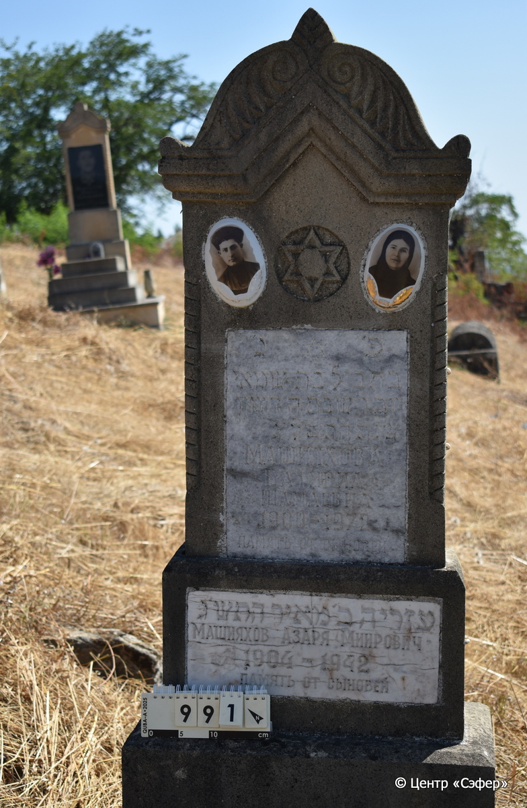
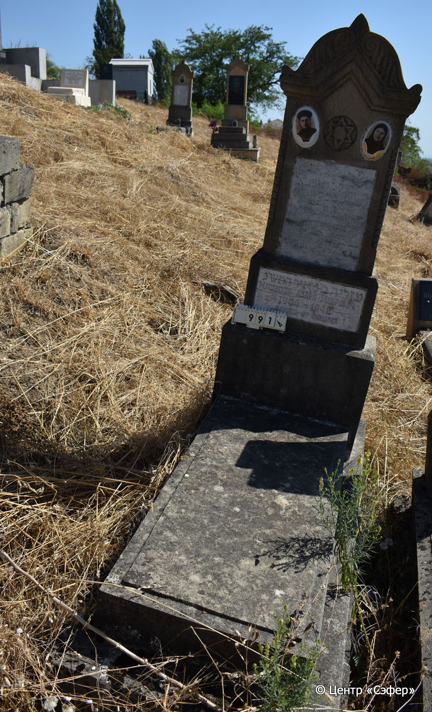

::: {style="font-size: 1em; margin-bottom: 1.2em"}
[Куба (центральное)](../cemeteries/QBA.html) > QBA0991
:::

```{r}
suppressPackageStartupMessages(library(tidyverse))
```


:::: {.columns}

::: {.column width="20%"}

```{r}
#| lightbox:
#|   group: photos




```
:::

::: {.column width="5%"}
:::

::: {.column width="74%"}

::: {.name-style}
МАШИЯХОВА Батвил, дочь Шамая (Бативил Шамаевна)
:::

::: {style="font-size: 1.2em;"}
בתביל בת שמאי
:::

:::: {.columns}
::: {.column width="5%"}
{width=1.3em}
:::

::: {.column style="width: 40%; padding-left: 0.2em;"}
-.-.1900 /  
:::

::: {.column width="5%"}
{width=1.3em}
:::

::: {.column style="width: 50%; padding-left: 0.2em;"}
-.-.1972 / 05.Ch.5733
:::

::::

---

::: {.name-style}
МАШИЯХОВ Азарья, сын Меира (Азаря Миирович)
:::

::: {style="font-size: 1.2em;"}
עזריה בן מאיר
:::

:::: {.columns}
::: {.column width="5%"}
{width=1.3em}
:::

::: {.column style="width: 40%; padding-left: 0.2em;"}
-.-.1904 /  
:::

::: {.column width="5%"}
{width=1.3em}
:::

::: {.column style="width: 50%; padding-left: 0.2em;"}
-.-.1942 / 
:::

::::


::: {.panel-tabset}

#### Эпитафия

```{r}
tibble(`Оригинал` = "сверху
פ׳ נ׳
בתביל  בת שמאי
יום ו׳ שבת ה׳ חשון 
שנת התשל׳ג
Машияхова
Бативил
Шамаевна
1900-1972
память от сыновей

снизу
עזריה ב׳ מאיר התש׳ג 
Машияхов Азаря Миирович
1904-1942
память от сыновей",
       `Перевод` = "
Здесь покоится
Батвиль, дочь Шамая.
Пятница, 5 хешвана
года 5733.
Машияхова
Бативил
Шамаевна
1900-1972
память от сыновей

 
Азарья, сын Меира. 5703 год.
Машияхов Азаря Миирович
1904-1942
память от сыновей.") |>
  mutate(`Оригинал` = str_split(`Оригинал`, "
"),
         `Перевод` = str_split(`Перевод`, "
")) |>
  unnest_longer(c(`Оригинал`, `Перевод`)) |> 
  mutate(id = 1:n()) |> 
  relocate(id, .before = Перевод) |> 
  rename(` ` = id) |> 
  knitr::kable(align = c("r", "c", "l"))
```

|||
|-|---|
|**Примечания**| |
|**Язык**      |иврит, русский    |
|**Метки**     |     |
: {tbl-colwidths="[25,75]"}

#### Памятник

|||
|-|---|
|**Тип памятника**   |L-образный                                                                         |
|**Материал**        |песчаник, известняк (следы эрозии,две мраморные вставки,керамические медальоны)                                                     |
|**Размеры**         |158×60×31  --- стела; 13×53×115  --- плита; 18×71×171  --- основание                                                                        |
|**Тип декора**      |архитектурно-орнаментальный, растительный, традиционная символика                                                                        |
|**Элементы декора** |фигурное завершение с волютами и растительным орнаментом,конек,звезда Давида в нише,витые полуколонны, звезда Давида на вставке                                                                          |
|**Координаты**      |[41.37087566, 48.50944962](https://www.google.com/maps/place/41.37087566, 48.50944962)                    |
: {tbl-colwidths="[25,75]"}

#### Источник

|||
|-|---|
|**Место хранения**        |Архив полевых исследований Центра «Сэфер»     |
|**Контакты**              |students@sefer.ru    |
|**Ссылка**                |https://sfira.org        |
|**Исходный ID**           |  |
|**Условия использования** |[CC BY-NC 4.0](https://creativecommons.org/licenses/by-nc/4.0/deed.ru)     |
: {tbl-colwidths="[25,75]"}

:::

:::

::::

