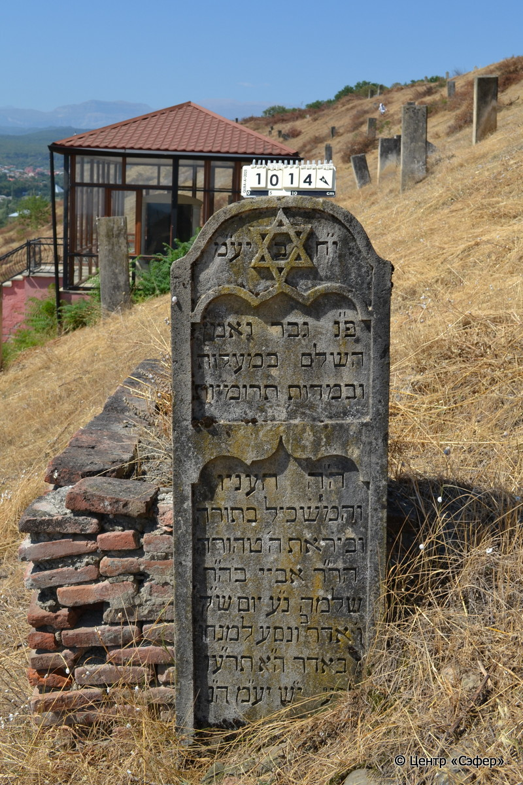
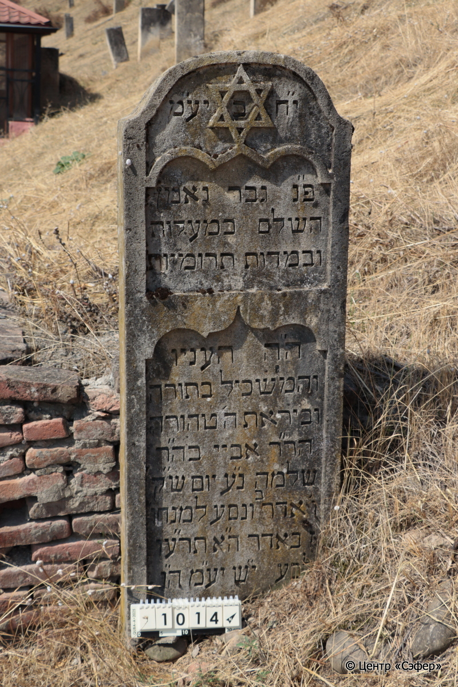
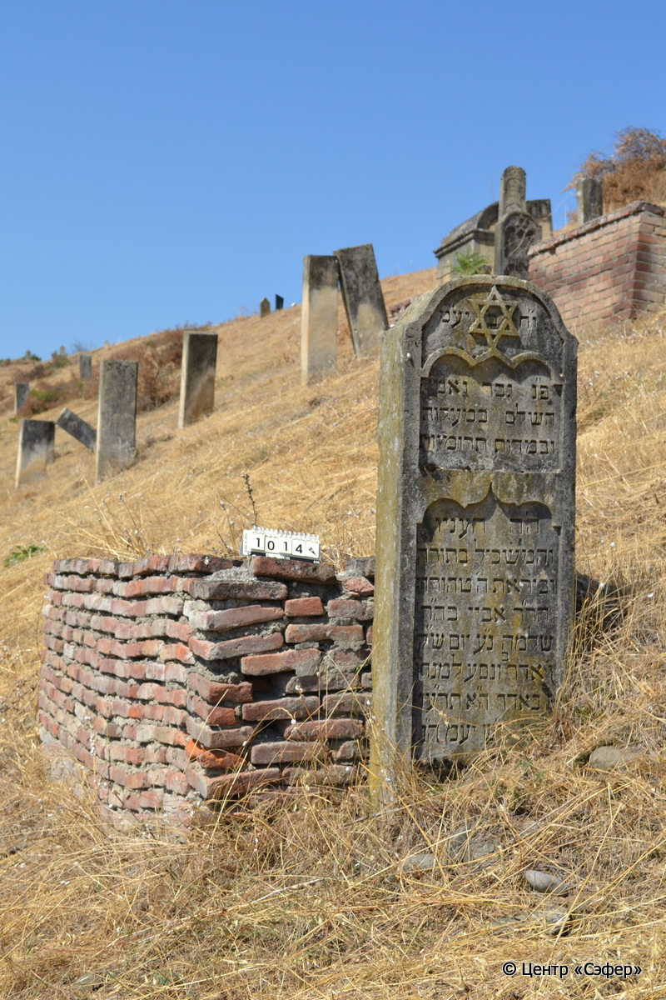

::: {style="font-size: 1em; margin-bottom: 1.2em"}
[Куба (центральное)](../cemeteries/QBA.html) > QBA1014
:::

```{r}
suppressPackageStartupMessages(library(tidyverse))
```


:::: {.columns}

::: {.column width="20%"}

```{r}
#| lightbox:
#|   group: photos





```
:::

::: {.column width="5%"}
:::

::: {.column width="74%"}

::: {.name-style}
Абай, сын Шломо
:::

::: {style="font-size: 1.2em;"}
אביי בן שלמה
:::

:::: {.columns}
::: {.column width="5%"}
{width=1.3em}
:::

::: {.column style="width: 40%; padding-left: 0.2em;"}
  /  
:::

::: {.column width="5%"}
{width=1.3em}
:::

::: {.column style="width: 50%; padding-left: 0.2em;"}
11.03.1916* / 06.Ad2.5676
:::

::::


::: {.panel-tabset}

#### Эпитафия

```{r}
tibble(`Оригинал` = "י״ח ב׳ יע״מ
פ״נ גבר נאמן 
השלם במעלות
ובמדות תרומיות
ה׳ה העניו 
והמשכיל בתורה
וביראת ה׳ טהורה
הר׳ר אביי בה״ר
שלמה נ״ע יום ש״ק
ו׳ אדר ב׳ ונסע למנוחו׳
ז׳ אדר ה״א תרע״ו
לב׳ע י״ש יע״מ ה״נ",
       `Перевод` = "Пусть торжествуют праведники во славе и радуются на ложах своих.
Здесь покоится верный мужчина,
совершенный в добродетелях и 
благородных качествах,
г-н скромный
и просвещённый в Торе,
и искренне богобоязненный,
р. Абай, сын р.
Шломо, душа его в раю. <Скончался> в день святой субботы,
6 адара-II, и отправился в последний путь 
7 адара 5676 года
от сотворения мира. Он обретёт покой! Те, кто идёт путем прямым, возлягут и отдохнут") |>
  mutate(`Оригинал` = str_split(`Оригинал`, "
"),
         `Перевод` = str_split(`Перевод`, "
")) |>
  unnest_longer(c(`Оригинал`, `Перевод`)) |> 
  mutate(id = 1:n()) |> 
  relocate(id, .before = Перевод) |> 
  rename(` ` = id) |> 
  knitr::kable(align = c("r", "c", "l"))
```

|||
|-|---|
|**Примечания**| |
|**Язык**      |иврит    |
|**Метки**     |знаток Писания    |
: {tbl-colwidths="[25,75]"}

#### Памятник

|||
|-|---|
|**Тип памятника**   |L-образный                                                                         |
|**Материал**        |известняк, кирпич (полуразрушенный саркофаг из кирпича; на известняковой стеле следы эрозии и цементного раствора)                                                     |
|**Размеры**         |145×50×19  --- стела; 78×101×260  --- саркофаг                                                                        |
|**Тип декора**      |архитектурно-орнаментальный, традиционная символика                                                                        |
|**Элементы декора** |полукруглое завершение с плечиками; звезда Давида; фигурные ниши для текста                                                                          |
|**Координаты**      |[41.37064741, 48.50909266](https://www.google.com/maps/place/41.37064741, 48.50909266)                    |
: {tbl-colwidths="[25,75]"}

#### Источник

|||
|-|---|
|**Место хранения**        |Архив полевых исследований Центра «Сэфер»     |
|**Контакты**              |students@sefer.ru    |
|**Ссылка**                |https://sfira.org        |
|**Исходный ID**           |  |
|**Условия использования** |[CC BY-NC 4.0](https://creativecommons.org/licenses/by-nc/4.0/deed.ru)     |
: {tbl-colwidths="[25,75]"}

:::

:::

::::

