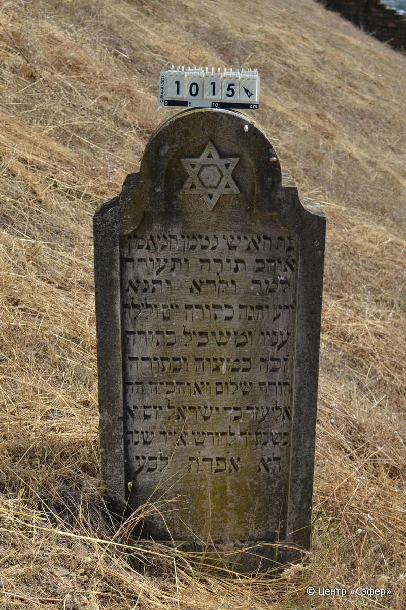
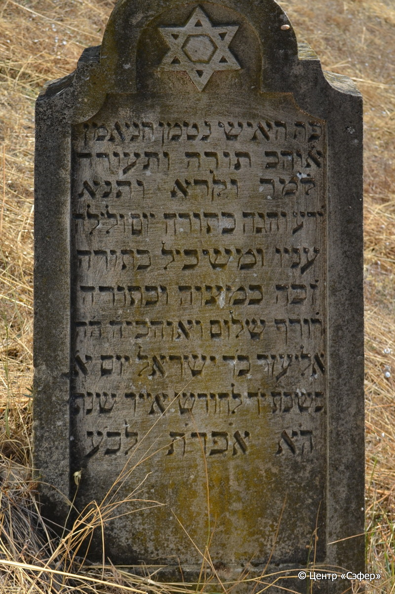

::: {style="font-size: 1em; margin-bottom: 1.2em"}
[Куба (центральное)](../cemeteries/QBA.html) > QBA1015
:::

```{r}
suppressPackageStartupMessages(library(tidyverse))
```


:::: {.columns}

::: {.column width="20%"}

```{r}
#| lightbox:
#|   group: photos




```
:::

::: {.column width="5%"}
:::

::: {.column width="74%"}

::: {.name-style}
Элиэзер, сын Исраэля
:::

::: {style="font-size: 1.2em;"}
אליעזר בן ישראל
:::

:::: {.columns}
::: {.column width="5%"}
{width=1.3em}
:::

::: {.column style="width: 40%; padding-left: 0.2em;"}
  /  
:::

::: {.column width="5%"}
{width=1.3em}
:::

::: {.column style="width: 50%; padding-left: 0.2em;"}
22.05.1921* / 14.Iy.5681
:::

::::


::: {.panel-tabset}

#### Эпитафия

```{r}
tibble(`Оригинал` = "פה האיש נטמן הנאמן
אוהב תורה ותעודה
למד וקרא ותנא
ידע והגה כתורה יום ולילה
עניו ומשכיל בתורה
זכה במצוה ובתודה
רודף שלום ואוהב יה׳ ה׳ה
אליעזר בר ישראל יום א׳
בשבת יד לחודש אייר שנת
ה׳א אפרת לב׳ע",
       `Перевод` = "Здесь покоится человек верный,
любящий Тору и учение*,
учился и читал и повторял,
знал и поступал по <закону> Тору денно и нощно,
скромный и просвещённый в Торе,
преуспел в заповедях и в учении,
стремился к миру и любил Всевышнего, г-н
Элиэзер, сын р. Исраэля. Воскресенье,
14 число месяца ияр года
5681 от сотворения мира.") |>
  mutate(`Оригинал` = str_split(`Оригинал`, "
"),
         `Перевод` = str_split(`Перевод`, "
")) |>
  unnest_longer(c(`Оригинал`, `Перевод`)) |> 
  mutate(id = 1:n()) |> 
  relocate(id, .before = Перевод) |> 
  rename(` ` = id) |> 
  knitr::kable(align = c("r", "c", "l"))
```

|||
|-|---|
|**Примечания**|*Цит. Ис 20:8|
|**Язык**      |иврит    |
|**Метки**     |знаток Писания    |
: {tbl-colwidths="[25,75]"}

#### Памятник

|||
|-|---|
|**Тип памятника**   |стела                                                                         |
|**Материал**        |известняк (следы эрозии)                                                     |
|**Размеры**         |127×50×17  --- стела                                                                        |
|**Тип декора**      |архитектурно-орнаментальный, традиционная символика                                                                        |
|**Элементы декора** |полукруглое завершение с вогнутыми плечиками; фигурная ниша для текста; звезда Давида                                                                          |
|**Координаты**      |[41.37062569, 48.50911658](https://www.google.com/maps/place/41.37062569, 48.50911658)                    |
: {tbl-colwidths="[25,75]"}

#### Источник

|||
|-|---|
|**Место хранения**        |Архив полевых исследований Центра «Сэфер»     |
|**Контакты**              |students@sefer.ru    |
|**Ссылка**                |https://sfira.org        |
|**Исходный ID**           |  |
|**Условия использования** |[CC BY-NC 4.0](https://creativecommons.org/licenses/by-nc/4.0/deed.ru)     |
: {tbl-colwidths="[25,75]"}

:::

:::

::::

