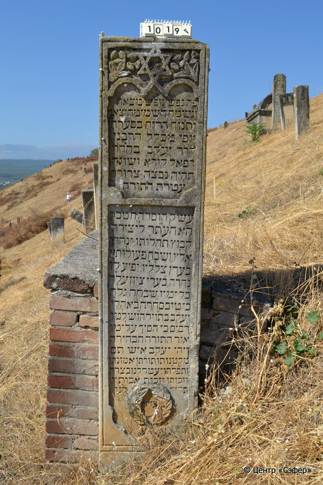
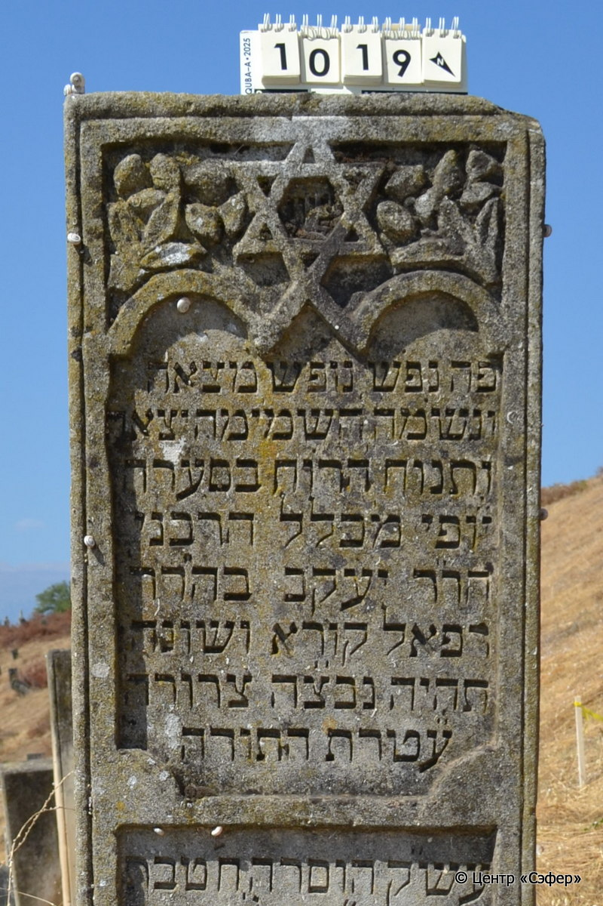
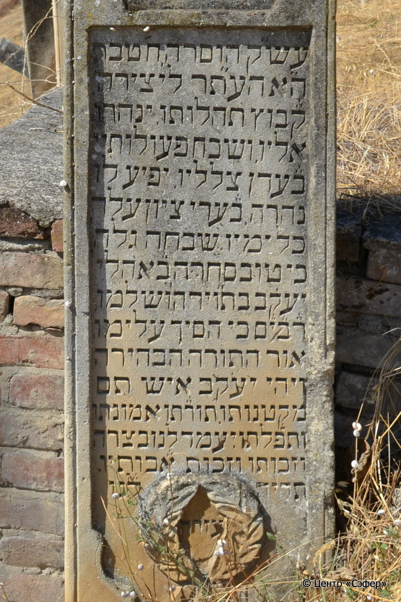
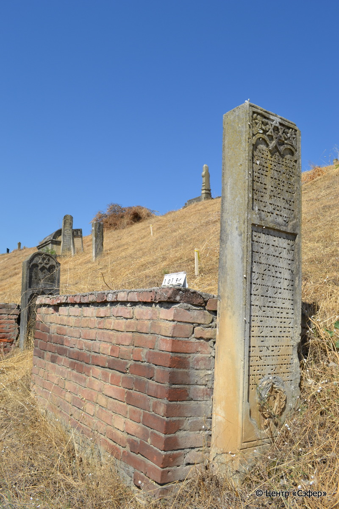

::: {style="font-size: 1em; margin-bottom: 1.2em"}
[Куба (центральное)](../cemeteries/QBA.html) > QBA1019
:::

```{r}
suppressPackageStartupMessages(library(tidyverse))
```


:::: {.columns}

::: {.column width="20%"}

```{r}
#| lightbox:
#|   group: photos






```
:::

::: {.column width="5%"}
:::

::: {.column width="74%"}

::: {.name-style}
Яаков, сын Рафаэля
:::

::: {style="font-size: 1.2em;"}
יעקב בן רפאל
:::

:::: {.columns}
::: {.column width="5%"}
{width=1.3em}
:::

::: {.column style="width: 40%; padding-left: 0.2em;"}
  /  
:::

::: {.column width="5%"}
{width=1.3em}
:::

::: {.column style="width: 50%; padding-left: 0.2em;"}
25.12.1914* / 08.Te.5675
:::

::::


::: {.panel-tabset}

#### Эпитафия

```{r}
tibble(`Оригинал` = "ציון
פה נפש נופש מצאה
ונשמה השמימה יצאה
ותנוח הרוח בסערה
י֗ופי מכלל* הרבני
הר׳ר יעקב בהר׳ר
רפאל קורא ושונה
תהיה נב״צה צרורה
ע֗טרת התורה
עש״ק הוסרה, ח׳ טבת
ה״א הע״תר לי֗צירה.
ק֗בוץ תהלותו. ינהרו
אליו, ושבח פעולותיו
ב֗עדן צלליו. יפיע לו
נהרה, ב֗ערי ציון עלה
כל ימיו. שבחה גלה
כי טוב סחרה** ב֗אהלי 
יעק֗ב בת״וירה ושלמו
ר֗ב֗י֗ם כי הסיך עלימו
אור התורה הבהירה
ויהי יעקב איש תם
מקטנותו תור֗תו אמונתו
ותפלתו יִעמד לנו בצרה
וזכותו וזכות א֗בותיו
תהיה עזרה ל֗נו",
       `Перевод` = "Знак.
Здесь душа нашла отдохновение,
и душа отошла на небо,
и отдохнет дух от бурь,
совершенство красоты, ученый,
наш великий рав, р. Яаков, сын нашего великого рава
Рафаэля, усердно читал и толковал <Писание>. 
Да будет душа его в узле жизни связана,
венец Торы
в канун святой субботы был сорван, 8 тевета
5675 от сотворения мира.
Вся его слава изольется
на него, и прославятся его деяния
в райской сени. Явится ему
сияние, и в города Сиона возносился он
во все дни свои. Алкал благословения,
ибо обретение его приносит благо в шатрах
Иакова. Любовь к Торе, богобоязненность и миролюбие
его велики, ибо он проливал на день свой
свет сияние Торы,
и да пребудет Яаков, человек честный
в своей скромности, учении, вере
и молитве, и да заступится за нас в беде,
и память его и предков его
будет нам в помощь.") |>
  mutate(`Оригинал` = str_split(`Оригинал`, "
"),
         `Перевод` = str_split(`Перевод`, "
")) |>
  unnest_longer(c(`Оригинал`, `Перевод`)) |> 
  mutate(id = 1:n()) |> 
  relocate(id, .before = Перевод) |> 
  rename(` ` = id) |> 
  knitr::kable(align = c("r", "c", "l"))
```

|||
|-|---|
|**Примечания**|*Псалмы 50:2
נב״צה צרורה =  נפשו בצרור החיים צרורה
**Притчи 3:14|
|**Язык**      |иврит    |
|**Метки**     |раввин    |
: {tbl-colwidths="[25,75]"}

#### Памятник

|||
|-|---|
|**Тип памятника**   |L-образный                                                                         |
|**Материал**        |известняк, бетон, кирпич (следы эрозии и цементного раствора; трещины)                                                     |
|**Размеры**         |192×44×21  --- стела; 113×110×235  --- саркофаг                                                                        |
|**Тип декора**      |архитектурно-орнаментальный, растительный, традиционная символика                                                                        |
|**Элементы декора** |звезда Давида в обрамлении растительных элементов; фигурные ниши для текста; две ветви у основания стелы!                                                                          |
|**Координаты**      |[41.37066263, 48.50898758](https://www.google.com/maps/place/41.37066263, 48.50898758)                    |
: {tbl-colwidths="[25,75]"}

#### Источник

|||
|-|---|
|**Место хранения**        |Архив полевых исследований Центра «Сэфер»     |
|**Контакты**              |students@sefer.ru    |
|**Ссылка**                |https://sfira.org        |
|**Исходный ID**           |  |
|**Условия использования** |[CC BY-NC 4.0](https://creativecommons.org/licenses/by-nc/4.0/deed.ru)     |
: {tbl-colwidths="[25,75]"}

:::

:::

::::

