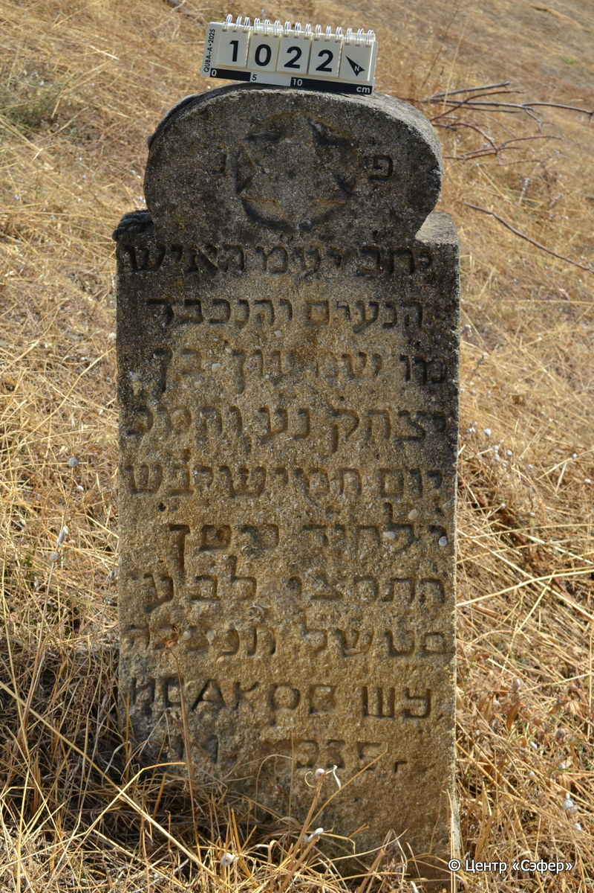
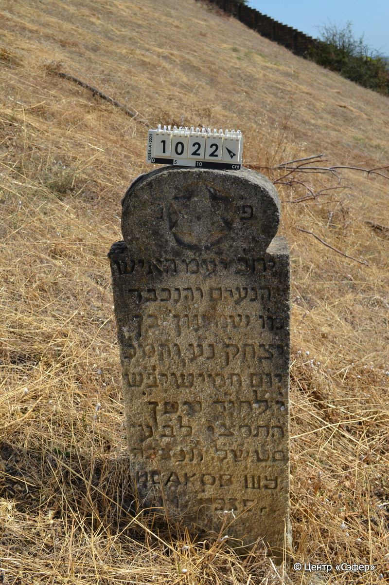

::: {style="font-size: 1em; margin-bottom: 1.2em"}
[Куба (центральное)](../cemeteries/QBA.html) > QBA1022
:::

```{r}
suppressPackageStartupMessages(library(tidyverse))
```


:::: {.columns}

::: {.column width="20%"}

```{r}
#| lightbox:
#|   group: photos




```
:::

::: {.column width="5%"}
:::

::: {.column width="74%"}

::: {.name-style}
ИСАКОВ Шимон, сын Ицхака (Шумун)
:::

::: {style="font-size: 1.2em;"}
שמעון בן יצחק
:::

:::: {.columns}
::: {.column width="5%"}
{width=1.3em}
:::

::: {.column style="width: 40%; padding-left: 0.2em;"}
  /  
:::

::: {.column width="5%"}
{width=1.3em}
:::

::: {.column style="width: 50%; padding-left: 0.2em;"}
-.-.1935 / 10.Ni.5696
:::

::::


::: {.panel-tabset}

#### Эпитафия

```{r}
tibble(`Оригинал` = "פ׳נ׳
יח״ב יע״מ האיש
הנעים והנכבד
מו׳ שמעון בן
יצחק נ֗ע֗ והמ׳כ
יום חמישי בש׳
י׳ לחוד׳ ניסן
התרצו לב֗ע֗
ס׳ט׳ש׳ל׳ תנצבה
ИСАКОВ ШУ
УМ 1935",
       `Перевод` = "Здесь покоится.
Пусть торжествует праведник во славе и радуется на ложе своем, человек
приятный и уважаемый,
г-н Шимон, сын
Ицхака, душа его в раю и благословен его покой.
Четверг, 
10 число месяца нисан
5696 года от сотворения мира. 
[Добрый знак, благословление Господу]. Да будет душа его завязана в узле жизни.
Исаков Шумун.
Умер в 1935 году.") |>
  mutate(`Оригинал` = str_split(`Оригинал`, "
"),
         `Перевод` = str_split(`Перевод`, "
")) |>
  unnest_longer(c(`Оригинал`, `Перевод`)) |> 
  mutate(id = 1:n()) |> 
  relocate(id, .before = Перевод) |> 
  rename(` ` = id) |> 
  knitr::kable(align = c("r", "c", "l"))
```

|||
|-|---|
|**Примечания**| |
|**Язык**      |иврит, русский    |
|**Метки**     |     |
: {tbl-colwidths="[25,75]"}

#### Памятник

|||
|-|---|
|**Тип памятника**   |стела                                                                         |
|**Материал**        |ракушечник (следы эрозии, сколы)                                                     |
|**Размеры**         |110×40×11                                                                        |
|**Тип декора**      |архитектурно-орнаментальный, традиционная символика                                                                        |
|**Элементы декора** |полукруглое завершение с плечиками, звезда Давида в круглой нише                                                                          |
|**Координаты**      |[41.37054638, 48.50904737](https://www.google.com/maps/place/41.37054638, 48.50904737)                    |
: {tbl-colwidths="[25,75]"}

#### Источник

|||
|-|---|
|**Место хранения**        |Архив полевых исследований Центра «Сэфер»     |
|**Контакты**              |students@sefer.ru    |
|**Ссылка**                |https://sfira.org        |
|**Исходный ID**           |  |
|**Условия использования** |[CC BY-NC 4.0](https://creativecommons.org/licenses/by-nc/4.0/deed.ru)     |
: {tbl-colwidths="[25,75]"}

:::

:::

::::

