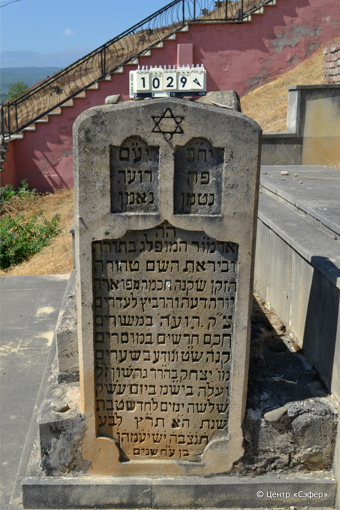
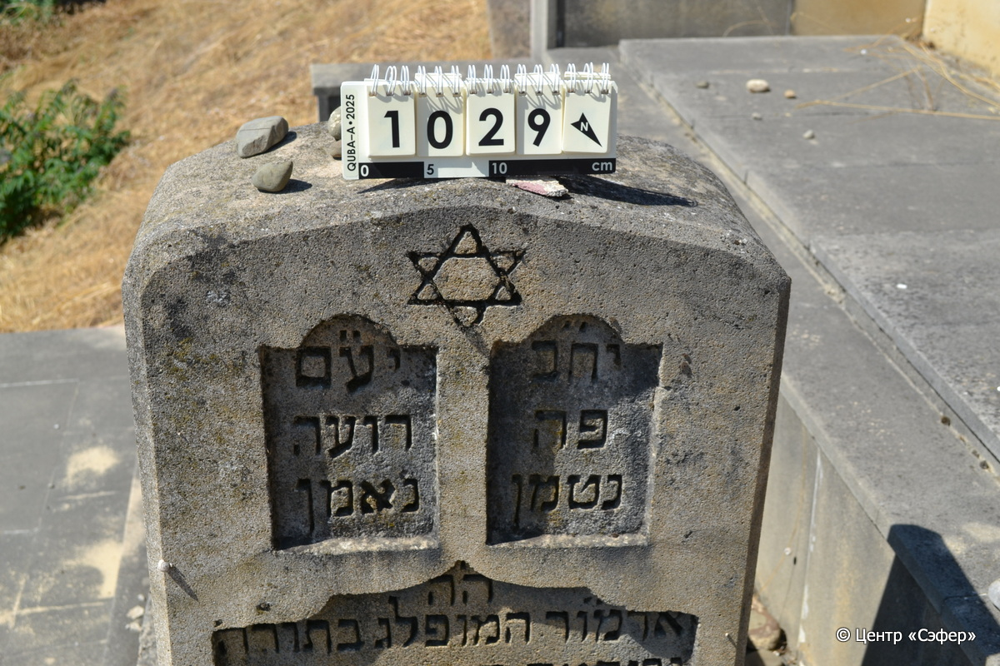
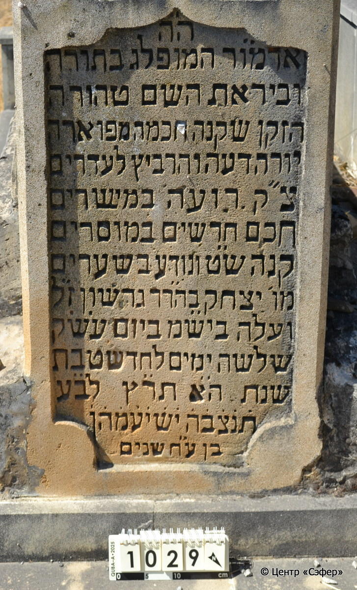
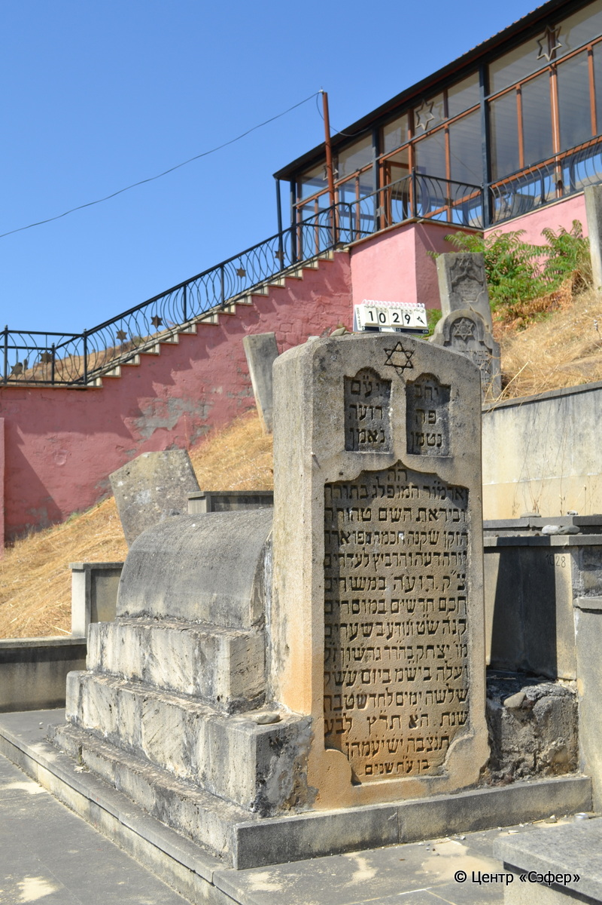

::: {style="font-size: 1em; margin-bottom: 1.2em"}
[Куба (центральное)](../cemeteries/QBA.html) > QBA1029
:::

```{r}
suppressPackageStartupMessages(library(tidyverse))
```


:::: {.columns}

::: {.column width="20%"}

```{r}
#| lightbox:
#|   group: photos






```
:::

::: {.column width="5%"}
:::

::: {.column width="74%"}

::: {.name-style}
Ицхак, сын Гершона
:::

::: {style="font-size: 1.2em;"}
יצחק בן גרשון
:::

:::: {.columns}
::: {.column width="5%"}
{width=1.3em}
:::

::: {.column style="width: 40%; padding-left: 0.2em;"}
  /  
:::

::: {.column width="5%"}
{width=1.3em}
:::

::: {.column style="width: 50%; padding-left: 0.2em;"}
03.01.1930* / 03.Te.5690
:::

::::


::: {.panel-tabset}

#### Эпитафия

```{r}
tibble(`Оригинал` = "יח״ב יע״מ
פה רועה
נטמן נאמן
ה׳ה׳
אדמ֗ו֗ר המופלג בתורה
וביראת השם טהורה
הזקן שקנה חכמה מפוארה
יורה דעה והרביץ לעדרים
צ״ק רועה במישרים
חכם חרשים* במוסרים
קנה ש״ט ונודע בשערים**
מו׳ יצחק בהר׳ר גרשון ז״ל
ועלה ביש״מ ביום ע׳ש׳ק׳
שלשה ימים לחדש טבת
שנת ה׳א תר֗ץ לב֗ע֗
ת֗נ֗צ֗ב֗ה֗ י֗ש֗י֗ע֗מ֗ה֗ן֗
בן ע״ח שנים",
       `Перевод` = "Пусть торжествуют праведники во славе и радуются на ложах своих.
Здесь пастырь
сокрыт верный,
г-н,
великий учитель, выдающийся в Торе
и в чистом страхе перед Богом,
старец, стяжавший великолепную мудрость,
наставлял знаниями и просвещал общины,
праведник, ведущий прямо,
мудрец среди кудесников, в наставлениях
стяжал доброе имя и был известен во вратах,
г-н Ицхак, сын р. Гершона, благословенной памяти,
и поднялся в небесную обитель в канун святой субботы
третьего числа месяца тевет
года 5690 от сотворения мира.
Да будет его душа связана в узле жизни. Он обретёт покой! Те, кто идёт путем прямым, возлягут и отдохнут.
Ему было 78 лет.") |>
  mutate(`Оригинал` = str_split(`Оригинал`, "
"),
         `Перевод` = str_split(`Перевод`, "
")) |>
  unnest_longer(c(`Оригинал`, `Перевод`)) |> 
  mutate(id = 1:n()) |> 
  relocate(id, .before = Перевод) |> 
  rename(` ` = id) |> 
  knitr::kable(align = c("r", "c", "l"))
```

|||
|-|---|
|**Примечания**|*Цит. Исайя 3:3
**Цит. Притчи 31:23

Ицхак, сын р. Герошона Мизрахи – духовный лидер общины, глава релизиозного суда и раввин Кубы в 1905–1930 гг.|
|**Язык**      |иврит    |
|**Метки**     |раввин, знаток Писания, благородное происхождение, судья    |
: {tbl-colwidths="[25,75]"}

#### Памятник

|||
|-|---|
|**Тип памятника**   |L-образный                                                                         |
|**Материал**        |природный камень, известняк (трещины, цементный раствор, следы эрозии, сколы)                                                     |
|**Размеры**         |120×52×24  --- стела; 57×73×140  --- Саркофаг; 30×98×192  --- основание                                                                        |
|**Тип декора**      |архитектурно-орнаментальный, традиционная символика                                                                        |
|**Элементы декора** |треугольное завершение со скругленными углами, три фигурные ниши для текста                                                                          |
|**Координаты**      |[41.37048908, 48.50903442](https://www.google.com/maps/place/41.37048908, 48.50903442)                    |
: {tbl-colwidths="[25,75]"}

#### Источник

|||
|-|---|
|**Место хранения**        |Архив полевых исследований Центра «Сэфер»     |
|**Контакты**              |students@sefer.ru    |
|**Ссылка**                |https://sfira.org        |
|**Исходный ID**           |  |
|**Условия использования** |[CC BY-NC 4.0](https://creativecommons.org/licenses/by-nc/4.0/deed.ru)     |
: {tbl-colwidths="[25,75]"}

:::

:::

::::

