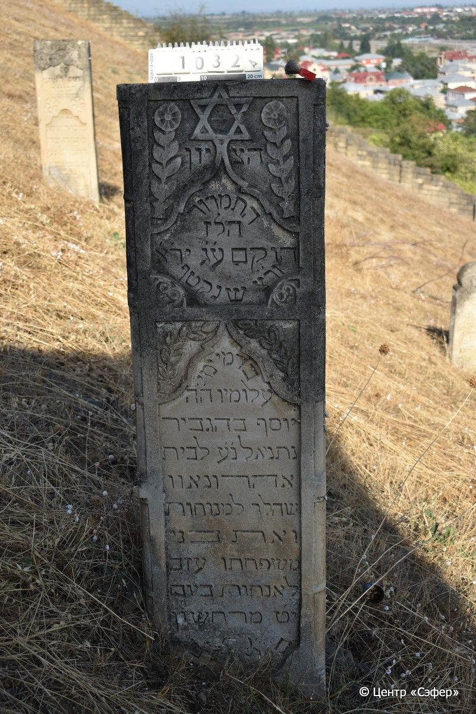

::: {style="font-size: 1em; margin-bottom: 1.2em"}
[Куба (центральное)](../cemeteries/QBA.html) > QBA1032
:::

```{r}
suppressPackageStartupMessages(library(tidyverse))
```


:::: {.columns}

::: {.column width="20%"}

```{r}
#| lightbox:
#|   group: photos



```
:::

::: {.column width="5%"}
:::

::: {.column width="74%"}

::: {.name-style}
Йосеф, сын Натаниэля
:::

::: {style="font-size: 1.2em;"}
יוסף בן נתנאל
:::

:::: {.columns}
::: {.column width="5%"}
{width=1.3em}
:::

::: {.column style="width: 40%; padding-left: 0.2em;"}
  /  
:::

::: {.column width="5%"}
{width=1.3em}
:::

::: {.column style="width: 50%; padding-left: 0.2em;"}
08.11.1914* / 19.Ch.5675
:::

::::


::: {.panel-tabset}

#### Эпитафия

```{r}
tibble(`Оригинал` = "הציון
התמרור
הלז
הוקם ע׳ג׳ י׳ר׳א׳
ור׳צ׳ שנקטף
בדמי ימי
עלומיו ה״ה
יוסף בהגביר
נתנאל נ׳ע׳ לבית
אהרונאוו
שהלך למנוחות
ואת בני
משפחתו עזב
לאנחות ביום
י׳ט מרחשון
ה֗ע֗ת֗ר֗ תנצבה",
       `Перевод` = "Знак
скорби
сей
воздвигнут над телом богобоязненного
и стремящегося к правде, который был сорван
во цвете дней
его юности, г-н
Йосеф, сын благородного
Нетанеля, душа его поднялась в дом вечности.
Агарунов,
который ушел на покой
и свою
семью покинул
воздыхать в день
19 мархешвана
675 года. Да будет душа его завязана в узле жизни.") |>
  mutate(`Оригинал` = str_split(`Оригинал`, "
"),
         `Перевод` = str_split(`Перевод`, "
")) |>
  unnest_longer(c(`Оригинал`, `Перевод`)) |> 
  mutate(id = 1:n()) |> 
  relocate(id, .before = Перевод) |> 
  rename(` ` = id) |> 
  knitr::kable(align = c("r", "c", "l"))
```

|||
|-|---|
|**Примечания**| |
|**Язык**      |иврит    |
|**Метки**     |     |
: {tbl-colwidths="[25,75]"}

#### Памятник

|||
|-|---|
|**Тип памятника**   |стела                                                                         |
|**Материал**        |песчаник (следы эрозии, сколы)                                                     |
|**Размеры**         |146×44×20                                                                        |
|**Тип декора**      |архитектурно-орнаментальный, растительный, традиционная символика                                                                        |
|**Элементы декора** |две фигурные ниши для текста, цветочный орнамент, звезда Давида, грани стелы с лицевой стороны фигурно оформлены                                                                          |
|**Координаты**      |[41.37055151, 48.50896585](https://www.google.com/maps/place/41.37055151, 48.50896585)                    |
: {tbl-colwidths="[25,75]"}

#### Источник

|||
|-|---|
|**Место хранения**        |Архив полевых исследований Центра «Сэфер»     |
|**Контакты**              |students@sefer.ru    |
|**Ссылка**                |https://sfira.org        |
|**Исходный ID**           |  |
|**Условия использования** |[CC BY-NC 4.0](https://creativecommons.org/licenses/by-nc/4.0/deed.ru)     |
: {tbl-colwidths="[25,75]"}

:::

:::

::::

