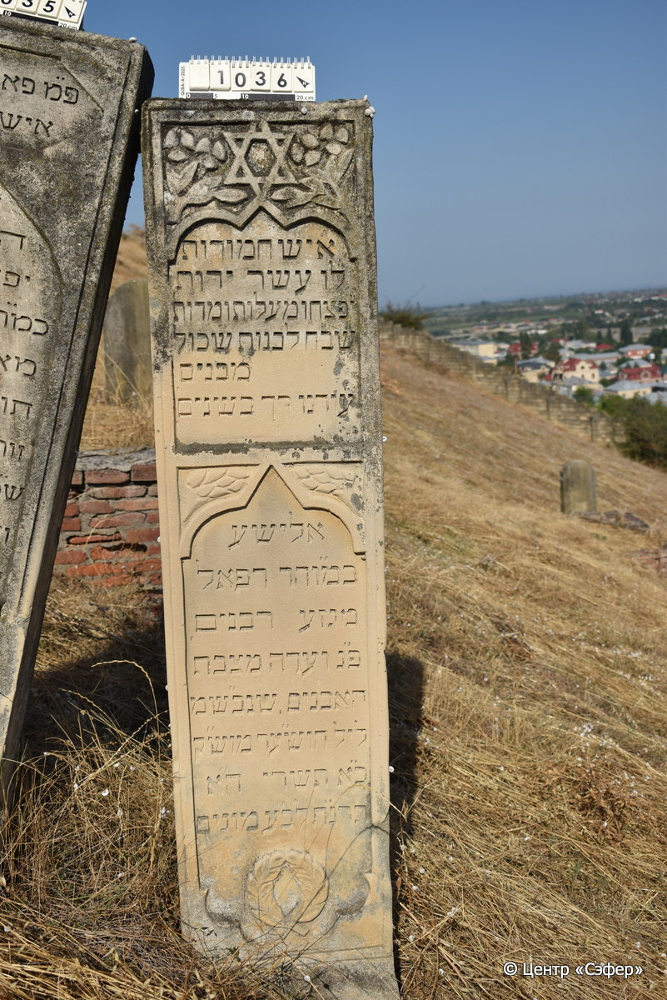

::: {style="font-size: 1em; margin-bottom: 1.2em"}
[Куба (центральное)](../cemeteries/QBA.html) > QBA1036
:::

```{r}
suppressPackageStartupMessages(library(tidyverse))
```


:::: {.columns}

::: {.column width="20%"}

```{r}
#| lightbox:
#|   group: photos



```
:::

::: {.column width="5%"}
:::

::: {.column width="74%"}

::: {.name-style}
Элиша, сын Рафаэля
:::

::: {style="font-size: 1.2em;"}
אלישע בן רפאל
:::

:::: {.columns}
::: {.column width="5%"}
{width=1.3em}
:::

::: {.column style="width: 40%; padding-left: 0.2em;"}
  /  
:::

::: {.column width="5%"}
{width=1.3em}
:::

::: {.column style="width: 50%; padding-left: 0.2em;"}
17.10.1897* / 21.Ti.5658
:::

::::


::: {.panel-tabset}

#### Эпитафия

```{r}
tibble(`Оригинал` = "א֒יש חמודות
ל֒ו עשר ידות 
י֒פצחו מעלות ומדות 
ש֒בֺח לבנות שכול 
מבנים                   
ע֒ודנו רך בשנים
אלישע 
כמו״הר רפאל
מגזע רבנים
פ״נ ועדה מצבת 
האבנים שנב״שמ 
ליל הוש״ער מו״שק
כ֗א֗ תשרי ה״א
תרנ״ח לב״ע מונים",
       `Перевод` = "Человек, 
у него словно десять рук
распространяют достоинства и благодетели,
хвала дочерям и разумнейших
из сынов,
еще юный годами,
Элиша,
сын нашего уважаемого рава Рафаэля,
из раввинского рода.
Здесь скончался, и свидетель сей знак
каменный, что был призван в небесную обитель
в ночь Хошана Раба, на исходе святой субботы,
21 тишрея
5658 года от сотворения мира считая.") |>
  mutate(`Оригинал` = str_split(`Оригинал`, "
"),
         `Перевод` = str_split(`Перевод`, "
")) |>
  unnest_longer(c(`Оригинал`, `Перевод`)) |> 
  mutate(id = 1:n()) |> 
  relocate(id, .before = Перевод) |> 
  rename(` ` = id) |> 
  knitr::kable(align = c("r", "c", "l"))
```

|||
|-|---|
|**Примечания**|Первые буквы строк образуют акростих с именем покойного.|
|**Язык**      |иврит    |
|**Метки**     |     |
: {tbl-colwidths="[25,75]"}

#### Памятник

|||
|-|---|
|**Тип памятника**   |стела                                                                         |
|**Материал**        |известняк (следы эрозии, сколы)                                                     |
|**Размеры**         |196×43×21  --- стела                                                                        |
|**Тип декора**      |архитектурно-орнаментальный, растительный, традиционная символика                                                                        |
|**Элементы декора** |звезда Давида в обрамлении цветочной композиции; фигурные ниши для текста; между нишами растительный элемент; две ветви у основания стелы                                                                          |
|**Координаты**      |[41.37063031, 48.50889381](https://www.google.com/maps/place/41.37063031, 48.50889381)                    |
: {tbl-colwidths="[25,75]"}

#### Источник

|||
|-|---|
|**Место хранения**        |Архив полевых исследований Центра «Сэфер»     |
|**Контакты**              |students@sefer.ru    |
|**Ссылка**                |https://sfira.org        |
|**Исходный ID**           |  |
|**Условия использования** |[CC BY-NC 4.0](https://creativecommons.org/licenses/by-nc/4.0/deed.ru)     |
: {tbl-colwidths="[25,75]"}

:::

:::

::::

