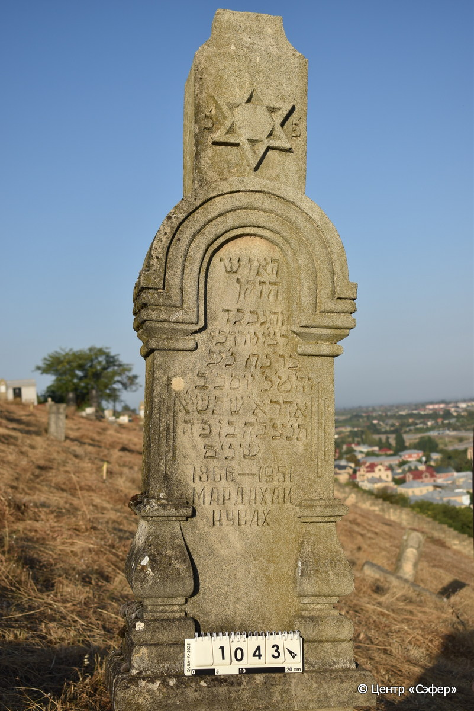
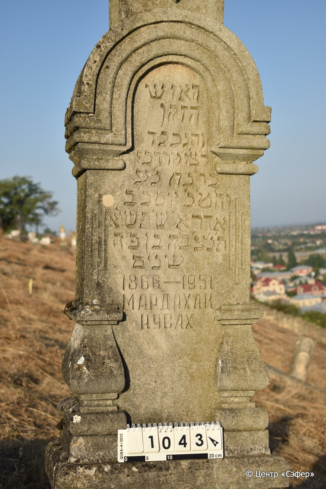
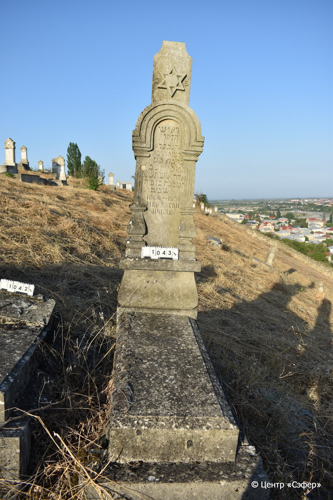

::: {style="font-size: 1em; margin-bottom: 1.2em"}
[Куба (центральное)](../cemeteries/QBA.html) > QBA1043
:::

```{r}
suppressPackageStartupMessages(library(tidyverse))
```


:::: {.columns}

::: {.column width="20%"}

```{r}
#| lightbox:
#|   group: photos





```
:::

::: {.column width="5%"}
:::

::: {.column width="74%"}

::: {.name-style}
Мордехай, сын Ноаха (Мардахаи)
:::

::: {style="font-size: 1.2em;"}
מרדכי בן נוח
:::

:::: {.columns}
::: {.column width="5%"}
{width=1.3em}
:::

::: {.column style="width: 40%; padding-left: 0.2em;"}
-.-.1866 /  
:::

::: {.column width="5%"}
{width=1.3em}
:::

::: {.column style="width: 50%; padding-left: 0.2em;"}
-.-.1951 / 22.Ad.5711
:::

::::


::: {.panel-tabset}

#### Эпитафия

```{r}
tibble(`Оригинал` = "פ֗ נ֗
האיש 
הזקן
והנכבד
ר׳צ׳ו מרדכי
בר נח נ׳ע
וה׳מ׳כ יום כ״ב
אדר א׳ ש׳ תשי׳א
ת׳ נ׳צ׳ ב׳ה בן פ׳ה
שנים
1866-1951
МАРДАХАИ
НУВАХ",
       `Перевод` = "Здесь покоится
человек 
пожилой
и уважаемый,
стремящийся к правде Мордехай,
сын р. Ноаха, душа его в раю,
и благословен его покой. 22
адара-I года 711.
Да будет душа его завязана в узле жизни, в возрасте 85
лет.
1866-1951
МАРДАХАИ
НУВАХ") |>
  mutate(`Оригинал` = str_split(`Оригинал`, "
"),
         `Перевод` = str_split(`Перевод`, "
")) |>
  unnest_longer(c(`Оригинал`, `Перевод`)) |> 
  mutate(id = 1:n()) |> 
  relocate(id, .before = Перевод) |> 
  rename(` ` = id) |> 
  knitr::kable(align = c("r", "c", "l"))
```

|||
|-|---|
|**Примечания**| |
|**Язык**      |иврит, русский    |
|**Метки**     |     |
: {tbl-colwidths="[25,75]"}

#### Памятник

|||
|-|---|
|**Тип памятника**   |L-образный                                                                         |
|**Материал**        |песчаник (основание деформировано, следы эрозии, сколы)                                                     |
|**Размеры**         |204×55×32  --- стела; 16×51×122  --- плита; 40×90×196  --- основание                                                                        |
|**Тип декора**      |архитектурно-орнаментальный, традиционная символика                                                                        |
|**Элементы декора** |фигурное навершие со звездой Давида, полукруглый портал на полуколоннах, резные рамки по бокам стелы                                                                          |
|**Координаты**      |[41.37072459, 48.50875226](https://www.google.com/maps/place/41.37072459, 48.50875226)                    |
: {tbl-colwidths="[25,75]"}

#### Источник

|||
|-|---|
|**Место хранения**        |Архив полевых исследований Центра «Сэфер»     |
|**Контакты**              |students@sefer.ru    |
|**Ссылка**                |https://sfira.org        |
|**Исходный ID**           |  |
|**Условия использования** |[CC BY-NC 4.0](https://creativecommons.org/licenses/by-nc/4.0/deed.ru)     |
: {tbl-colwidths="[25,75]"}

:::

:::

::::

