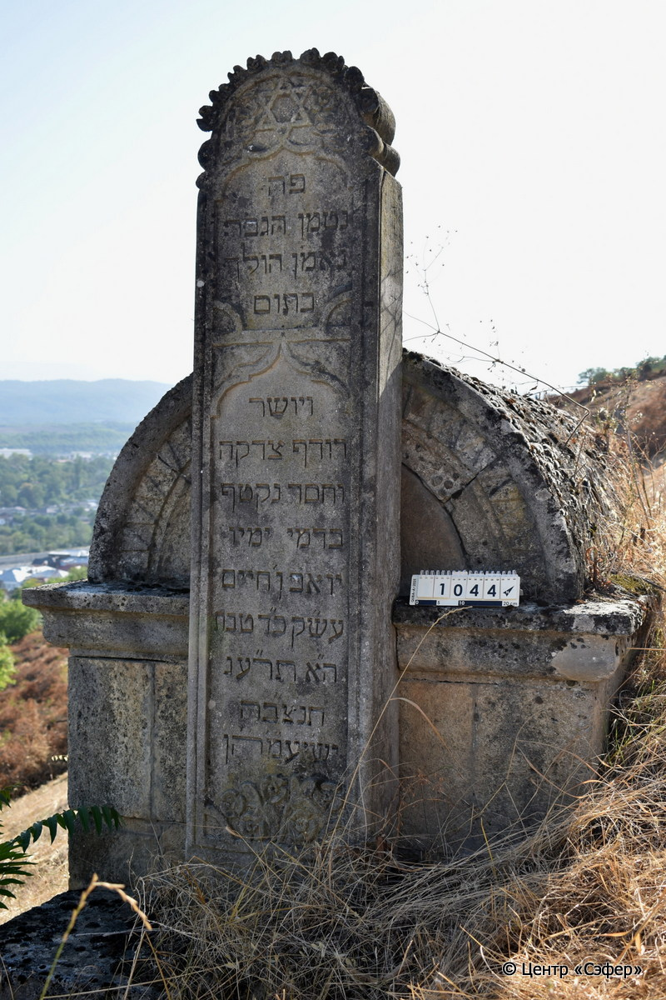
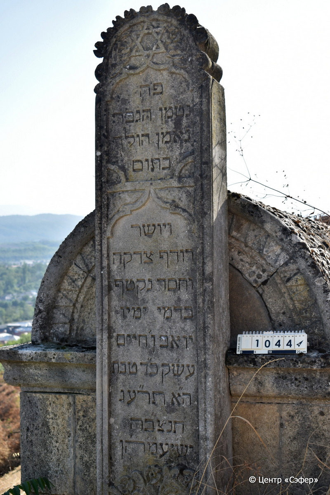

::: {style="font-size: 1em; margin-bottom: 1.2em"}
[Куба (центральное)](../cemeteries/QBA.html) > QBA1044
:::

```{r}
suppressPackageStartupMessages(library(tidyverse))
```


:::: {.columns}

::: {.column width="20%"}

```{r}
#| lightbox:
#|   group: photos




```
:::

::: {.column width="5%"}
:::

::: {.column width="74%"}

::: {.name-style}
Йоав, сын Хаима
:::

::: {style="font-size: 1.2em;"}
יואב בן חיים
:::

:::: {.columns}
::: {.column width="5%"}
{width=1.3em}
:::

::: {.column style="width: 40%; padding-left: 0.2em;"}
  /  
:::

::: {.column width="5%"}
{width=1.3em}
:::

::: {.column style="width: 50%; padding-left: 0.2em;"}
03.01.1913* / 24.Te.5673
:::

::::


::: {.panel-tabset}

#### Эпитафия

```{r}
tibble(`Оригинал` = "פה
נטמן הגבר
נאמן הולך
בתום
ויושר
רודף צדקה
וחסד נקטף
בדמי ימיו
יואב ן׳ חיים
עש״ק כ״ד טבת
ה״א תר״עג
תנצ״בה
יש׳יע׳מ׳ה״ן",
       `Перевод` = "Здесь
покоится мужчина
верный, ходивший
честно
и прямодушно,
стремившийся к правде
и милости, срезанный
в расцвете дней его,
Йоав, сын Хаима.
Канун святой субботы, 24 тевета
5673 года.
Да будет душа его завязана в узле жизни.
Он обретёт покой! Те, кто идёт путем прямым, возлягут и отдохнут.") |>
  mutate(`Оригинал` = str_split(`Оригинал`, "
"),
         `Перевод` = str_split(`Перевод`, "
")) |>
  unnest_longer(c(`Оригинал`, `Перевод`)) |> 
  mutate(id = 1:n()) |> 
  relocate(id, .before = Перевод) |> 
  rename(` ` = id) |> 
  knitr::kable(align = c("r", "c", "l"))
```

|||
|-|---|
|**Примечания**| |
|**Язык**      |иврит    |
|**Метки**     |     |
: {tbl-colwidths="[25,75]"}

#### Памятник

|||
|-|---|
|**Тип памятника**   |L-образный                                                                         |
|**Материал**        |известняк, ракушечник (цементный раствор, следы эрозии)                                                     |
|**Размеры**         |200×45×21  --- стела; 60×128×209  --- саркофаг; 102×155×237  --- основание саркофага                                                                        |
|**Тип декора**      |архитектурно-орнаментальный, растительный, традиционная символика                                                                        |
|**Элементы декора** |полукруглое завершение с декором в виде роз и двух свитков пергамента, звезда Давида в окружении цветов, фигурные ниши для текста, растительный орнамент                                                                          |
|**Координаты**      |[41.37065251, 48.5087832](https://www.google.com/maps/place/41.37065251, 48.5087832)                    |
: {tbl-colwidths="[25,75]"}

#### Источник

|||
|-|---|
|**Место хранения**        |Архив полевых исследований Центра «Сэфер»     |
|**Контакты**              |students@sefer.ru    |
|**Ссылка**                |https://sfira.org        |
|**Исходный ID**           |  |
|**Условия использования** |[CC BY-NC 4.0](https://creativecommons.org/licenses/by-nc/4.0/deed.ru)     |
: {tbl-colwidths="[25,75]"}

:::

:::

::::

