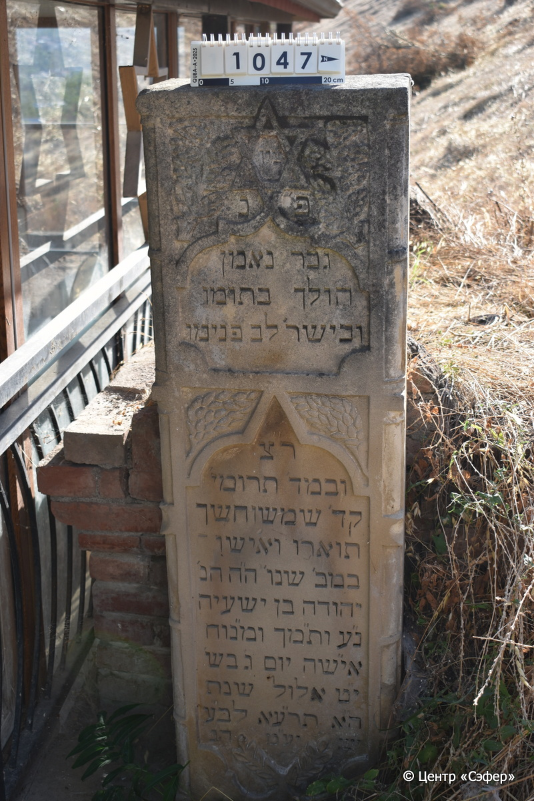

::: {style="font-size: 1em; margin-bottom: 1.2em"}
[Куба (центральное)](../cemeteries/QBA.html) > QBA1047
:::

```{r}
suppressPackageStartupMessages(library(tidyverse))
```


:::: {.columns}

::: {.column width="20%"}

```{r}
#| lightbox:
#|   group: photos



```
:::

::: {.column width="5%"}
:::

::: {.column width="74%"}

::: {.name-style}
Йехуда, сын Йешайаху
:::

::: {style="font-size: 1.2em;"}
יהודה בן ישעיה
:::

:::: {.columns}
::: {.column width="5%"}
{width=1.3em}
:::

::: {.column style="width: 40%; padding-left: 0.2em;"}
  /  
:::

::: {.column width="5%"}
{width=1.3em}
:::

::: {.column style="width: 50%; padding-left: 0.2em;"}
12.09.1911* / 19.El.5671
:::

::::


::: {.panel-tabset}

#### Эпитафия

```{r}
tibble(`Оригинал` = "ציו׳
פ׳נ׳
גבר נאמן 
הולך בתומו
ובישר׳ לב פנימו
ר״צ
ובמד׳ תרומי׳
קד׳ שמשו חשך
תוארו ואישו-
במב׳ שנו׳ ה״ה הנ׳
יהודה בן ישעיה 
נ״ע ות״מך ומ״נוח
אי״שה יום ג׳ בש׳
י״ט אלול שנת 
ה״א תר״עא לב״ע
יש״ יע״מ ה״נ",
       `Перевод` = "Знак.
Здесь покоится
верный мужчина,
ходивший честно
и прямодушно, в сердце своем
стремился к правде,
и славился добродетелями и щедростью.
Его солнце погасло, потемнел
свет его, и он ушел
в свои лучшие годы, г-н уважаемый
Йехуда, сын Йешайяху,
душа его в раю, и благословен его покой, и [оставил 
жену] во вторник,
19 элула года
5671 от сотворения мира.
Он обретёт покой! Те, кто идёт путем прямым, возлягут и отдохнут.") |>
  mutate(`Оригинал` = str_split(`Оригинал`, "
"),
         `Перевод` = str_split(`Перевод`, "
")) |>
  unnest_longer(c(`Оригинал`, `Перевод`)) |> 
  mutate(id = 1:n()) |> 
  relocate(id, .before = Перевод) |> 
  rename(` ` = id) |> 
  knitr::kable(align = c("r", "c", "l"))
```

|||
|-|---|
|**Примечания**| |
|**Язык**      |иврит    |
|**Метки**     |     |
: {tbl-colwidths="[25,75]"}

#### Памятник

|||
|-|---|
|**Тип памятника**   |стела                                                                         |
|**Материал**        |песчаник, кирпич (следы эрозии и цементного раствора)                                                     |
|**Размеры**         |152×43×18  --- стела; 105×101×240  --- саркофаг                                                                        |
|**Тип декора**      |архитектурно-орнаментальный, растительный, традиционная символика                                                                        |
|**Элементы декора** |звезда Давида в обрамлении цветочной композиции; две фигурные ниши для текста, разделенные растительными элементами; у основания стелы две ветви; скошенные грани;                                                                          |
|**Координаты**      |[41.37056821, 48.50883341](https://www.google.com/maps/place/41.37056821, 48.50883341)                    |
: {tbl-colwidths="[25,75]"}

#### Источник

|||
|-|---|
|**Место хранения**        |Архив полевых исследований Центра «Сэфер»     |
|**Контакты**              |students@sefer.ru    |
|**Ссылка**                |https://sfira.org        |
|**Исходный ID**           |  |
|**Условия использования** |[CC BY-NC 4.0](https://creativecommons.org/licenses/by-nc/4.0/deed.ru)     |
: {tbl-colwidths="[25,75]"}

:::

:::

::::

