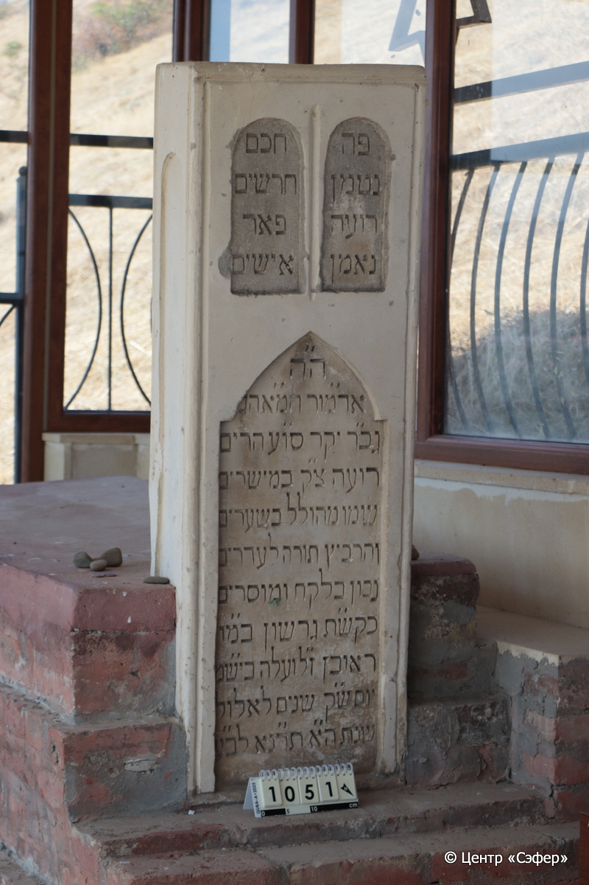
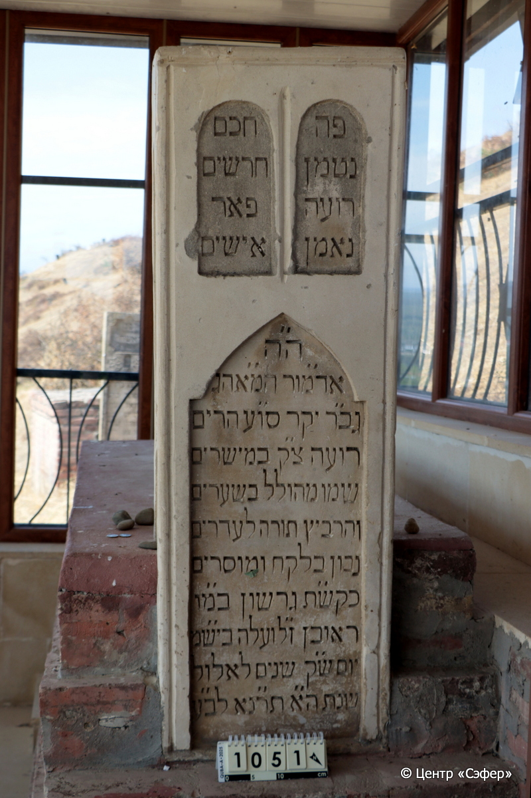
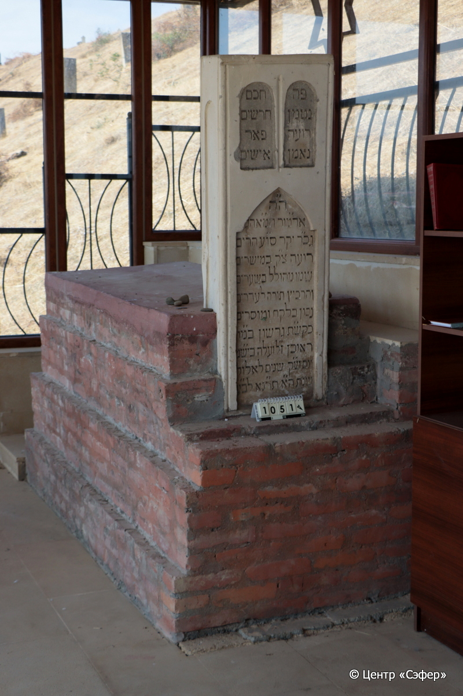

::: {style="font-size: 1em; margin-bottom: 1.2em"}
[Куба (центральное)](../cemeteries/QBA.html) > QBA1051
:::

```{r}
suppressPackageStartupMessages(library(tidyverse))
```


:::: {.columns}

::: {.column width="20%"}

```{r}
#| lightbox:
#|   group: photos





```
:::

::: {.column width="5%"}
:::

::: {.column width="74%"}

::: {.name-style}
Гершон, сын Реувена
:::

::: {style="font-size: 1.2em;"}
גרשון בן ראובן
:::

:::: {.columns}
::: {.column width="5%"}
{width=1.3em}
:::

::: {.column style="width: 40%; padding-left: 0.2em;"}
  /  
:::

::: {.column width="5%"}
{width=1.3em}
:::

::: {.column style="width: 50%; padding-left: 0.2em;"}
05.09.1891* / 02.El.5651
:::

::::


::: {.panel-tabset}

#### Эпитафия

```{r}
tibble(`Оригинал` = "справа
פה
נטמן
רועה
נאמן

слева
חכם
חרשים
פאר
אישים

по центру
ה׳ה
אד״מור המ״אהג
גב״ר יקר סו״ע הרים
רועה צ״ק במישרים
שמו מהולל בשערים
והרביץ תורה לעדרים
נבון בלקח ומוסרים
כק״שת גרשון במו״
ראובן ז״ל ועלה ביש״מ
יום ש״ק שנים לאלול
שנת ה״א תר״נא לב״ע",
       `Перевод` = "
Здесь
покоится
пастырь
верный

 
мудрейший
из кудесников,
украшение
рода людского.

 
Г-н,
наш господин, учитель и раввин, светило великого света,
дорогой человек, Синай и сокрушающий горы, 
праведный и справедливый пастырь,
имя его прославлено во вратах,
и преподавал Тору пастве,
уроки и нравоучения его мудры,
высокочтимый раввин, да будет он благословен, Гершон, сын нашего учителя
Реувена, благословенной памяти, и поднялся в небесные чертоги
в день святой субботы, 2 элула
года 5651 от сотворения мира.") |>
  mutate(`Оригинал` = str_split(`Оригинал`, "
"),
         `Перевод` = str_split(`Перевод`, "
")) |>
  unnest_longer(c(`Оригинал`, `Перевод`)) |> 
  mutate(id = 1:n()) |> 
  relocate(id, .before = Перевод) |> 
  rename(` ` = id) |> 
  knitr::kable(align = c("r", "c", "l"))
```

|||
|-|---|
|**Примечания**|Гершон, сын Реувена Мизраха (ГАВАР), духовный лидер горских евреев и раввин Кубы в 1853–1891 гг.|
|**Язык**      |иврит    |
|**Метки**     |раввин, благородное происхождение    |
: {tbl-colwidths="[25,75]"}

#### Памятник

|||
|-|---|
|**Тип памятника**   |шатёр (охель)                                                                         |
|**Материал**        |известняк, бетон, кирпич (следы цементного раствора)                                                     |
|**Размеры**         |137×46×21  --- стела; 21×83×123  --- плита; 94×129×257  --- основание                                                                        |
|**Тип декора**      |архитектурно-орнаментальный                                                                        |
|**Элементы декора** |три фигурные ниши для текста, две фигурные ниши по боковым сторонам памятника                                                                          |
|**Координаты**      |[41.37054456, 48.50880774](https://www.google.com/maps/place/41.37054456, 48.50880774)                    |
: {tbl-colwidths="[25,75]"}

#### Источник

|||
|-|---|
|**Место хранения**        |Архив полевых исследований Центра «Сэфер»     |
|**Контакты**              |students@sefer.ru    |
|**Ссылка**                |https://sfira.org        |
|**Исходный ID**           |  |
|**Условия использования** |[CC BY-NC 4.0](https://creativecommons.org/licenses/by-nc/4.0/deed.ru)     |
: {tbl-colwidths="[25,75]"}

:::

:::

::::

