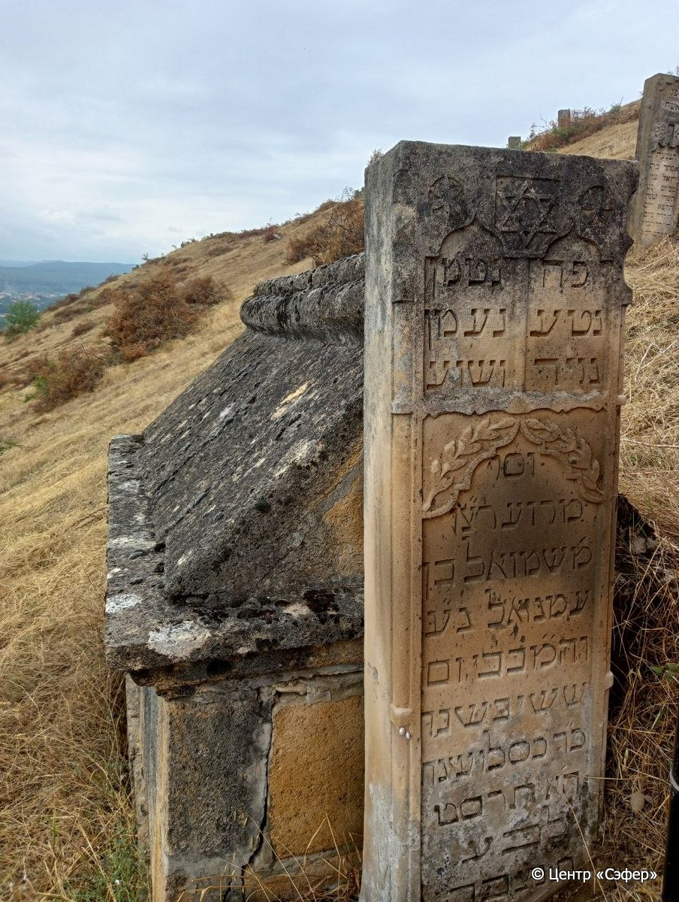
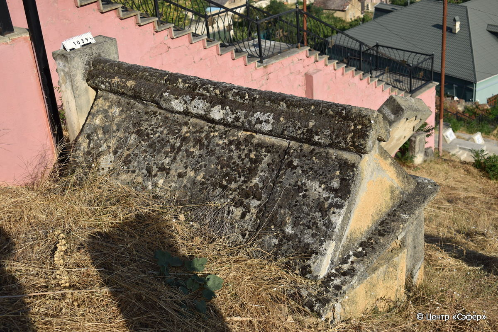

::: {style="font-size: 1em; margin-bottom: 1.2em"}
[Куба (центральное)](../cemeteries/QBA.html) > QBA1059
:::

```{r}
suppressPackageStartupMessages(library(tidyverse))
```


:::: {.columns}

::: {.column width="20%"}

```{r}
#| lightbox:
#|   group: photos




```
:::

::: {.column width="5%"}
:::

::: {.column width="74%"}

::: {.name-style}
Шмуэль, сын Имануэля
:::

::: {style="font-size: 1.2em;"}
שמואל בן עימנואל
:::

:::: {.columns}
::: {.column width="5%"}
{width=1.3em}
:::

::: {.column style="width: 40%; padding-left: 0.2em;"}
  /  
:::

::: {.column width="5%"}
{width=1.3em}
:::

::: {.column style="width: 50%; padding-left: 0.2em;"}
18.12.1908* / 24.Ki.5669
:::

::::


::: {.panel-tabset}

#### Эпитафия

```{r}
tibble(`Оригинал` = "פה נטמן
נטע נעמן
נגיד ושוע
וסר
מרוע רצ׳ו׳
מ׳ שמואל בן
עמנואל נ׳ע
והמ׳כ ביום
ששי בשבת
כ״ד כסלו שנת
ה׳א תרסט
לבע
ת׳נ׳צ׳ב׳ה׳",
       `Перевод` = "Здесь покоится
прекрасный саженец,
благородный и знатный,
и уклоняющийся
от зла, стремящийся к правде и милости,
г-н Шмуэль, сын р.
Имануэля, душа его в раю,
и благословен его покой, в день
пятница,
24 кислева года
5669
от сотворения мира.
Да будет душа его завязана в узле жизни.") |>
  mutate(`Оригинал` = str_split(`Оригинал`, "
"),
         `Перевод` = str_split(`Перевод`, "
")) |>
  unnest_longer(c(`Оригинал`, `Перевод`)) |> 
  mutate(id = 1:n()) |> 
  relocate(id, .before = Перевод) |> 
  rename(` ` = id) |> 
  knitr::kable(align = c("r", "c", "l"))
```

|||
|-|---|
|**Примечания**| |
|**Язык**      |иврит    |
|**Метки**     |     |
: {tbl-colwidths="[25,75]"}

#### Памятник

|||
|-|---|
|**Тип памятника**   |шатёр (охель)                                                                         |
|**Материал**        |песчаник, известняк (следы эрозии, сколы, трещины)                                                     |
|**Размеры**         |141×43×19  --- стела; 180×140×230  --- саркофаг; 35×70×290  --- основание                                                                        |
|**Тип декора**      |архитектурно-орнаментальный, растительный, традиционная символика                                                                        |
|**Элементы декора** |две фигурные ниши для текста, звезда Давида, растительные розетки, растительный орнамент между нишами                                                                          |
|**Координаты**      |[41.37049682, 48.50878445](https://www.google.com/maps/place/41.37049682, 48.50878445)                    |
: {tbl-colwidths="[25,75]"}

#### Источник

|||
|-|---|
|**Место хранения**        |Архив полевых исследований Центра «Сэфер»     |
|**Контакты**              |students@sefer.ru    |
|**Ссылка**                |https://sfira.org        |
|**Исходный ID**           |  |
|**Условия использования** |[CC BY-NC 4.0](https://creativecommons.org/licenses/by-nc/4.0/deed.ru)     |
: {tbl-colwidths="[25,75]"}

:::

:::

::::

