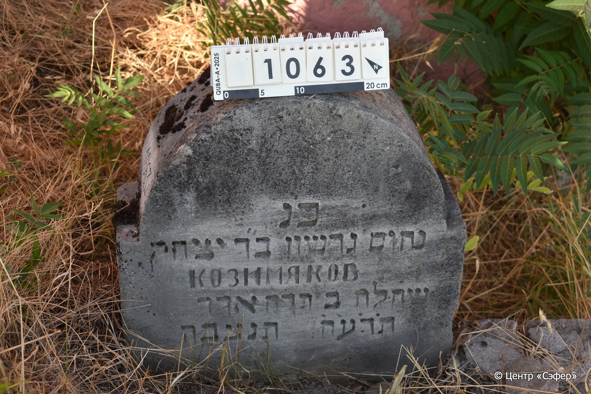
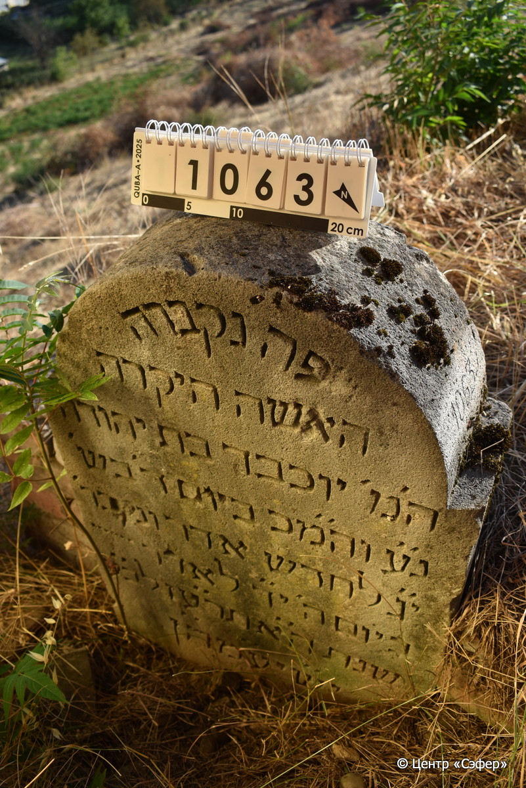
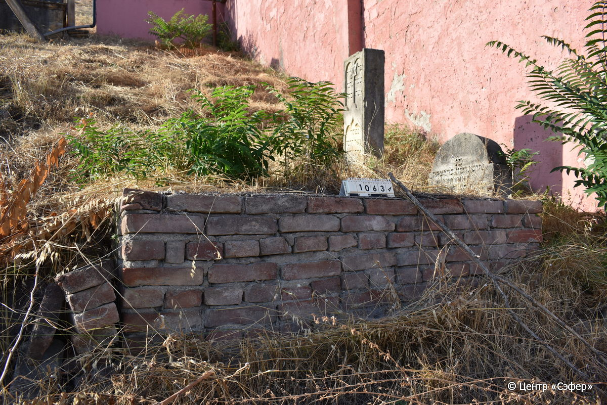

::: {style="font-size: 1em; margin-bottom: 1.2em"}
[Куба (центральное)](../cemeteries/QBA.html) > QBA1063
:::

```{r}
suppressPackageStartupMessages(library(tidyverse))
```


:::: {.columns}

::: {.column width="20%"}

```{r}
#| lightbox:
#|   group: photos





```
:::

::: {.column width="5%"}
:::

::: {.column width="74%"}

::: {.name-style}
КОЗИМЯКОВ Нахум Гершон, сын Ицхака
:::

::: {style="font-size: 1.2em;"}
נחום גרשון בן יצחק
:::

:::: {.columns}
::: {.column width="5%"}
{width=1.3em}
:::

::: {.column style="width: 40%; padding-left: 0.2em;"}
  /  
:::

::: {.column width="5%"}
{width=1.3em}
:::

::: {.column style="width: 50%; padding-left: 0.2em;"}
  / 02.Ad.5678
:::

::::

---

::: {.name-style}
Йохевед, дочь Йехуды
:::

::: {style="font-size: 1.2em;"}
יוכבד בת יהודה
:::

:::: {.columns}
::: {.column width="5%"}
{width=1.3em}
:::

::: {.column style="width: 40%; padding-left: 0.2em;"}
  /  
:::

::: {.column width="5%"}
{width=1.3em}
:::

::: {.column style="width: 50%; padding-left: 0.2em;"}
  / 13.Ad.5677
:::

::::


::: {.panel-tabset}

#### Эпитафия

```{r}
tibble(`Оригинал` = "лицевая сторона
פ״נ
נחום גרשון ב״ר יצחק
КОЗИМЯКОВ
שחלח ב דרח אדר
ת֗ר֗ע֗ח֗ תנצבה

обратная сторона
פה נקברה
האשה היקרה
ה׳מ׳ יוכבד בת יהודה
נ״ ע וה״ מכ ביום ד׳ בש׳
י״ ג לחדש אדר ונקבר׳
ביום ה׳ י״ ד לאדר
שנת ה״ א תרע״ז לב״ ע
יש״ יע״ מה״ ן",
       `Перевод` = "
Здесь покоится
Нахум Гершон, сын р. Ицхака.
Козимяков,
который оставил жизнь всем живым 2 числа месяца адар
678 года. Да будет душа его завязана в узле жизни.

 
Здесь покоится
женщина дорогая,
уважаемая г-жа Йохевед, дочь Йехуды,
душа ее в раю и благословен ее покой в день среда,
13 числа месяца адар, и похоронена
в день четверг, 14 адара
года 5677 от сотворения мира.
Он обретёт покой! Те, кто идёт путем прямым, возлягут и отдохнут.") |>
  mutate(`Оригинал` = str_split(`Оригинал`, "
"),
         `Перевод` = str_split(`Перевод`, "
")) |>
  unnest_longer(c(`Оригинал`, `Перевод`)) |> 
  mutate(id = 1:n()) |> 
  relocate(id, .before = Перевод) |> 
  rename(` ` = id) |> 
  knitr::kable(align = c("r", "c", "l"))
```

|||
|-|---|
|**Примечания**| |
|**Язык**      |иврит, русский    |
|**Метки**     |     |
: {tbl-colwidths="[25,75]"}

#### Памятник

|||
|-|---|
|**Тип памятника**   |L-образный                                                                         |
|**Материал**        |известняк, кирпич (стела из известняка, следы эрозии, сколы, саркофаг из кирпичей и цементного раствора, деформирован)                                                     |
|**Размеры**         |83×53×17  --- стела; 64×85×226  --- Саркофаг                                                                        |
|**Тип декора**      |архитектурно-орнаментальный                                                                        |
|**Элементы декора** |полукруглое завершение с плечиками                                                                          |
|**Координаты**      |[41.3704217, 48.50887963](https://www.google.com/maps/place/41.3704217, 48.50887963)                    |
: {tbl-colwidths="[25,75]"}

#### Источник

|||
|-|---|
|**Место хранения**        |Архив полевых исследований Центра «Сэфер»     |
|**Контакты**              |students@sefer.ru    |
|**Ссылка**                |https://sfira.org        |
|**Исходный ID**           |  |
|**Условия использования** |[CC BY-NC 4.0](https://creativecommons.org/licenses/by-nc/4.0/deed.ru)     |
: {tbl-colwidths="[25,75]"}

:::

:::

::::

