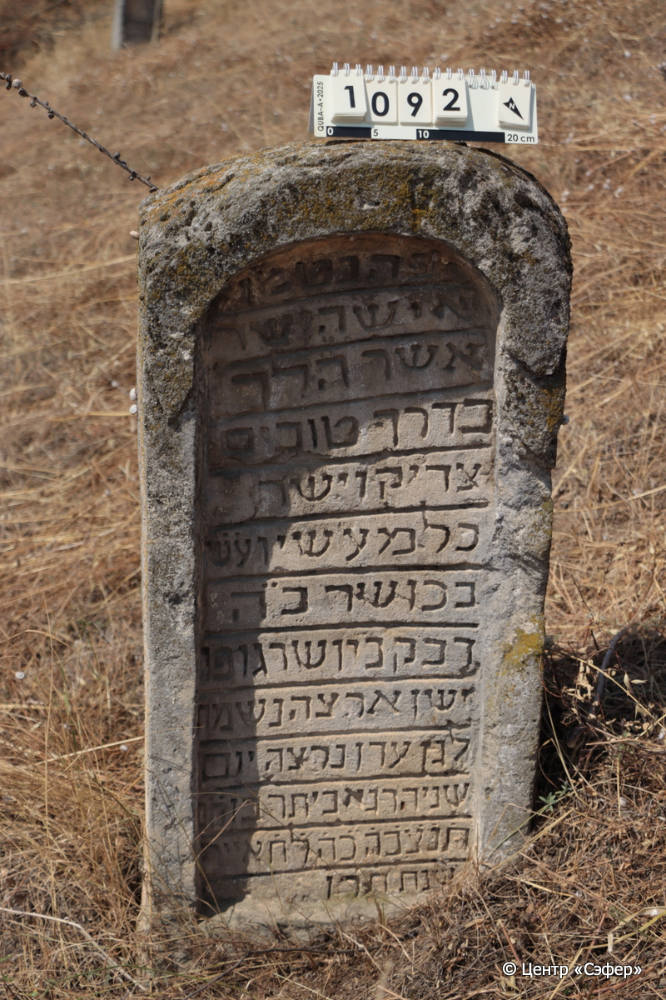
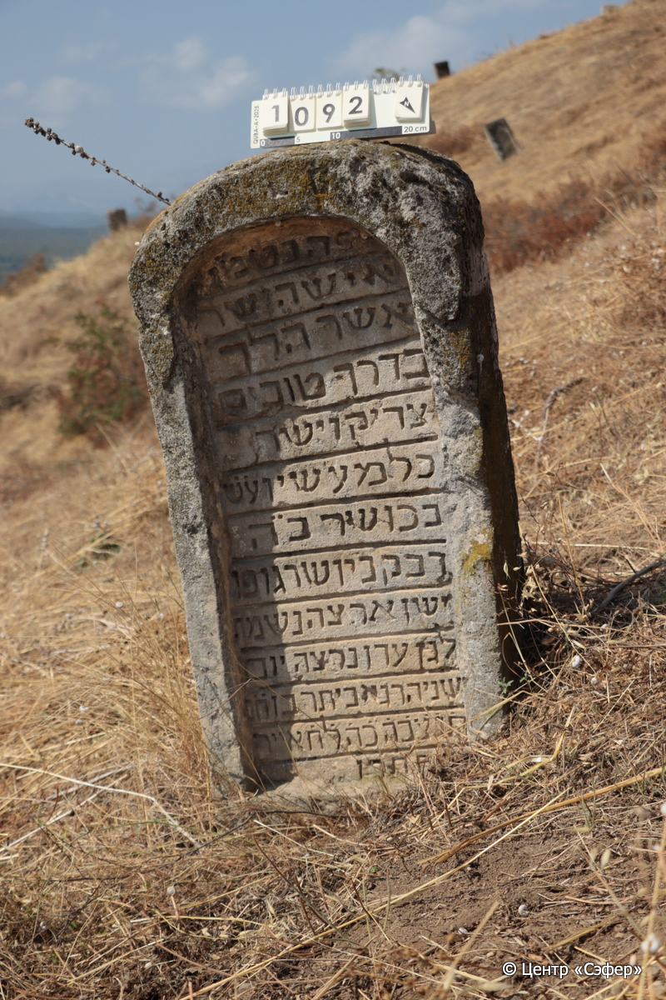

::: {style="font-size: 1em; margin-bottom: 1.2em"}
[Куба (центральное)](../cemeteries/QBA.html) > QBA1092
:::

```{r}
suppressPackageStartupMessages(library(tidyverse))
```


:::: {.columns}

::: {.column width="20%"}

```{r}
#| lightbox:
#|   group: photos




```
:::

::: {.column width="5%"}
:::

::: {.column width="74%"}

::: {.name-style}
Эвьятар, сын Хаима
:::

::: {style="font-size: 1.2em;"}
אביתר בן חיים
:::

:::: {.columns}
::: {.column width="5%"}
{width=1.3em}
:::

::: {.column style="width: 40%; padding-left: 0.2em;"}
  /  
:::

::: {.column width="5%"}
{width=1.3em}
:::

::: {.column style="width: 50%; padding-left: 0.2em;"}
15.05.1890* / 25.Iy.5650
:::

::::


::: {.panel-tabset}

#### Эпитафия

```{r}
tibble(`Оригинал` = "פה נטמן
איש הישר
אשר הלך
בדרך טובים
צדיקו ישר
כל מעשין ע֗ש֗
בכושר כ״ה 
דבק ביושר גופו
ישן ארצה נשמחו
לגן עדן נרצה יום
שניהרג אביתר בן ח֗ם֗
ת֗נ֗צ֗ב֗ה֗ כ֗ה֗ ל֗ח֗ אייר 
שנת ת֗ר֗ן֗",
       `Перевод` = "Здесь покоится
человек прямодушный,
который ходил
праведными путями,
его праведность прямодушна,
все поступки его совершал
с праведностью, всей душой
стремился к правде, тело его
покоится в земле, а душа
призвана в райский сад в день,
когда был убит Эвьятан, сын Хаима.
Да будет душа его завязана в узле жизни. 25 число месяца ияр
года 650.") |>
  mutate(`Оригинал` = str_split(`Оригинал`, "
"),
         `Перевод` = str_split(`Перевод`, "
")) |>
  unnest_longer(c(`Оригинал`, `Перевод`)) |> 
  mutate(id = 1:n()) |> 
  relocate(id, .before = Перевод) |> 
  rename(` ` = id) |> 
  knitr::kable(align = c("r", "c", "l"))
```

|||
|-|---|
|**Примечания**| |
|**Язык**      |иврит    |
|**Метки**     |     |
: {tbl-colwidths="[25,75]"}

#### Памятник

|||
|-|---|
|**Тип памятника**   |стела                                                                         |
|**Материал**        |известняк (следы эрозии, сколы, разрушенное завершение)                                                     |
|**Размеры**         |94×48×21                                                                        |
|**Тип декора**      |архитектурно-орнаментальный                                                                        |
|**Элементы декора** |ниша текста, полукруглое завершение стелы                                                                          |
|**Координаты**      |[41.37006724, 48.5076538](https://www.google.com/maps/place/41.37006724, 48.5076538)                    |
: {tbl-colwidths="[25,75]"}

#### Источник

|||
|-|---|
|**Место хранения**        |Архив полевых исследований Центра «Сэфер»     |
|**Контакты**              |students@sefer.ru    |
|**Ссылка**                |https://sfira.org        |
|**Исходный ID**           |  |
|**Условия использования** |[CC BY-NC 4.0](https://creativecommons.org/licenses/by-nc/4.0/deed.ru)     |
: {tbl-colwidths="[25,75]"}

:::

:::

::::

