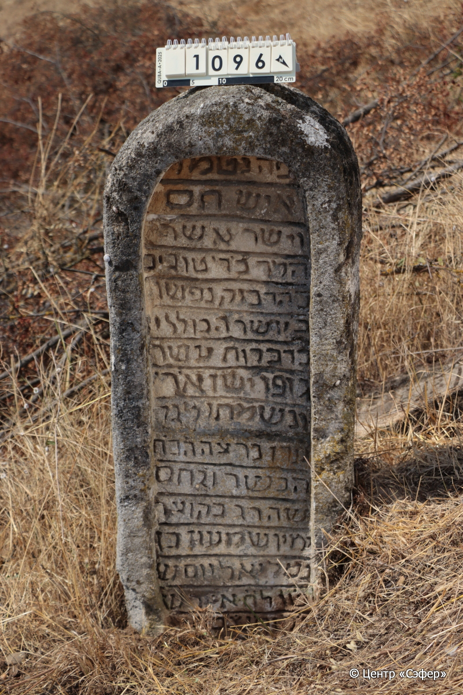
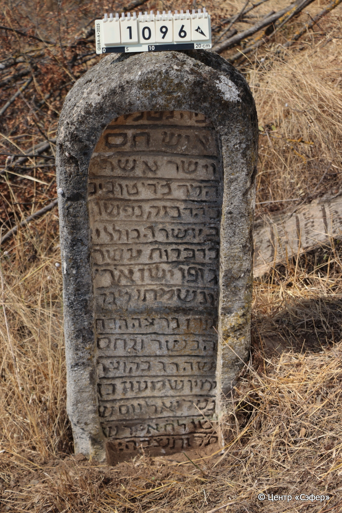

::: {style="font-size: 1em; margin-bottom: 1.2em"}
[Куба (центральное)](../cemeteries/QBA.html) > QBA1096
:::

```{r}
suppressPackageStartupMessages(library(tidyverse))
```


:::: {.columns}

::: {.column width="20%"}

```{r}
#| lightbox:
#|   group: photos




```
:::

::: {.column width="5%"}
:::

::: {.column width="74%"}

::: {.name-style}
Шимон, сын Гамлиэля
:::

::: {style="font-size: 1.2em;"}
שמעון בן גמליאל
:::

:::: {.columns}
::: {.column width="5%"}
{width=1.3em}
:::

::: {.column style="width: 40%; padding-left: 0.2em;"}
  /  
:::

::: {.column width="5%"}
{width=1.3em}
:::

::: {.column style="width: 50%; padding-left: 0.2em;"}
11.05.1846* / 15.Iy.5606
:::

::::


::: {.panel-tabset}

#### Эпитафия

```{r}
tibble(`Оригинал` = "פה נטמן
איש תם
וישר אשר
הלך בד׳ טובים
בהדביק נפשו
ביושר הכוללים
בדברות עשר
גופו ישן אר׳
ונשמתו לגן
עדן נרצה הבח׳
הכשר ו[ה]חס׳
שהרג בקוצר
ימיו שמעון בן
גמליאל יום ש׳
ט֗ו֗ לח֗ אייר ש׳
תרו ת֗נ֗צ֗ב֗ה֗",
       `Перевод` = "Здесь покоится
человек честный
и прямодушный, который
ходил праведными путями,
стремясь душой
к праведности, которая содержится
в десяти заповедях,
тело его покоится в земле,
а душа в райский
сад была призвана, юноша
праведный и благочестивый,
который был убит в расцвете
лет, Шимон, сын
Гамлиэля. Суббота,
15 число месяца ияр года
606. Да будет душа его завязана в узле жизни.") |>
  mutate(`Оригинал` = str_split(`Оригинал`, "
"),
         `Перевод` = str_split(`Перевод`, "
")) |>
  unnest_longer(c(`Оригинал`, `Перевод`)) |> 
  mutate(id = 1:n()) |> 
  relocate(id, .before = Перевод) |> 
  rename(` ` = id) |> 
  knitr::kable(align = c("r", "c", "l"))
```

|||
|-|---|
|**Примечания**| |
|**Язык**      |иврит    |
|**Метки**     |     |
: {tbl-colwidths="[25,75]"}

#### Памятник

|||
|-|---|
|**Тип памятника**   |стела                                                                         |
|**Материал**        |известняк (следы эрозии, сколы)                                                     |
|**Размеры**         |115×44×20                                                                        |
|**Тип декора**      |архитектурно-орнаментальный                                                                        |
|**Элементы декора** |фигурная ниша для текста, полукругое завершение                                                                          |
|**Координаты**      |[41.37001626, 48.5074341](https://www.google.com/maps/place/41.37001626, 48.5074341)                    |
: {tbl-colwidths="[25,75]"}

#### Источник

|||
|-|---|
|**Место хранения**        |Архив полевых исследований Центра «Сэфер»     |
|**Контакты**              |students@sefer.ru    |
|**Ссылка**                |https://sfira.org        |
|**Исходный ID**           |  |
|**Условия использования** |[CC BY-NC 4.0](https://creativecommons.org/licenses/by-nc/4.0/deed.ru)     |
: {tbl-colwidths="[25,75]"}

:::

:::

::::

