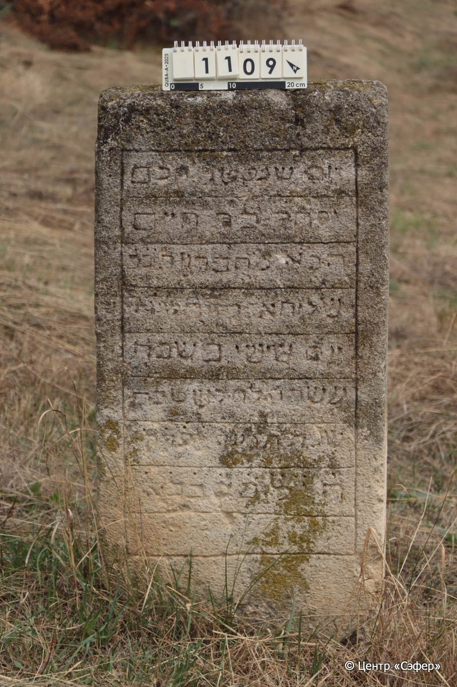
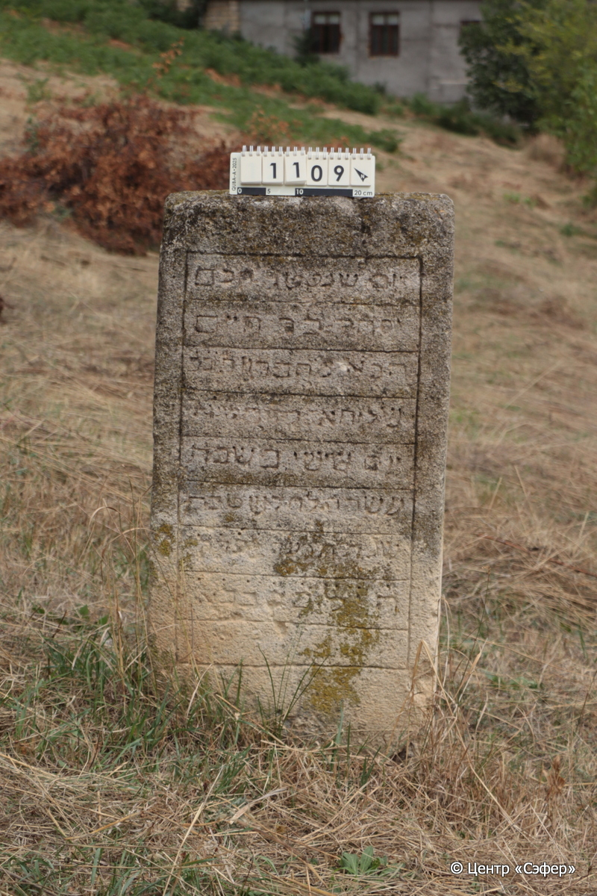

::: {style="font-size: 1em; margin-bottom: 1.2em"}
[Куба (центральное)](../cemeteries/QBA.html) > QBA1109
:::

```{r}
suppressPackageStartupMessages(library(tidyverse))
```


:::: {.columns}

::: {.column width="20%"}

```{r}
#| lightbox:
#|   group: photos




```
:::

::: {.column width="5%"}
:::

::: {.column width="74%"}

::: {.name-style}
Ицхак, сын Хаима
:::

::: {style="font-size: 1.2em;"}
יצחק בן חיים
:::

:::: {.columns}
::: {.column width="5%"}
{width=1.3em}
:::

::: {.column style="width: 40%; padding-left: 0.2em;"}
  /  
:::

::: {.column width="5%"}
{width=1.3em}
:::

::: {.column style="width: 50%; padding-left: 0.2em;"}
27.12.1914* / 10.Te.5675
:::

::::


::: {.panel-tabset}

#### Эпитафия

```{r}
tibble(`Оригинал` = "יום שנפטר חכם
יסחק בר חיים
הבא מחברון [ת֗ו֗ב֗ב֗]
שליחא [ק֗ש֗ס֗ש֗א֗]
יום שישי בשבת
עשרה לחדש טבת
שנת תקעה לפ֗ר֗ק֗
ה֗י֗ל֗ [ב֗ס֗כ֗כ֗א֗]",
       `Перевод` = "День, когда скончался мудрец
Ицхак, сын Хаима,
пришедший из Хеврона, да будет он отстроен и укреплен в скорости, в наши дни.
… посланник.
Пятница,
десятое число месяца тевет
года 675 по малому летоисчислению. Да хранит его Господь навечно. ...
…") |>
  mutate(`Оригинал` = str_split(`Оригинал`, "
"),
         `Перевод` = str_split(`Перевод`, "
")) |>
  unnest_longer(c(`Оригинал`, `Перевод`)) |> 
  mutate(id = 1:n()) |> 
  relocate(id, .before = Перевод) |> 
  rename(` ` = id) |> 
  knitr::kable(align = c("r", "c", "l"))
```

|||
|-|---|
|**Примечания**|תובב = תבנה ותכונן במהרה בימינו
היל = ה׳ ישמרהו לנצח|
|**Язык**      |иврит    |
|**Метки**     |%география%, хахам    |
: {tbl-colwidths="[25,75]"}

#### Памятник

|||
|-|---|
|**Тип памятника**   |стела                                                                         |
|**Материал**        |ракушечник (сколы, следы эрозии)                                                     |
|**Размеры**         |113×51×18                                                                        |
|**Тип декора**      |архитектурно-орнаментальный                                                                        |
|**Элементы декора** |рамка для текста                                                                          |
|**Координаты**      |[41.36941083, 48.50809478](https://www.google.com/maps/place/41.36941083, 48.50809478)                    |
: {tbl-colwidths="[25,75]"}

#### Источник

|||
|-|---|
|**Место хранения**        |Архив полевых исследований Центра «Сэфер»     |
|**Контакты**              |students@sefer.ru    |
|**Ссылка**                |https://sfira.org        |
|**Исходный ID**           |  |
|**Условия использования** |[CC BY-NC 4.0](https://creativecommons.org/licenses/by-nc/4.0/deed.ru)     |
: {tbl-colwidths="[25,75]"}

:::

:::

::::

