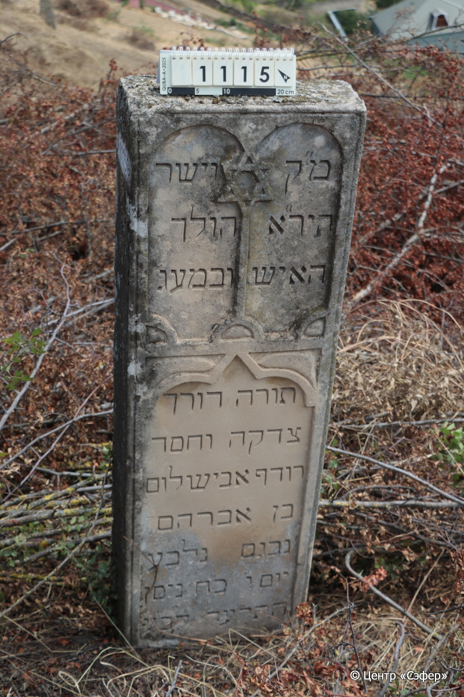
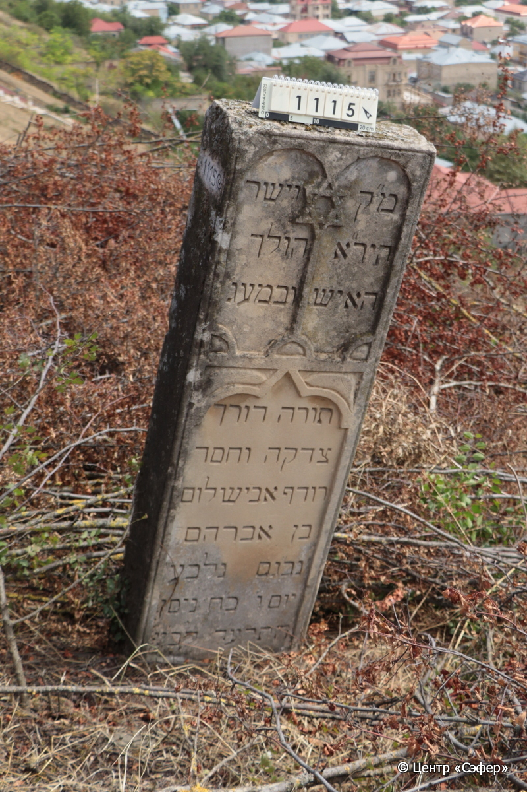

::: {style="font-size: 1em; margin-bottom: 1.2em"}
[Куба (центральное)](../cemeteries/QBA.html) > QBA1115
:::

```{r}
suppressPackageStartupMessages(library(tidyverse))
```


:::: {.columns}

::: {.column width="20%"}

```{r}
#| lightbox:
#|   group: photos




```
:::

::: {.column width="5%"}
:::

::: {.column width="74%"}

::: {.name-style}
Авишалом, сын Авраама
:::

::: {style="font-size: 1.2em;"}
אבישלום בן אברהם
:::

:::: {.columns}
::: {.column width="5%"}
{width=1.3em}
:::

::: {.column style="width: 40%; padding-left: 0.2em;"}
  /  
:::

::: {.column width="5%"}
{width=1.3em}
:::

::: {.column style="width: 50%; padding-left: 0.2em;"}
24.04.1914* / 28.Ni.5674
:::

::::


::: {.panel-tabset}

#### Эпитафия

```{r}
tibble(`Оригинал` = "справа
מ״ק
היר״א
האיש

слева
וישר
הולך
ובמעג׳
по центру
תורה דורך
צדקה וחסד
רודף אבישלום
בן אברהם
נב״גם נבל״ע
יום ו׳ כ״ח ניסן
התרע׳ד לב׳ע",
       `Перевод` = "
Место упокоения
богобоязненного
человека


и прямодушного,
ходившего
и по кругам

Торы ступавшего,
к правде и милости
стремившегося. Авишалом,
сын р. Авраама.
Душа его в небесных чертогах, и он ушел в дом вечности
в пятницу, 28 нисана
5674 года от сотворения мира.") |>
  mutate(`Оригинал` = str_split(`Оригинал`, "
"),
         `Перевод` = str_split(`Перевод`, "
")) |>
  unnest_longer(c(`Оригинал`, `Перевод`)) |> 
  mutate(id = 1:n()) |> 
  relocate(id, .before = Перевод) |> 
  rename(` ` = id) |> 
  knitr::kable(align = c("r", "c", "l"))
```

|||
|-|---|
|**Примечания**| |
|**Язык**      |иврит    |
|**Метки**     |     |
: {tbl-colwidths="[25,75]"}

#### Памятник

|||
|-|---|
|**Тип памятника**   |                                                                          |
|**Материал**        |известняк (побелка, следы эрозии ,сколы)                                                     |
|**Размеры**         |132×43×18  --- стела                                                                        |
|**Тип декора**      |архитектурно-орнаментальный, традиционная символика                                                                        |
|**Элементы декора** |два полукруглые рамки для текста со звездой Давида между ними, резная рамка для текста внизу                                                                          |
|**Координаты**      |[41.36999198, 48.50708828](https://www.google.com/maps/place/41.36999198, 48.50708828)                    |
: {tbl-colwidths="[25,75]"}

#### Источник

|||
|-|---|
|**Место хранения**        |Архив полевых исследований Центра «Сэфер»     |
|**Контакты**              |students@sefer.ru    |
|**Ссылка**                |https://sfira.org        |
|**Исходный ID**           |  |
|**Условия использования** |[CC BY-NC 4.0](https://creativecommons.org/licenses/by-nc/4.0/deed.ru)     |
: {tbl-colwidths="[25,75]"}

:::

:::

::::

