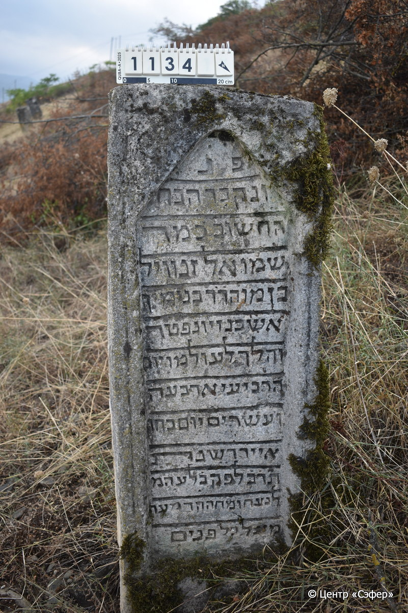

::: {style="font-size: 1em; margin-bottom: 1.2em"}
[Куба (центральное)](../cemeteries/QBA.html) > QBA1134
:::

```{r}
suppressPackageStartupMessages(library(tidyverse))
```


:::: {.columns}

::: {.column width="20%"}

```{r}
#| lightbox:
#|   group: photos



```
:::

::: {.column width="5%"}
:::

::: {.column width="74%"}

::: {.name-style}
Шмуэль Занвиль, сын Беньямина
:::

::: {style="font-size: 1.2em;"}
שמואל זנוויל בן בינימין
:::

:::: {.columns}
::: {.column width="5%"}
{width=1.3em}
:::

::: {.column style="width: 40%; padding-left: 0.2em;"}
  /  
:::

::: {.column width="5%"}
{width=1.3em}
:::

::: {.column style="width: 50%; padding-left: 0.2em;"}
04.05.1842* / 24.Iy.5602
:::

::::


::: {.panel-tabset}

#### Эпитафия

```{r}
tibble(`Оригинал` = "פ֗נ֗
ונקבר הבח֗
החשוב כמה
שמואל זנוויל
בן מוהרר בנימין
אשכנזי ונפטר
והלך לעולמו יום
הרביעי ארבעה
ועשרים יום בחו׳
אייר דשנת
ת֗ר֗ב֗ לפק בלע המ֗
לנצח ומחה הדמעה
מעל כל פנים",
       `Перевод` = "Здесь покоится
и похоронен юноша
почтенный, наш учитель
Шмуэль Занвл,
сын нашего великого учителя Беньямина,
ашкеназ, и скончался
и ушел в вечность
в среду, 24
числа месяца
ияр года
602 по малому летоисчислению. Проглотила смерть
навеки и стерла слезу
на всяком лице.") |>
  mutate(`Оригинал` = str_split(`Оригинал`, "
"),
         `Перевод` = str_split(`Перевод`, "
")) |>
  unnest_longer(c(`Оригинал`, `Перевод`)) |> 
  mutate(id = 1:n()) |> 
  relocate(id, .before = Перевод) |> 
  rename(` ` = id) |> 
  knitr::kable(align = c("r", "c", "l"))
```

|||
|-|---|
|**Примечания**| |
|**Язык**      |иврит    |
|**Метки**     |     |
: {tbl-colwidths="[25,75]"}

#### Памятник

|||
|-|---|
|**Тип памятника**   |стела                                                                         |
|**Материал**        |ракушечник (сколы, следы эрозии, следы ремонта)                                                     |
|**Размеры**         |138×46×25                                                                        |
|**Тип декора**      |архитектурно-орнаментальный                                                                        |
|**Элементы декора** |фигурная ниша для текста                                                                          |
|**Координаты**      |[41.36947721, 48.5070571](https://www.google.com/maps/place/41.36947721, 48.5070571)                    |
: {tbl-colwidths="[25,75]"}

#### Источник

|||
|-|---|
|**Место хранения**        |Архив полевых исследований Центра «Сэфер»     |
|**Контакты**              |students@sefer.ru    |
|**Ссылка**                |https://sfira.org        |
|**Исходный ID**           |  |
|**Условия использования** |[CC BY-NC 4.0](https://creativecommons.org/licenses/by-nc/4.0/deed.ru)     |
: {tbl-colwidths="[25,75]"}

:::

:::

::::

