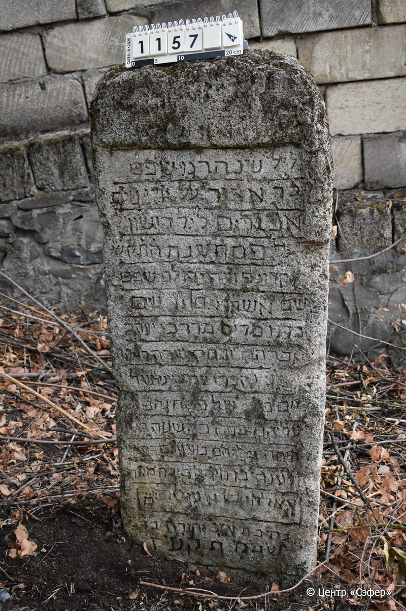
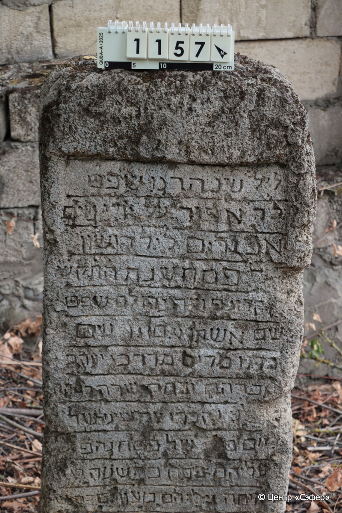
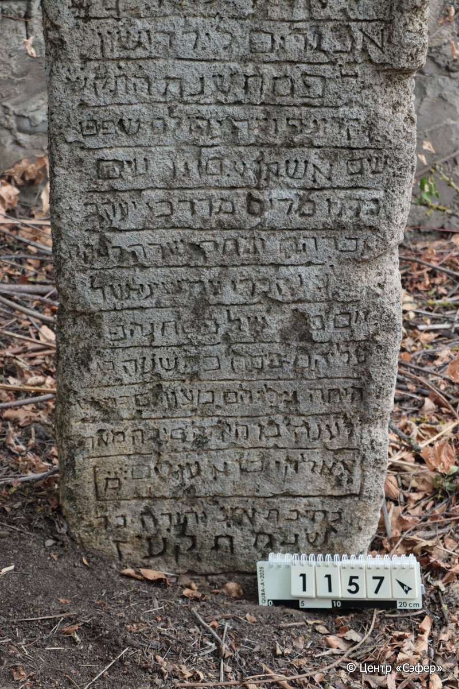
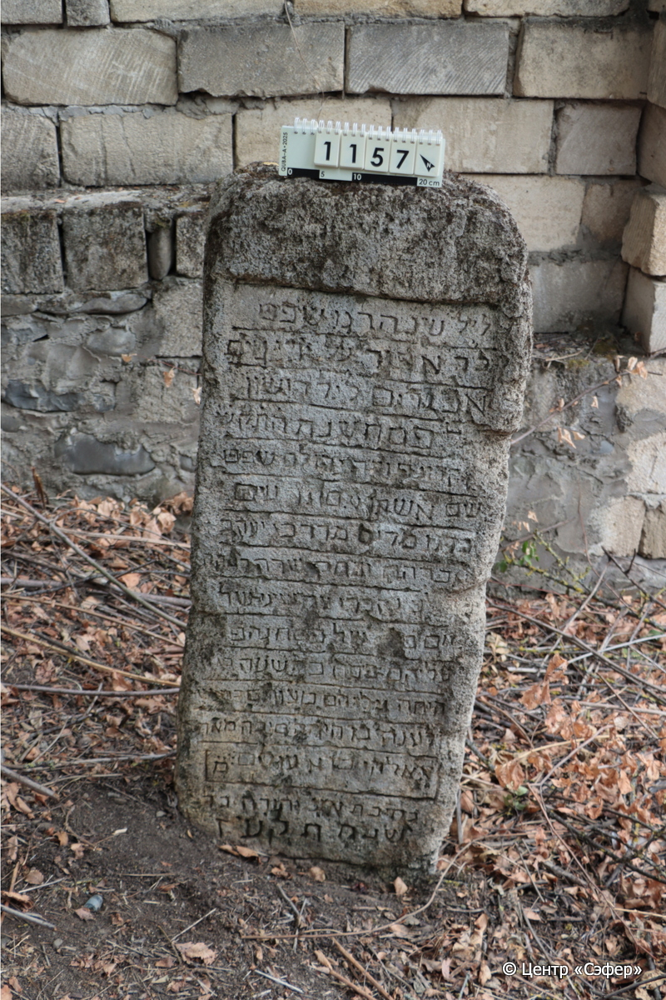

::: {style="font-size: 1em; margin-bottom: 1.2em"}
[Куба (центральное)](../cemeteries/QBA.html) > QBA1157
:::

```{r}
suppressPackageStartupMessages(library(tidyverse))
```


:::: {.columns}

::: {.column width="20%"}

```{r}
#| lightbox:
#|   group: photos






```
:::

::: {.column width="5%"}
:::

::: {.column width="74%"}

::: {.name-style}
Мирьям
:::

::: {style="font-size: 1.2em;"}
מרים
:::

:::: {.columns}
::: {.column width="5%"}
{width=1.3em}
:::

::: {.column style="width: 40%; padding-left: 0.2em;"}
  /  
:::

::: {.column width="5%"}
{width=1.3em}
:::

::: {.column style="width: 50%; padding-left: 0.2em;"}
  / 15.Ni.5577
:::

::::

---

::: {.name-style}
Мордехай
:::

::: {style="font-size: 1.2em;"}
מרדכי
:::

:::: {.columns}
::: {.column width="5%"}
{width=1.3em}
:::

::: {.column style="width: 40%; padding-left: 0.2em;"}
  /  
:::

::: {.column width="5%"}
{width=1.3em}
:::

::: {.column style="width: 50%; padding-left: 0.2em;"}
  / 15.Ni.5577
:::

::::

---

::: {.name-style}
Яаков
:::

::: {style="font-size: 1.2em;"}
יעקב
:::

:::: {.columns}
::: {.column width="5%"}
{width=1.3em}
:::

::: {.column style="width: 40%; padding-left: 0.2em;"}
  /  
:::

::: {.column width="5%"}
{width=1.3em}
:::

::: {.column style="width: 50%; padding-left: 0.2em;"}
  / 15.Ni.5577
:::

::::

---

::: {.name-style}
Авраам
:::

::: {style="font-size: 1.2em;"}
אברהם
:::

:::: {.columns}
::: {.column width="5%"}
{width=1.3em}
:::

::: {.column style="width: 40%; padding-left: 0.2em;"}
  /  
:::

::: {.column width="5%"}
{width=1.3em}
:::

::: {.column style="width: 50%; padding-left: 0.2em;"}
  / 15.Ni.5577
:::

::::

---

::: {.name-style}
Ривка
:::

::: {style="font-size: 1.2em;"}
רבקה
:::

:::: {.columns}
::: {.column width="5%"}
{width=1.3em}
:::

::: {.column style="width: 40%; padding-left: 0.2em;"}
  /  
:::

::: {.column width="5%"}
{width=1.3em}
:::

::: {.column style="width: 50%; padding-left: 0.2em;"}
  / 15.Ni.5577
:::

::::


::: {.panel-tabset}

#### Эпитафия

```{r}
tibble(`Оригинал` = "ליל שנהרגו שפט׳
[לך אפור] על ידי גוים
אכזרים ליל רושון
לפסח שנת ה֗ת֗ק֗ע֗ז
... היה ל[מ]שפט
שם אשתו אם [...]ים
בתו מרים מרדכי יעקב
אברהם [...] ובת כשרה רבקה
... נקברו יום שיני של
יום ב של פסח נהפ...
עליהם פסח בתשעה [בא...]
היתה עליהם [מע...ים]...
לענה בו היה ה׳ סיבה מאר׳
אאלהים  א׳ עזרים מ׳
בחיבת א׳׳ע יקירה
שנת תקעז",
       `Перевод` = "Вечер, когда были убиты …
… руками иноверцев
жестоких, первый вечер
Песаха, года 5577
… постиг жребий
имя жены его …
дочь его Мирьям, Мордехай, Яаков,
Авраам, … и праведная, дочь Ривка,
… и были похоронены на второй день,
на второй день Песаха, превратился
для них Песах в [...],
и стала для них ...
... [в которой была причина ...]
... Господь ... помогали
... в милости ... дорогой
год 577.") |>
  mutate(`Оригинал` = str_split(`Оригинал`, "
"),
         `Перевод` = str_split(`Перевод`, "
")) |>
  unnest_longer(c(`Оригинал`, `Перевод`)) |> 
  mutate(id = 1:n()) |> 
  relocate(id, .before = Перевод) |> 
  rename(` ` = id) |> 
  knitr::kable(align = c("r", "c", "l"))
```

|||
|-|---|
|**Примечания**|Из-за низкой сохранности памятника расшифровка текста затруднена|
|**Язык**      |иврит    |
|**Метки**     |     |
: {tbl-colwidths="[25,75]"}

#### Памятник

|||
|-|---|
|**Тип памятника**   |стела                                                                         |
|**Материал**        |известняк (следы эрозии, сколы)                                                     |
|**Размеры**         |125×48×19                                                                        |
|**Тип декора**      |архитектурно-орнаментальный                                                                        |
|**Элементы декора** |ниша для текста                                                                          |
|**Координаты**      |[41.36905277, 48.50741607](https://www.google.com/maps/place/41.36905277, 48.50741607)                    |
: {tbl-colwidths="[25,75]"}

#### Источник

|||
|-|---|
|**Место хранения**        |Архив полевых исследований Центра «Сэфер»     |
|**Контакты**              |students@sefer.ru    |
|**Ссылка**                |https://sfira.org        |
|**Исходный ID**           |  |
|**Условия использования** |[CC BY-NC 4.0](https://creativecommons.org/licenses/by-nc/4.0/deed.ru)     |
: {tbl-colwidths="[25,75]"}

:::

:::

::::

